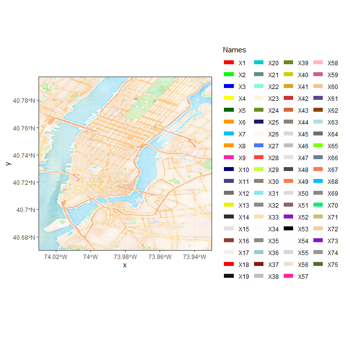

```{r setup, include=FALSE}
knitr::opts_chunk$set(echo = TRUE)
```

# Load Packages

```{r}
library(tidyverse)
library(lubridate)
library(imputeTS)
source("Routinen/ANNUtils.r")
```


# NYC bike project

## Überblick

In diesem Anwendungsprojekt werden Daten der City of New York bearbeitet, visualisiert und analysiert, die Informationen zum städtischen Bikesharing aus dem Jahr 2016 enthalten. Das Hauptaugenmerk in diesem Projekt liegt darauf, möglichst sinnvoll und genau die Anzahl der Nutzer an den verschiedenen Stationen vorherzusagen. Zu diesem Zweck werden zusätzlich Wetterdaten der Stadt New York hinzugezogen.

## Daten

Die Daten zum Bikesharing sind folgendermaßen strukturiert. Jede Zeile des ursprünglichen Datensatzes repräsentiert eine Fahrt mit einem Fahrrad der Bikesharing Flotte. Zu jeder Fahrt ist die Dauer der Leihe, der Start- und Endzeitpunkt, sowie die Start- und Endstation festgehalten. Außerdem ist die Indentifikationsnummer des jeweiligen Fahrrades vorhanden. Des Weiteren sind Kundeninformationen festgehalten. Das Geschlecht und Geburtsjahr, sowie der Nutzertyp. Hier wird zwischen Customer und Subscriber unterschieden. Subscriber haben ein jährliches Abonnement abgeschlossen, wohingegen Customer einen Ein- oder Drei-Tages-Pass erworben haben.

Die Wetterdaten halten die täglichen Maximal- und Minimaltemperaturen fest, sowie die Tagesdurchschnittstemperatur. Des Weiteren geben Sie Auskunft über den gefallenen Regen, sowie den neuen Schneefall und die Tiefe der aktuellen Schneedecke.

## Forschungsfragen

Nach einigen Diskussionen und Analysen der Daten haben sich zwei interessante Forschungsfragen ergeben.

1. Können die Nutzerzahlen pro Station und Stunde zuverlässig vorrausgesagt werden?   und

2. Können die Nutzerzahlen pro Tag in Abhängigkeit zum Wetter vorrausgesagt werden?

## Load data

Zunächst wird der Datensatz geladen, der die Wetterdaten enthält.

```{r}
#weather <- read.csv("Data/weather_data_nyc_centralpark_2016(1).csv")
```


Da die Bikesharingdaten von der Stadt New York monatlich gespeichert werden, werden sie zunächst je Monat in einen Data Frame geladen.

```{r}

'januar <- read_csv("H:/Projekt Daten/201608-citibike-tripdata/201601-citibike-tripdata.csv")
februar <- read_csv("H:/Projekt Daten/201608-citibike-tripdata/201602-citibike-tripdata.csv")
maerz <-read_csv("H:/Projekt Daten/201608-citibike-tripdata/201603-citibike-tripdata.csv")
april <-read_csv("H:/Projekt Daten/201608-citibike-tripdata/201604-citibike-tripdata.csv")
mai <-read_csv("H:/Projekt Daten/201608-citibike-tripdata/201605-citibike-tripdata.csv")
juni <-read_csv("H:/Projekt Daten/201608-citibike-tripdata/201606-citibike-tripdata.csv")
juli <-read_csv("H:/Projekt Daten/201608-citibike-tripdata/201607-citibike-tripdata.csv")
august <-read_csv("H:/Projekt Daten/201608-citibike-tripdata/201608-citibike-tripdata.csv")
september <-read_csv("H:/Projekt Daten/201608-citibike-tripdata/201609-citibike-tripdata.csv")
oktober <-read_csv("H:/Projekt Daten/201608-citibike-tripdata/201610-citibike-tripdata.csv")
november <-read_csv("H:/Projekt Daten/201608-citibike-tripdata/201611-citibike-tripdata.csv")
dezember <-read_csv("H:/Projekt Daten/201608-citibike-tripdata/201612-citibike-tripdata.csv")'
```


## Preprocessing

Da es in R schwierig sein kann mit Spaltennamen zu arbeiten, die Leerzeichen enthalten, werden diese zunächst durch Unterstriche ersetzt.

```{r}
'names(januar) <- str_replace_all(names(januar), c(" " = "_"))
names(februar) <- str_replace_all(names(februar), c(" " = "_"))
names(maerz) <- str_replace_all(names(maerz), c(" " = "_"))
names(april) <- str_replace_all(names(april), c(" " = "_"))
names(mai) <- str_replace_all(names(mai), c(" " = "_"))
names(juni) <- str_replace_all(names(juni), c(" " = "_"))
names(juli) <- str_replace_all(names(juli), c(" " = "_"))
names(august) <- str_replace_all(names(august), c(" " = "_"))
names(september) <- str_replace_all(names(september), c(" " = "_"))
names(oktober) <- str_replace_all(names(oktober), c(" " = "_"))
names(november) <- str_replace_all(names(november), c(" " = "_"))
names(dezember) <- str_replace_all(names(dezember), c(" " = "_"))'
```

In einem nächsten Schritt werden die Spaltennamen der Monate Oktober bis Dezember an die Namen der anderen Monate angepasst, damit ein Datensatz entstehen kann, der alle Monate umfasst.

```{r}
'dezember <- dezember %>%
  rename(tripduration = Trip_Duration,
         starttime = Start_Time,
         stoptime = Stop_Time,
         start_station_id = Start_Station_ID,
         start_station_name = Start_Station_Name,
         start_station_latitude = Start_Station_Latitude,
         start_station_longitude = Start_Station_Longitude,
         end_station_id = End_Station_ID,
         end_station_name = End_Station_Name,
         end_station_latitude = End_Station_Latitude,
         end_station_longitude = End_Station_Longitude,
         bikeid = Bike_ID,
         usertype = User_Type,
         birth_year = Birth_Year,
         gender = Gender)

november <- november %>%
  rename(tripduration = Trip_Duration,
         starttime = Start_Time,
         stoptime = Stop_Time,
         start_station_id = Start_Station_ID,
         start_station_name = Start_Station_Name,
         start_station_latitude = Start_Station_Latitude,
         start_station_longitude = Start_Station_Longitude,
         end_station_id = End_Station_ID,
         end_station_name = End_Station_Name,
         end_station_latitude = End_Station_Latitude,
         end_station_longitude = End_Station_Longitude,
         bikeid = Bike_ID,
         usertype = User_Type,
         birth_year = Birth_Year,
         gender = Gender)

oktober <- oktober %>%
  rename(tripduration = Trip_Duration,
         starttime = Start_Time,
         stoptime = Stop_Time,
         start_station_id = Start_Station_ID,
         start_station_name = Start_Station_Name,
         start_station_latitude = Start_Station_Latitude,
         start_station_longitude = Start_Station_Longitude,
         end_station_id = End_Station_ID,
         end_station_name = End_Station_Name,
         end_station_latitude = End_Station_Latitude,
         end_station_longitude = End_Station_Longitude,
         bikeid = Bike_ID,
         usertype = User_Type,
         birth_year = Birth_Year,
         gender = Gender)'
```

Aufgrund der Datenmenge werden die Monate einzeln abgespeichert und nach dem Laden zu einem Data Frame zusammengefasst. So ist während der Projektarbeit sichergestellt, dass alle Teammitglieder zu jeder Zeit über GitHub die jeweils aktuellen Daten nutzen können und keine Diskrepanzen entstehen.

```{r}
'saveRDS(januar, "Bike_Data_Jan.RDS")
saveRDS(februar, "Bike_Data_Feb.RDS")
saveRDS(maerz, "Bike_Data_Mrz.RDS")
saveRDS(april, "Bike_Data_Apr.RDS")
saveRDS(mai, "Bike_Data_Mai.RDS")
saveRDS(juni, "Bike_Data_Jun.RDS")
saveRDS(juli, "Bike_Data_Jul.RDS")
saveRDS(august, "Bike_Data_Aug.RDS")
saveRDS(september, "Bike_Data_Sep.RDS")
saveRDS(oktober, "Bike_Data_Okt.RDS")
saveRDS(november, "Bike_Data_Nov.RDS")
saveRDS(dezember, "Bike_Data_Dez.RDS")'
```

Die einzelnen Datensätze für jeden Monat werden geladen und in einem Datensatz mit dem Namen "bike" zusammengefasst. Da in den Datensätzen Januar bis September die Start- und Stopzeiten als <character> formatiert sind, in den Monaten Oktober bis Dezember aber als Unixtime bzw. bereits richtig umgewandelt als <datetime>, muss vor der Zusammenführung das Format vereinheitlicht werden. Hierfür wird in den Monaten Januar bis September der Datentyp von <character> zu <datetime> umgewandelt. So ist weiteres Arbeiten mit den Datumsangaben problemlos möglich.

```{r}
df1 <- read_rds("Data/Bike_Data_Jan.RDS")
df1$starttime <- mdy_hms(df1$starttime)
df1$stoptime <- mdy_hms(df1$stoptime)

df2 <- read_rds("Data/Bike_Data_Feb.RDS")
df2$starttime <- mdy_hms(df2$starttime)
df2$stoptime <- mdy_hms(df2$stoptime)

df3 <- read_rds("Data/Bike_Data_Mrz.RDS")
df3$starttime <- mdy_hms(df3$starttime)
df3$stoptime <- mdy_hms(df3$stoptime)

df4 <- read_rds("Data/Bike_Data_Apr.RDS")
df4$starttime <- mdy_hms(df4$starttime)
df4$stoptime <- mdy_hms(df4$stoptime)

df5 <- read_rds("Data/Bike_Data_Mai.RDS")
df5$starttime <- mdy_hms(df5$starttime)
df5$stoptime <- mdy_hms(df5$stoptime)

df6 <- read_rds("Data/Bike_Data_Jun.RDS")
df6$starttime <- mdy_hms(df6$starttime)
df6$stoptime <- mdy_hms(df6$stoptime)

df7 <- read_rds("Data/Bike_Data_Jul.RDS")
df7$starttime <- mdy_hms(df7$starttime)
df7$stoptime <- mdy_hms(df7$stoptime)

df8 <- read_rds("Data/Bike_Data_Aug.RDS")
df8$starttime <- mdy_hms(df8$starttime)
df8$stoptime <- mdy_hms(df8$stoptime)

df9 <- read_rds("Data/Bike_Data_Sep.RDS")
df9$starttime <- mdy_hms(df9$starttime)
df9$stoptime <- mdy_hms(df9$stoptime)

df10 <- read_rds("Data/Bike_Data_Okt.RDS")
df11 <- read_rds("Data/Bike_Data_Nov.RDS")
df12 <- read_rds("Data/Bike_Data_Dez.RDS")


bike <- rbind(df1, df2, df3, df4, df5, df6, df7, df8, df9, df10, df11, df12)
rm(df1, df2, df3, df4, df5, df6, df7, df8, df9, df10, df11, df12)
```


### Missing Values

Im nächsten Schritt des Preprocessing wird im gesamten Datensatz nach fehlenden Werten gesucht und diese entfernt oder ersetzt. Dies ist notwendig, da die späteren Analyseergebnisse durch fehlende Werte beeinträchtigt werden können.

```{r}

# Überprüfe auf Missing values

'apply(bike, 2, function(x) sum(is.na(x)))

apply(weather, 2, function(x) sum(is.na(x)))'


# Mögliche Variante für missing Values beim Wetter

#weather_test <- weather
#is.na(weather_test$precipitation) <- which(weather$precipitation == 'T')
#is.na(weather_test$snow.fall) <- which(weather$snow.fall == 'T')
#is.na(weather_test$snow.depth) <- which(weather$snow.depth == 'T')'

'weather_test$precipitation <- as.numeric(weather_test$precipitation)

weather_test[is.na(weather_test$precipitation),"precipitation"] <- 0.01

weather_test_interpolated <- na_interpolation(weather_test$precipitation, option = "spline")'
```

Die Spalten usertype und birth_year enthalten als einzige fehlende Werte. Um einen sauberen Datensatz zu erhalten, haben wir uns dazu entschlossen die Zeilen, die fehlende Werte enthalten aus dem Datensatz zu entfernen. Die hat zwei Gründe. Zum Einen kann das Geburtsjahr, sowie auch der Nutzertyp (Subscriber oder Customer) nicht sinnvoll interpoliert werden. Es können von den davor und danach liegenden Datenpunkten keine sinnvollen Rückschlüsse auf die fehlenden Werte gezogen werden. Zum Anderen liegt hier ein ausreichend großer Datensatz vor (über 13 000 000 Zeilen), sodass der Informationsverlust, der durch das Löschen von ca. 1 600 000 Zeilen gering ist. So können Verzerrungen durch falsch interpolierte Werte vermieden werden.


```{r}
bike <- na.omit(bike)


#apply(bike, 2, function(x) sum(is.na(x)))


'test <- read_rds("Data/Bike_Data_Mrz.RDS") #Erstellen Testdatensatz, da Abfragen sonst zu lang dauern
apply(test, 2, function(x) sum(is.na(x)))
test <- na.omit(test)
apply(test, 2, function(x) sum(is.na(x)))
sum(bike$usertype == "Customer")'
```


### Tidy Data

Um mit den Wetterdaten arbeiten zu können, muss zunächst die Spalte date in das richtige Datumsformat 
überführt werden. Die Temperaturangaben in Fahrenheit werden in Celsius, die Menge des Regens und des 
Schnees in Inches in Millimeter umgerechnet. Kann die Menge des gefallenen Regens oder Schnees nicht 
gemessen werden, wird dies durch ein T gekennzeichnet. Um mit den Daten problemlos arbeiten zu können, 
wird das T durch den Wert 0.01 ersetzt. So ist ein numerischer Wert vorhanden, der kennzeichnet, dass 
Regen oder Schnee gefallen ist. Jedoch ist dieser sehr gering, sodass er keinen unverhältnismäßigen 
Einfluss auf etwaige Analyseergebnisse hat. Die T-Werte werden zunächst durch den Wert 100 ersetzt, da so Probleme beim Umrechnen umgangen werden, die durch z.B. NAs entstehen. In keiner der Spalten kommt vorher der Wert 100 vor, sodass nach dem Umrechnen weiterhin klar ist, welche Werte vorher ein T waren. Nach dem Umrechnen haben diese den Wert 2540 und können problemlos mit 0.01 ersetzt werden.

```{r}
'weather$date <- dmy(weather$date)

weather <- weather %>%
  mutate(maximum.temperature = round((maximum.temperature-32)*5/9, 2),
         minimum.temperature = round((minimum.temperature-32)*5/9, 2),
         average.temperature = round((average.temperature-32)*5/9, 2))

levels(weather$precipitation)
levels(weather$snow.fall)
levels(weather$snow.depth)

weather$precipitation <- as.character(weather$precipitation)
weather$precipitation[weather$precipitation == "T"] <- 100
weather$precipitation <- as.double(weather$precipitation)

weather$snow.fall <- as.character(weather$snow.fall)
weather$snow.fall[weather$snow.fall == "T"] <- 100
weather$snow.fall <- as.double(weather$snow.fall)

weather$snow.depth <- as.character(weather$snow.depth)
weather$snow.depth[weather$snow.depth == "T"] <- 100
weather$snow.depth <- as.double(weather$snow.depth)

weather <- weather %>%
  mutate(precipitation = round(precipitation*25.4, 2),
         snow.fall = round(snow.fall*25.4, 2),
         snow.depth = round(snow.depth*25.4, 2))

max(weather$precipitation)
weather$precipitation[weather$precipitation == 2540] <- 0.01

max(weather$snow.fall)
weather$snow.fall[weather$snow.fall == 2540] <- 0.01

max(weather$snow.depth)
weather$snow.depth[weather$snow.depth == 2540] <- 0.01'

# Wetter gespeichert

#saveRDS(weather, "weather_rdy.rds")

weather <- readRDS("weather_rdy.rds")
```


### Aggregate Data

 Nach einer Diskussion haben wir festgestellt das sich zwei interessante Fragen auftun.
 
 1. Können wir die Nutzerzahlen pro STation pro Stunde vorraussagen ?   und
 2. Können wir die Nutzerzahlen pro Tag in abhängigkeit zum Wetter vorraussagen?
 
 Um die erste Forschungsfrage beantworten zu können, müssen die Daten zunächst so aggregiert werden, dass die Anzahl der Fahrten pro Stunde und Station sichtbar werden. Hier werden zwei Datensätze erstellt: Der Erste hält die Anzahl der pro Stunde losgefahrenen Radfahrer je Station fest (hourly_starts). Der Zweite hält die Anzahl der pro Stunde ankommenden Radfahrer je Station fest (hourly_stops). Die Anzahl der Fahrer wird mit der Variable user_count beschrieben. Die Variablen avg_age und avg_tripduration beschreiben jeweils das durchschnittliche Alter in Jahren, sowie die durchschnittliche Fahrtdauer in Sekunden. Die Variable weekend gibt an, ob der jeweilige Tag ein Wochenendtag (Samstag oder Sonntag) ist (1 = ja, 0 = nein). In den Variablen male_user_count, female_user_count und undefined_user_count geben die Anzahl der Fahrer nach Geschlecht gesplittet an. subscriber_count und customer_count geben an, wie viele der Fahrer ein Abo hatten bzw. einen 1-Tages oder 3-Tages-Pass. In den letzten 5 genannten Variablen werden fehlende Werte durch 0 ersetzt, da sich diese durch das Pivotieren der jeweiligen Data Frames ergeben und für die Anzahl der Fahrer stehen.
 
```{r}

'
bike_q1 <- bike
bike_q1 <- bike_q1 %>%
  mutate(start_date = as_date(starttime),
         start_hour = hour(starttime),
         stop_date = as_date(stoptime),
         stop_hour = hour(stoptime))

hourly_starts <- bike_q1 %>%
  group_by(start_date, start_hour, start_station_id, start_station_name, start_station_latitude,
           start_station_longitude) %>%
  summarise(user_count = n(),
            avg_age = round(2016 - mean(birth_year)),
            avg_tripduration = mean(tripduration)) %>%
  mutate(weekend = ifelse(wday(start_date) == 6 | wday(start_date) == 7, 1,0))

gender <- bike_q1 %>%
  group_by(start_date, start_hour, start_station_id, gender) %>%
  summarise(user = n())
gender <- pivot_wider(gender, names_from = gender, values_from = user)

hourly_starts <- cbind(hourly_starts, gender)
hourly_starts$start_date1 <- NULL
hourly_starts$start_hour1 <- NULL
hourly_starts$start_station_id1 <- NULL

usertype <- bike_q1 %>%
  group_by(start_date, start_hour, start_station_id, usertype) %>%
  summarise(user = n())
usertype <- pivot_wider(usertype, names_from = usertype, values_from = user)

hourly_starts <- cbind(hourly_starts, usertype)
hourly_starts$start_date1 <- NULL
hourly_starts$start_hour1 <- NULL
hourly_starts$start_station_id1 <- NULL

hourly_starts <- hourly_starts %>%
  rename(male_user_count = "1",
         female_user_count = "2",
         undefined_user_count = "0",
         subscriber_count = Subscriber,
         customer_count = Customer)

hourly_starts$male_user_count[is.na(hourly_starts$male_user_count)] <- 0
hourly_starts$female_user_count[is.na(hourly_starts$female_user_count)] <- 0
hourly_starts$undefined_user_count[is.na(hourly_starts$undefined_user_count)] <- 0
hourly_starts$subscriber_count[is.na(hourly_starts$subscriber_count)] <- 0
hourly_starts$customer_count[is.na(hourly_starts$customer_count)] <- 0

rm(gender)
rm(usertype)

hourly_stops <- bike_q1 %>%
  group_by(stop_date, stop_hour, end_station_id, end_station_name, end_station_latitude,
           end_station_longitude) %>%
  summarise(user_count = n(),
            avg_age = round(2016 - mean(birth_year)),
            avg_tripduration = mean(tripduration)) %>%
  mutate(weekend = ifelse(wday(stop_date) == 6 | wday(stop_date) == 7, 1,0))

gender <- bike_q1 %>%
  group_by(stop_date, stop_hour, end_station_id, end_station_name, end_station_latitude,
           end_station_longitude,gender) %>%
  summarise(user = n())
gender <- pivot_wider(gender, names_from = gender, values_from = user)

hourly_stops <- cbind(hourly_stops, gender)
hourly_stops$stop_date1 <- NULL
hourly_stops$stop_hour1 <- NULL
hourly_stops$end_station_id1 <- NULL
hourly_stops$end_station_name1 <- NULL 
hourly_stops$end_station_latitude1 <- NULL
hourly_stops$end_station_longitude1 <- NULL

usertype <- bike_q1 %>%
  group_by(stop_date, stop_hour, end_station_id, end_station_name, end_station_latitude,
           end_station_longitude, usertype) %>%
  summarise(user = n())
usertype <- pivot_wider(usertype, names_from = usertype, values_from = user)

hourly_stops <- cbind(hourly_stops, usertype)
hourly_stops$stop_date1 <- NULL
hourly_stops$stop_hour1 <- NULL
hourly_stops$end_station_id1 <- NULL
hourly_stops$end_station_name1 <- NULL 
hourly_stops$end_station_latitude1 <- NULL
hourly_stops$end_station_longitude1 <- NULL

hourly_stops <- hourly_stops %>%
  rename(male_user_count = "1",
         female_user_count = "2",
         undefined_user_count = "0",
         subscriber_count = Subscriber,
         customer_count = Customer)

hourly_stops$male_user_count[is.na(hourly_stops$male_user_count)] <- 0
hourly_stops$female_user_count[is.na(hourly_stops$female_user_count)] <- 0
hourly_stops$undefined_user_count[is.na(hourly_stops$undefined_user_count)] <- 0
hourly_stops$subscriber_count[is.na(hourly_stops$subscriber_count)] <- 0
hourly_stops$customer_count[is.na(hourly_stops$customer_count)] <- 0

rm(gender)
rm(usertype)

saveRDS(hourly_starts, "Data/bike_q1_starts.rds")
saveRDS(hourly_stops, "Data/bike_q1_stops.rds")
'

hourly_starts <- readRDS("Data/bike_q1_starts.rds")
hourly_stops <- readRDS("Data/bike_q1_stops.rds")

```

 
 Um die Daten für die zweite Frage zu aggregieren, müssen die Abfahrten und Ankünfte pro Station pro Tag zusammengefasst werden. Deswegen werde ich als erstes das Datum extrahieren damit ich damit nach dem Tag aggregieren kann.
 
```{r}
'
# Kopiere Datensatz in Question2 Datensatz und wandel Date/time Spalte in Date spalte um und füge Sie hinzu
bike_q2 <- bike
bike_q2 <- bike_q2 %>%
  mutate(date_start=date(bike_q2$starttime),
         date_stop=date(bike_q2$stoptime))


# Extrahiere das Gender aus dem Datensatz für die Starts
bike_q2_starts_gender <- bike_q2 %>%
  group_by(date_start, start_station_name, start_station_latitude, start_station_longitude, gender) %>%
  summarise( anzahl = n() )

# Extrahiere das Gender aus dem Datensatz für die Stops
bike_q2_stops_gender <- bike_q2 %>%
  group_by(date_stop, end_station_name, end_station_latitude, end_station_longitude, gender) %>%
  summarise( anzahl = n() )

# Tidy Gender Tabelle für starts und stops
gender_q2_starts <- pivot_wider(bike_q2_starts_gender, names_from = gender, values_from = anzahl)

gender_q2_stops <- pivot_wider(bike_q2_stops_gender, names_from = gender, values_from = anzahl)


# Aggregiere Starts und Stops nach Datum und Station

bike_q2_starts <- bike_q2 %>%
  group_by(date_start, start_station_name, start_station_latitude, start_station_longitude) %>%
  summarise(avr_age = round(2016-mean(birth_year)), avg_tripduration = mean(tripduration), anzahl = n() )
bike_q2_stops <- bike_q2 %>%
  group_by(date_stop, end_station_name, end_station_latitude, end_station_longitude) %>%
  summarise(avr_age = round(2016-mean(birth_year)), avg_tripduration = mean(tripduration), anzahl = n() )


# Füge den agregierten Tabellen das Gender hinzu

bike_q2_starts_rdy <- left_join(bike_q2_starts, gender_q2_starts, by = c("date_start", "start_station_name" ))
bike_q2_stops_rdy <- left_join(bike_q2_stops, gender_q2_stops, by = c("date_stop", "end_station_name" ))

# Nicht benötigte Spalten gelöscht und NAs in 0 umgewandelt weil wir wissen das diese 0 sind

bike_q2_starts_rdy$start_station_latitude.y <- NULL
bike_q2_starts_rdy$start_station_longitude.y <- NULL

bike_q2_starts_rdy[is.na(bike_q2_starts_rdy$`1`),"1"] <- 0
bike_q2_starts_rdy[is.na(bike_q2_starts_rdy$`2`),"2"] <- 0
bike_q2_starts_rdy[is.na(bike_q2_starts_rdy$`0`),"0"] <- 0

bike_q2_starts_rdy <- rename(bike_q2_starts_rdy, male = "1")
bike_q2_starts_rdy <- rename(bike_q2_starts_rdy, woman = "2")
bike_q2_starts_rdy <- rename(bike_q2_starts_rdy, undefined = "0")


bike_q2_stops_rdy$end_station_latitude.y <- NULL
bike_q2_stops_rdy$end_station_longitude.y <- NULL

bike_q2_stops_rdy[is.na(bike_q2_stops_rdy$`1`),"1"] <- 0
bike_q2_stops_rdy[is.na(bike_q2_stops_rdy$`2`),"2"] <- 0
bike_q2_stops_rdy[is.na(bike_q2_stops_rdy$`0`),"0"] <- 0

bike_q2_stops_rdy <- rename(bike_q2_stops_rdy, male = "1")
bike_q2_stops_rdy <- rename(bike_q2_stops_rdy, woman = "2")
bike_q2_stops_rdy <- rename(bike_q2_stops_rdy, undefined = "0")

rm(bike_q2, bike_q2_starts, bike_q2_starts_gender, bike_q2_stops, bike_q2_stops_gender, gender_q2_starts, gender_q2_stops)


saveRDS(bike_q2_starts_rdy, "Data/bike_q2_starts.rds")
saveRDS(bike_q2_stops_rdy, "Data/bike_q2_stops.rds")
'

q2_starts <- read_rds("Data/bike_q2_starts.rds")
q2_stops <- read_rds("Data/bike_q2_stops.rds")

```


## Visualization

### Basic Visualizations

Um ein Gefühl für die Daten zu bekommen und erste Einblicke in deren Beschaffenheit zu erhalten, werden zunächst einfache Visualisierungen genutzt.

```{r}
library(ggplot2)
library(gridExtra)
```
Zunächst werden die monatlichen Nutzerzahlen betrachtet.

```{r}
q2_starts %>%
  group_by(month = month(date_start, label = T)) %>%
  summarise(user_sum = sum(anzahl)) %>%
  ggplot(aes(month, user_sum)) +
  geom_line(colour = "cadetblue", size = 0.75, group = 1) +
  geom_point(colour = "cadetblue", size = 1.5) +
  theme_light() +
  labs(title = "Nutzeranzahl Pro Monat", y = "Nutzeranzahl",
       x = "Monat")
```

Diese entsprechen weitestgehend den Erwartungen. In den Wintermonaten sind die Nutzerzahlen wesentlich geringer als in den Sommermonaten. Ab Februar steigen die Nutzerzahlen bis September stetig an, mit Ausnahme eines Einbruchs im Juli. Dieser kann verschiedene Gründe haben. Zum Einen könnten viele Menschen ihren Sommerurlaub nehmen und verreisen oder die Temperaturen könnten so hoch sein, dass Radfahren als unangenehm empfunden wird.

Als nächstes sollen die monatlichen Nutzerzahlen von Männern und Frauen verglichen werden, um zu sehen, ob Unterschiede bestehen.

```{r}
q2_starts %>%
  group_by(month = month(date_start, label = T)) %>%
  summarise(male_sum = sum(male),
            female_sum = sum(woman)) %>%
  ggplot() +
  geom_line(aes(month, male_sum, colour = "cadetblue"), size = 0.75, group = 1) +
  geom_line(aes(month, female_sum, colour = "cadetblue4"), size = 0.75, group = 1) +
  scale_colour_manual(name = "Gender", values = c("cadetblue" = "cadetblue", "cadetblue4" = "cadetblue4"),
                      labels = c("Male", "Female")) +
  theme_light() +
  labs(title = "Nutzeranzahl Pro Monat Nach Geschlecht",
       y = "Nutzeranzahl", x = "Monat")
```

Auch nach der Trennung der Nutzerzahlen nach Geschlecht ist das vorherige Muster noch sichtbar. Jedoch ist klar erkennbar, dass deutlich mehr Männer das Fahrradangebot nutzen als Frauen. Hier kann weitere Forschung seitens des Unternehmens oder der Stadt New York betrieben werden, um herauszufinden, warum im Verhältnis zu den Männern so wenige Frauen das Angebot nutzen. Hieraus können dann Strategien abgeleitet werden, um mehr Frauen anzusprechen und sie als Kunden zu gewinnen.

In einem nächsten Schritt werden die durchschnittlichen Nutzerzahlen, sowie die durchschnittliche Fahrtdauer pro Wochentag betrachtet.

```{r}
p <- q2_starts %>%
  group_by(wday = wday(date_start, label = T, abbr = F, week_start = 1)) %>%
  summarise(user_mean = round(sum(anzahl)/365)) %>%
  ggplot(aes(wday, user_mean)) +
  geom_line(colour = "cadetblue", size = 0.75, group = 1) +
  geom_point(colour = "cadetblue", size = 1.5) +
  theme_light() +
  labs(title = "Durschnittliche Nutzeranzahl Pro Wochentag", y = "Durchschnittliche Nutzeranzahl",
       x = "Wochentag")

p1 <- q2_starts %>%
  group_by(wday = wday(date_start, label = T, abbr = F, week_start = 1)) %>%
  summarise(mean_tripduration = mean(avg_tripduration)) %>%
  ggplot(aes(wday, mean_tripduration)) +
  geom_line(colour = "cadetblue", size = 0.75, group = 1) +
  geom_point(colour = "cadetblue", size = 1.5) +
  theme_light() +
  labs(title = "Durschnittliche Fahrtdauer Pro Wochentag", y = "Durchschnittliche Fahrtdauer",
       x = "Wochentag")

grid.arrange(p, p1, nrow = 2)
```

Betrachtet man zunächst die Nutzerzahlen pro Wochentag, so fällt auf, dass diese unter der Woche höher sind als am Wochenende. Dies lässt darauf schließen, dass viele Kuden das Rad nutzen, um zur Arbeit, zur Schule oder zu Universität zu fahren.
Im Gegensatz hierzu steht die durchschnittliche Dauer einer Fahrt. Die Fahrtdauer ist mit 15 Minuten am Samstag am höchsten. Dies könnte darauf schließen lassen, dass die Fahrtwege, die zur Arbeit zurückgelegt werden etwas kürzer sind, als diejenigen, die zu Freizeitzwecken zurückgelegt werden. Es kann jedoch nicht abschließend geklärt werden, ob dies tatsächlich der Fall ist, da über die Kunden ausßer ihrem Alter, Geschlecht und Abo-Status nichts bekannt ist. Des Weiteren sind die Unterschiede in der Fahrtdauer mit einigen Minuten nicht sehr groß.

Um weitere Anhaltspunkte für die Nutzung zu erhalten, werden die Nutzerzahlen eines Tages in Stundenintervallen betrachtet.

```{r}
hourly_starts %>%
  group_by(start_hour) %>%
  summarise(user_mean = round(sum(user_count)/365)) %>%
  ggplot(aes(start_hour, user_mean)) +
  geom_line(colour = "cadetblue4", size = 0.75) +
  geom_point(colour = "cadetblue4", size = 1.5) +
  theme_light() +
  labs(title = "Durchschnittliche Nutzeranzahl Pro Stunde", x = "Stunde", 
       y = "Durchschnittliche Nutzeranzahl")
```

Auch hier kann ein Muster erkannt werden. Von 5 Uhr bis 9 Uhr morgens steigen die Nutzerzahlen und fallen danach ab, um von 15 bis 17 Uhr wieder anzusteigen. Dies spricht für die zuvor geäußerte Vermutung, dass viele Kunden die Fahrräder für den Arbeitsweg nutzen. Am Vormittag und Nachmittag sind die Nutzerzahlen am höchsten. Dies kann den Arbeitsbeginn und das Arbeitsende markieren.

Als nächstes werden nun die Nutzerzahlen getrennt nach Abonnement (usertype) betrachtet, um festzustellen, ob Unterschiede in der täglichen Nutzung bestehen.

```{r}
hourly_starts %>%
  group_by(start_hour) %>%
  summarise(subscriber_mean = round(sum(subscriber_count)/365),
            customer_mean = round(sum(customer_count)/365)) %>%
  ggplot() +
  geom_line(aes(start_hour, subscriber_mean, colour = "cadetblue"), size = 0.75) +
  geom_line(aes(start_hour, customer_mean, colour = "cadetblue4"), size = 0.75) +
  scale_colour_manual(name = "User Type", values = c("cadetblue" = "cadetblue", "cadetblue4" = "cadetblue4"),
                      labels = c("Subscriber", "Customer")) +
  theme_light() +
  labs(title = "Durchschnittliche Nutzeranzahl Pro Stunde Nach Abonnement",
       y = "Durchschnittliche Nutzeranzahl", x = "Stunde")
```

Es ist zu sehen, dass für die Nutzergruppe, die ein jährliches Abo hat (Subscriber), das stündliche Muster erhalten bleibt. Jeweils morgens und nachmittags zu Arbeitsbeginn und -ende nutzen die meisten Kunden das Angebot. Die Nutzergruppe Customer, die nur einen ein- oder drei-Tages-Pass nutzen ist stark unterrepräsentiert. Dies kann darauf schließen lassen, dass das Angebot eher von Personen genutzt wird, die dies regelmäßig nutzen wollen, wie z.B. für den Arbeitsweg, und eher nicht für z.B. Tagesausflüge. Ähnlich wie bei den starken Unterschieden in der Nutzung bei den Geschlechtern, kann es hier lohnenswert sein die Hintergründe zu betrachten und weiter zu erforschen, um neue Nutzergruppen zu aquirieren.

Um mehr über die Nutzer zu erfahren, wird nun das durchschnittliche Alter der Nutzer pro Stunde betrachtet.

```{r}
hourly_starts %>%
  group_by(start_hour) %>%
  summarise(mean_age = mean(avg_age)) %>%
  ggplot(aes(start_hour, mean_age)) +
  geom_line(colour = "cadetblue", size = 0.75) +
  geom_point(colour = "cadetblue", size = 1.5) +
  theme_light() +
  labs(title = "Durschnittliches Alter Der Nutzer Pro Stunde", y = "Durchschnittliches Alter",
       x = "Stunde")
```

Es ist zu erkennen, dass die Nutzer am Abend und in der Nacht jünger sind, als die Nutzer am Tag. Hierfür kann es verschiedene Gründe geben. Zum Beispiel kann es sein, dass jüngere Kunden eher nachts ausgehen und für den Heimweg das Rad nehmen. Dies kann allerdings nicht abschließend bestätig werden, da zu wenig über die Nutzer bekannt ist. Es kann sich hier ebenfalls lohnen, die Altersstruktur der Nutzer genauer zu betrachten, um neue Nutzergruppen zu identifizieren. Es könnte beispielsweise sein, dass sich die Nutzer, die mit dem Rad zu Arbeit fahren, in mehr als der Nutzungsart von denjenigen unterscheiden, die nachts mit dem Rad von einer Feier nach Hause fahren. In der Konsequenz können die unterschiedlichen Nutzergruppen besser abgestimmt auf ihr Alter und den Nutzungszweck angesprochen werden.

In einer letzten Grafik wird die durchschnittliche Fahrtdauer pro Stunde betrachtet.

```{r}
hourly_starts %>%
  group_by(start_hour) %>%
  summarise(mean_tripduration = mean(avg_tripduration)) %>%
  ggplot(aes(start_hour, mean_tripduration)) +
  geom_line(colour = "cadetblue", size = 0.75) +
  geom_point(colour = "cadetblue", size = 1.5) +
  theme_light() +
  labs(title = "Durschnittliche Fahrtdauer Pro Stunde", y = "Durchschnittliche Fahrtdauer",
       x = "Stunde")
```

Die durchschnittliche Fahrtzeit pro Stunde unterscheidet sich nur leicht. Sie bewegt sich in einem Rahmen von 700 bis 900 Sekunden bzw. 11.5 und 15 Minuten. Am längsten ist die Fahrtzeit in der Zeit zwischen 2 und 3 Uhr morgens. Dies könnte darauf hindeuten, dass die Kunden nachts eher weiter entfernt von ihrem Wohnort aufhalten.

### Ein Tag in New York

Um die Nutzerströme zwischen den Stationen zu den verschiedenen Tageszeiten sichtbar zu machen, folgt eine animierte Grafik, die jeden Nutzer zeigt, der am 01.06.2016 ein Rad entliehen und wieder abgegeben hat.

```{r}
library(geojsonio)
library(move)
library(moveVis)

#load data for june 2016
df6 <- read_rds("Data/Bike_Data_Jun.RDS")
df6$starttime <- mdy_hms(df6$starttime)
df6$stoptime <- mdy_hms(df6$stoptime)

#add the column track_id and tidy the data so that each start and each stop gets its own row
df6 <- rowid_to_column(df6, "track_id")
geo <- df6 %>%
  pivot_longer(cols = c(starttime, stoptime), names_to = "datetime", values_to = "timestamp")
geo1 <- df6 %>%
  pivot_longer(cols = c(start_station_id, end_station_id), names_to = "station", values_to = "station_id")
geo2 <- df6 %>%
  pivot_longer(cols = c(start_station_latitude, end_station_latitude), names_to = "station", values_to = "station_lat")
geo3 <- df6 %>%
  pivot_longer(cols = c(start_station_longitude, end_station_longitude), names_to = "station", values_to = "station_long")

geo_rdy <- cbind(geo, geo1[,c("station_id")], geo2[,c("station_lat")], geo3[,c("station_long")])
geo_rdy <- as_tibble(geo_rdy)

geo_final <- geo_rdy %>% dplyr::select(track_id, timestamp, station_id, station_lat, station_long)

#remove unnecessary data frames
rm(geo)
rm(geo1)
rm(geo2)
rm(geo3)
rm(geo_rdy)

#process the data, so that only complete cases from 01.06.2016 with a distinct start- and end-station are included
geo_final <- geo_final %>%
  filter(date(timestamp) == "2016-06-01")
geo_unique <- unique(c(geo_final[,1], geo_final[,3], geo_final[,4], geo_final[,5]))
geo_unique <- as.data.frame(geo_unique)
colnames(geo_unique) <- c("track_id", "station_id", "station_lat", "station_long")
geo_unique <- geo_unique %>% distinct()
geo_unique <- geo_unique[geo_unique$track_id %in% names(which(table(geo_unique$track_id) == 2)), ]
geo_final <- inner_join(geo_unique, geo_final, by = c("track_id", "station_id", "station_lat", "station_long"))

#import the map, onto which will be projected
map <- geojson_read("Data/new-york-city-boroughs.geojson", what = "sp")

#create an object of class move
geo_move <- df2move(geo_final, proj = '+proj=longlat +datum=WGS84 +no_defs +ellps=WGS84 +towgs84=0,0,0', 
        track_id = "track_id", x = "station_long", y = "station_lat", time = "timestamp")

#align the movement on one scale FEHLER! Nachfolgender Code geht nicht für alle Datenpunkte
geo_aligned <- align_move(geo_move, res = 1, digit = 0, unit = "hours")

#create frames for movement
geo_frames <- frames_spatial(geo_aligned, map_service = "osm", map_type = "watercolor", alpha = 0.5) %>%
  add_labels(x = "Longitude", y = "Latitude", title = "Movement Of Cyclists", 
             subtitle = "First Week Of June 2016") %>% 
  add_northarrow() %>%
  add_scalebar() %>%
  add_timestamps(geo_aligned, type = "label") %>%
  add_progress()

#animate frames and save as .gif
animate_frames(geo_frames, out_file = "movement_of_cyclists_6_2016.gif")

```


### heat map

```{r}
library(geojsonio)
library(broom)
library(cartography)

# load geojson

spdf <- geojson_read("Data/new-york-city-boroughs.geojson",  what = "sp")
 
 
# Now I can plot this shape easily as described before:

ggplot() +
  geom_polygon(data = spdf, aes( x = long, y = lat, group = group), fill="white", color="grey") +
  theme_void() +
  coord_map()


q2_starts_test <- rename(q2_starts, long = start_station_longitude.x)
q2_starts_test <- rename(q2_starts, lat = start_station_latitude.x)


ggplot() +
  geom_polygon(data = spdf, aes( x = long, y = lat, group = group)) +
  theme_void() +
  coord_map()


# Build a choropleth
choroLayer(spdf = spdf, df = q2_starts, var = "anzahl" , legend.pos = "right")
title("Population in 2008")
```

```{r}
# Library
library(leaflet)


# Create a color palette with handmade bins.
#mybins <- seq(4, 6.5, by=0.5)
#mypalette <- colorBin( palette="YlOrBr", domain=quakes$mag, na.color="transparent", bins=mybins)

# Prepare the text for the tooltip:
'mytext <- paste(
   "Depth: ", quakes$depth, "<br/>", 
   "Stations: ", quakes$stations, "<br/>", 
   "Magnitude: ", quakes$mag, sep="") %>%
  lapply(htmltools::HTML)'

# Final Map
m <- leaflet(q2_starts) %>% 
  addTiles()  %>% 
  setView( lat=40, lng=-74 , zoom=4) %>%
  addProviderTiles("Esri.WorldImagery") %>%
  addCircleMarkers(~start_station_longitude.x, ~start_station_latitude.x, fillOpacity = 0.7, color="white", radius=8, stroke=FALSE,
    labelOptions = labelOptions( style = list("font-weight" = "normal", padding = "3px 8px"), textsize = "13px", direction = "auto")
  )


  addLegend( pal=mypalette, values=~mag, opacity=0.9, title = "Magnitude", position = "bottomright" )

m 
```


### choropleth map

## analytics

### split data

### regression

### knn

#### cross validation

## prediction


## Sources
https://www.kaggle.com/mathijs/weather-data-in-new-york-city-2016
https://www.citibikenyc.com/system-data