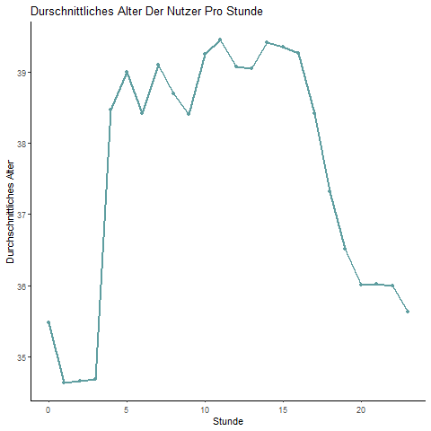
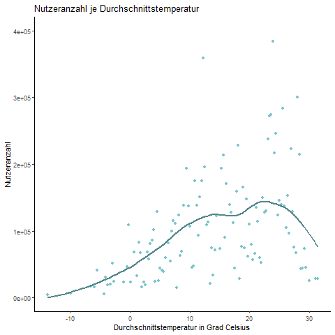

```{r setup, include=FALSE}
knitr::opts_chunk$set(echo = TRUE, warning = FALSE, message = FALSE)

```

```{r, include=FALSE}
library(tidyverse)
library(lubridate)
library(imputeTS)
library(timeDate)
library(fastDummies)

library(keras)

library(forecast)
library(keras)
library(ggplot2)
library(gridExtra)
library(geojsonio)
library(move)
library(moveVis)


source("Routinen/ANNUtils.r")

theme_set(theme_classic())
```

# New York City Bike Project

## Überblick

In diesem Anwendungsprojekt werden Daten der City of New York bearbeitet, visualisiert und analysiert, die Informationen zum städtischen Bikesharing aus dem Jahr 2016 enthalten. Das Hauptaugenmerk in diesem Projekt liegt darauf, möglichst sinnvoll und genau die Anzahl der Nutzer an den verschiedenen Stationen vorherzusagen. Zu diesem Zweck werden zusätzlich Wetterdaten der Stadt New York hinzugezogen. 

Die Vorhersage der Nutzerzahlen geschieht mit Hilfe eines künstlichen neuronalen Netzes, einem sogenannten **L**ong **S**hort **T**erm **M**emory Netz, kurz **LSTM**. Um die Performance des Netzes zu überprüfen wird das Ergebnis mit dem Ergebnis einer linearen Regression nach der Methode der kleinsten Quadrate, auch OLS Regression genannt, verglichen. 

## Daten

Die Daten zum Bikesharing sind folgendermaßen strukturiert. Jede Zeile des ursprünglichen Datensatzes repräsentiert eine Fahrt mit einem Fahrrad der Bikesharing Flotte. Zu jeder Fahrt ist die Dauer der Leihe, der Start- und Endzeitpunkt, sowie die Start- und Endstation festgehalten. Außerdem ist die Indentifikationsnummer des jeweiligen Fahrrades vorhanden. Des Weiteren sind Kundeninformationen festgehalten. Das Geschlecht und Geburtsjahr, sowie der Nutzertyp. Bei Letzterem wird zwischen Customer und Subscriber unterschieden. Subscriber haben ein jährliches Abonnement abgeschlossen, wohingegen Customer einen Ein- oder Drei-Tages-Pass erworben haben. Zu Analysezwecken wird dieser ursprüngliche Datensatz im Laufe des Projektes aggregiert. Dies geschieht auf verschiedenen Ebenen. Zum Einen werden die Daten nach Stunde und Tag und zum Anderen nach Leihstation und Stadtbezirk zusammengefasst.

Die täglichen Wetterdaten halten die täglichen Maximal- und Minimaltemperaturen fest, sowie die Tagesdurchschnittstemperatur. Des Weiteren geben Sie Auskunft über den gefallenen Regen, sowie den neuen Schneefall und die Tiefe der aktuellen Schneedecke.

Die stündlichen Wetterdaten geben Auskunft über die Temperatur, die Windgeschwindigkeit, sowie den gefallenen Regen.

## Forschungsfragen

Nach einigen Diskussionen und Analysen der Daten haben sich zwei interessante Forschungsfragen ergeben.

1. Können die Nutzerzahlen pro Station und Stunde zuverlässig vorausgesagt werden?   und

2. Können die Nutzerzahlen pro Station und Tag zuverlässig vorausgesagt werden? 

Im späteren Verlauf des Projektes haben sich aufgrund der Datenmenge Probleme in den Analysen ergeben. Aufgrunddessen werden die Forschungsfragen wie folgt bearbeitet:

**1.** Können die Nutzerzahlen pro Bezirk und Stunde zuverlässig vorausgesagt werden? und

**2.** Können die Nutzerzahlen pro Bezirk und Tag zuverlässig vorausgesagt werden?

Durch die Aggregation auf Bezirksebene verringert sich die Anzahl an Variablen erheblich. Aufgrund der dennoch enorm großen Datenmengen und den daraus resultierenden Problemen werden die Vorhersagen mit dem LSTM Netz und der linearen Regression exemplarisch für einen Bezirk durchgeführt. 

## Preprocessing

In einem ersten Schritt, werden alle zunächst zur Verfügung stehenden Datensätze geladen und entsprechend der Analysezwecke aufbereitet.

Zunächst werden die Datensätze geladen, die die Wetterdaten enthalten. Je Forschungsfrage gibt es einen eigenen Datensatz. Der Datensatz weather enthält tägliche Wetterdaten, wohingegen der Datensatz hourly_weather stündliche Wetterdaten enthält.

```{r, eval=FALSE, echo=TRUE}
weather <- read.csv("Data/weather_data_nyc_centralpark_2016(1).csv")
hourly_weather <- read.csv("Data/hourly_weather.csv")
```

Da die Bikesharingdaten von der Stadt New York monatlich gespeichert werden, werden sie zunächst je Monat in einen Data Frame geladen.

```{r, eval=FALSE, echo=TRUE}
januar <- read_csv("H:/Projekt Daten/201608-citibike-tripdata/201601-citibike-tripdata.csv")
februar <- read_csv("H:/Projekt Daten/201608-citibike-tripdata/201602-citibike-tripdata.csv")
maerz <-read_csv("H:/Projekt Daten/201608-citibike-tripdata/201603-citibike-tripdata.csv")
april <-read_csv("H:/Projekt Daten/201608-citibike-tripdata/201604-citibike-tripdata.csv")
mai <-read_csv("H:/Projekt Daten/201608-citibike-tripdata/201605-citibike-tripdata.csv")
juni <-read_csv("H:/Projekt Daten/201608-citibike-tripdata/201606-citibike-tripdata.csv")
juli <-read_csv("H:/Projekt Daten/201608-citibike-tripdata/201607-citibike-tripdata.csv")
august <-read_csv("H:/Projekt Daten/201608-citibike-tripdata/201608-citibike-tripdata.csv")
september <-read_csv("H:/Projekt Daten/201608-citibike-tripdata/201609-citibike-tripdata.csv")
oktober <-read_csv("H:/Projekt Daten/201608-citibike-tripdata/201610-citibike-tripdata.csv")
november <-read_csv("H:/Projekt Daten/201608-citibike-tripdata/201611-citibike-tripdata.csv")
dezember <-read_csv("H:/Projekt Daten/201608-citibike-tripdata/201612-citibike-tripdata.csv")
```

Da es in R schwierig sein kann mit Spaltennamen zu arbeiten, die Leerzeichen enthalten, werden diese durch Unterstriche ersetzt.

```{r, eval=FALSE, echo=TRUE}
names(januar) <- str_replace_all(names(januar), c(" " = "_"))
names(februar) <- str_replace_all(names(februar), c(" " = "_"))
names(maerz) <- str_replace_all(names(maerz), c(" " = "_"))
names(april) <- str_replace_all(names(april), c(" " = "_"))
names(mai) <- str_replace_all(names(mai), c(" " = "_"))
names(juni) <- str_replace_all(names(juni), c(" " = "_"))
names(juli) <- str_replace_all(names(juli), c(" " = "_"))
names(august) <- str_replace_all(names(august), c(" " = "_"))
names(september) <- str_replace_all(names(september), c(" " = "_"))
names(oktober) <- str_replace_all(names(oktober), c(" " = "_"))
names(november) <- str_replace_all(names(november), c(" " = "_"))
names(dezember) <- str_replace_all(names(dezember), c(" " = "_"))
```

In einem nächsten Schritt werden die Spaltennamen der Monate Oktober bis Dezember an die Namen der anderen Monate angepasst, damit ein Datensatz entstehen kann, der alle Monate umfasst.

```{r, eval=FALSE, echo=TRUE}
dezember <- dezember %>%
  rename(tripduration = Trip_Duration,
         starttime = Start_Time,
         stoptime = Stop_Time,
         start_station_id = Start_Station_ID,
         start_station_name = Start_Station_Name,
         start_station_latitude = Start_Station_Latitude,
         start_station_longitude = Start_Station_Longitude,
         end_station_id = End_Station_ID,
         end_station_name = End_Station_Name,
         end_station_latitude = End_Station_Latitude,
         end_station_longitude = End_Station_Longitude,
         bikeid = Bike_ID,
         usertype = User_Type,
         birth_year = Birth_Year,
         gender = Gender)

november <- november %>%
  rename(tripduration = Trip_Duration,
         starttime = Start_Time,
         stoptime = Stop_Time,
         start_station_id = Start_Station_ID,
         start_station_name = Start_Station_Name,
         start_station_latitude = Start_Station_Latitude,
         start_station_longitude = Start_Station_Longitude,
         end_station_id = End_Station_ID,
         end_station_name = End_Station_Name,
         end_station_latitude = End_Station_Latitude,
         end_station_longitude = End_Station_Longitude,
         bikeid = Bike_ID,
         usertype = User_Type,
         birth_year = Birth_Year,
         gender = Gender)

oktober <- oktober %>%
  rename(tripduration = Trip_Duration,
         starttime = Start_Time,
         stoptime = Stop_Time,
         start_station_id = Start_Station_ID,
         start_station_name = Start_Station_Name,
         start_station_latitude = Start_Station_Latitude,
         start_station_longitude = Start_Station_Longitude,
         end_station_id = End_Station_ID,
         end_station_name = End_Station_Name,
         end_station_latitude = End_Station_Latitude,
         end_station_longitude = End_Station_Longitude,
         bikeid = Bike_ID,
         usertype = User_Type,
         birth_year = Birth_Year,
         gender = Gender)
```

Aufgrund der Datenmenge werden die Monate einzeln abgespeichert und nach dem Laden zu einem Data Frame zusammengefasst. So ist während der Projektarbeit sichergestellt, dass alle Teammitglieder zu jeder Zeit über GitHub die jeweils aktuellen Daten nutzen können und keine Diskrepanzen entstehen.

```{r, eval=FALSE, echo=TRUE}
saveRDS(januar, "Bike_Data_Jan.RDS")
saveRDS(februar, "Bike_Data_Feb.RDS")
saveRDS(maerz, "Bike_Data_Mrz.RDS")
saveRDS(april, "Bike_Data_Apr.RDS")
saveRDS(mai, "Bike_Data_Mai.RDS")
saveRDS(juni, "Bike_Data_Jun.RDS")
saveRDS(juli, "Bike_Data_Jul.RDS")
saveRDS(august, "Bike_Data_Aug.RDS")
saveRDS(september, "Bike_Data_Sep.RDS")
saveRDS(oktober, "Bike_Data_Okt.RDS")
saveRDS(november, "Bike_Data_Nov.RDS")
saveRDS(dezember, "Bike_Data_Dez.RDS")
```

Die einzelnen Datensätze für jeden Monat werden geladen und in einem Datensatz mit dem Namen "bike" zusammengefasst. Da in den Datensätzen Januar bis September die Start- und Stopzeiten als `character` formatiert sind, in den Monaten Oktober bis Dezember aber als Unixtime bzw. bereits richtig umgewandelt als `datetime`, muss vor der Zusammenführung das Format vereinheitlicht werden. Hierfür wird in den Monaten Januar bis September der Datentyp von `character` zu `datetime` umgewandelt. So ist weiteres Arbeiten mit den Datums- und Zeitangaben problemlos möglich.

```{r, eval=FALSE, echo=TRUE}
df1 <- read_rds("Data/Bike_Data_Jan.RDS")
df1$starttime <- mdy_hms(df1$starttime)
df1$stoptime <- mdy_hms(df1$stoptime)

df2 <- read_rds("Data/Bike_Data_Feb.RDS")
df2$starttime <- mdy_hms(df2$starttime)
df2$stoptime <- mdy_hms(df2$stoptime)

df3 <- read_rds("Data/Bike_Data_Mrz.RDS")
df3$starttime <- mdy_hms(df3$starttime)
df3$stoptime <- mdy_hms(df3$stoptime)

df4 <- read_rds("Data/Bike_Data_Apr.RDS")
df4$starttime <- mdy_hms(df4$starttime)
df4$stoptime <- mdy_hms(df4$stoptime)

df5 <- read_rds("Data/Bike_Data_Mai.RDS")
df5$starttime <- mdy_hms(df5$starttime)
df5$stoptime <- mdy_hms(df5$stoptime)

df6 <- read_rds("Data/Bike_Data_Jun.RDS")
df6$starttime <- mdy_hms(df6$starttime)
df6$stoptime <- mdy_hms(df6$stoptime)

df7 <- read_rds("Data/Bike_Data_Jul.RDS")
df7$starttime <- mdy_hms(df7$starttime)
df7$stoptime <- mdy_hms(df7$stoptime)

df8 <- read_rds("Data/Bike_Data_Aug.RDS")
df8$starttime <- mdy_hms(df8$starttime)
df8$stoptime <- mdy_hms(df8$stoptime)

df9 <- read_rds("Data/Bike_Data_Sep.RDS")
df9$starttime <- mdy_hms(df9$starttime)
df9$stoptime <- mdy_hms(df9$stoptime)

df10 <- read_rds("Data/Bike_Data_Okt.RDS")
df11 <- read_rds("Data/Bike_Data_Nov.RDS")
df12 <- read_rds("Data/Bike_Data_Dez.RDS")


bike <- rbind(df1, df2, df3, df4, df5, df6, df7, df8, df9, df10, df11, df12)
rm(df1, df2, df3, df4, df5, df6, df7, df8, df9, df10, df11, df12)
```

### Missing Values

Im nächsten Schritt des Preprocessing wird in den Datensätzen bike und weather nach fehlenden Werten gesucht und diese entfernt oder ersetzt. Dies ist notwendig, da die späteren Analyseergebnisse durch fehlende Werte beeinträchtigt werden können. Die fehlenden Werte werden pro Spalte aufsummiert.

Im Datensatz der täglichen Wetterdaten befindet sich in den Spalten Niederschlagsmenge, Schneefall und Schneetiefe anstelle von numerischen Werten and einigen Stellen der Wert T. Dieser steht für eine nicht messbare Menge an Regen oder Schnee. Würde der Wert ein Platzhalter für fehlende Werte darstellen, könnten diese wie unten vorgestellt mit Hilfe der Spline-Interpolation sinnvoll geschätzt werden. Diese Variante wird nicht weiter genutzt, da der Wert T keinen fehlenden Wert darstellt.

```{r, eval=FALSE, echo=TRUE}
# Überprüfe auf missing values
apply(bike, 2, function(x) sum(is.na(x)))
apply(weather, 2, function(x) sum(is.na(x)))


# Mögliche Variante für missing values beim Wetter 
weather_test <- weather
is.na(weather_test$precipitation) <- which(weather$precipitation == 'T')
is.na(weather_test$snow.fall) <- which(weather$snow.fall == 'T')
is.na(weather_test$snow.depth) <- which(weather$snow.depth == 'T')

weather_test$precipitation <- as.numeric(weather_test$precipitation)

weather_test[is.na(weather_test$precipitation),"precipitation"] <- 0.01

weather_test_interpolated <- na_interpolation(weather_test$precipitation, option = "spline")
```

Die Spalten usertype und birth_year des bike Datensatzes enthalten als einzige fehlende Werte. Um einen sauberen Datensatz zu erhalten, werden die Zeilen, die fehlende Werte enthalten aus dem Datensatz entfernt. 

Die hat zwei Gründe. Zum Einen kann das Geburtsjahr, sowie auch der Nutzertyp (Subscriber oder Customer) nicht sinnvoll interpoliert werden. Es können von den davor und danach liegenden Datenpunkten keine sinnvollen Rückschlüsse auf die fehlenden Werte gezogen werden. Zum Anderen liegt hier ein ausreichend großer Datensatz vor (über 13 000 000 Zeilen), sodass der Informationsverlust, der durch das Löschen von ca. 1 600 000 Zeilen gering ist. So können Verzerrungen durch falsch interpolierte Werte vermieden werden.

```{r, eval=FALSE, echo=TRUE}
bike <- na.omit(bike)
```
```{r, eval=FALSE, echo=TRUE}
apply(bike, 2, function(x) sum(is.na(x)))
```

### Aufbereitung

#### Tägliche Wetterdaten

Um mit den täglichen Wetterdaten arbeiten zu können, muss zunächst die Spalte date in das richtige Datumsformat überführt werden. Die Temperaturangaben in Fahrenheit werden in Celsius, die Menge des Regens und des Schnees in Inches in Millimeter umgerechnet. Kann die Menge des gefallenen Regens oder Schnees nicht gemessen werden, wird dies durch ein T gekennzeichnet. Um mit den Daten problemlos arbeiten zu können, wird das T durch den Wert 0.01 ersetzt. So ist ein numerischer Wert vorhanden, der kennzeichnet, dass Regen oder Schnee gefallen ist. Jedoch ist dieser sehr gering, sodass er keinen unverhältnismäßigen Einfluss auf etwaige Analyseergebnisse hat. Die T-Werte werden zunächst durch den Wert 100 ersetzt, da so Probleme beim Umrechnen umgangen werden, die durch z.B. NAs entstehen. In keiner der Spalten kommt vorher der Wert 100 vor, sodass nach dem Umrechnen weiterhin klar ist, welche Werte vorher ein T waren. Nach dem Umrechnen haben diese den Wert 2540 und können problemlos mit 0.01 ersetzt werden.

```{r, eval=FALSE, echo=TRUE}

# Datum richtig formatieren
weather$date <- dmy(weather$date)

# Temperatur in Celsius umrechnen
weather <- weather %>%
  mutate(maximum.temperature = round((maximum.temperature-32)*5/9, 2),
         minimum.temperature = round((minimum.temperature-32)*5/9, 2),
         average.temperature = round((average.temperature-32)*5/9, 2))

levels(weather$precipitation)
levels(weather$snow.fall)
levels(weather$snow.depth)

# Niederschlagsmenge formatieren, T-Werte durch 100 ersetzen und zurückformatieren
weather$precipitation <- as.character(weather$precipitation)
weather$precipitation[weather$precipitation == "T"] <- 100
weather$precipitation <- as.double(weather$precipitation)

# Schneefall und -tiefe formatieren, T-Werte durch 100 ersetzten und zurückformatieren
weather$snow.fall <- as.character(weather$snow.fall)
weather$snow.fall[weather$snow.fall == "T"] <- 100
weather$snow.fall <- as.double(weather$snow.fall)

weather$snow.depth <- as.character(weather$snow.depth)
weather$snow.depth[weather$snow.depth == "T"] <- 100
weather$snow.depth <- as.double(weather$snow.depth)

# Regen und Schnee in mm umrechen
weather <- weather %>%
  mutate(precipitation = round(precipitation*25.4, 2),
         snow.fall = round(snow.fall*25.4, 2),
         snow.depth = round(snow.depth*25.4, 2))

# Die ehemaligen T-Werte (jetzt 2540) mit 0.01 ersetzten
max(weather$precipitation)
weather$precipitation[weather$precipitation == 2540] <- 0.01

max(weather$snow.fall)
weather$snow.fall[weather$snow.fall == 2540] <- 0.01

max(weather$snow.depth)
weather$snow.depth[weather$snow.depth == 2540] <- 0.01

# Wetter speichern
saveRDS(weather, "Data/weather_daily_2016.rds")

```

```{r}
# Wetterdaten laden
weather <- readRDS("Data/weather_daily_2016.rds")
```

Die Wetterdaten für das Jahr 2017 werden genauso aufbereitet wie die Vorherigen. Die Maßeinheiten Fahrenheit und Inches werden wieder in Celsius und Millimeter umgerechnet. Da die Spalte mit der täglichen Durchschnittstemperatur ausschließlich fehlende Werte enthält, wird sie aus dem Mittelwert der minimal und maximal Temperatur ermittelt. Dies ist ebenfalls das Vorgehen des **N**ational **C**limatic **D**ata **C**enter, kurz NCDC, woher die Daten stammen. Die Spalten Niederschlagsmenge, Schneefall und Schneetiefe enthalten im Jahr 2017 keine T-Werte wie noch im Jahr 2016 und müssen hier nicht dementsprechend aufbereitet werden.

```{r, eval=FALSE, echo=TRUE}
# Daten laden
weather17 <- read_csv("Data/daily_weather_2017.csv")

# Daten für 2017 auswählen, Spaltennamen dem Vorjahr anpassen und Durchschnittstemperatur berechnen
weather17 <- weather17 %>%
  filter(year(DATE) == 2017) %>%
  select(date = DATE,
         maximum.temperature = TMAX,
         minimum.temperature = TMIN,
         precipitation = PRCP,
         snow.fall = SNOW,
         snow.depth = SNWD) %>%
  mutate(average.temperature = (minimum.temperature+maximum.temperature)/2)

# Fehlende Werte überprüfen
apply(df, 2, function(x) sum(is.na(x)))

# Einheiten umrechnen
weather17 <- weather17 %>%
  mutate(maximum.temperature = round((maximum.temperature-32)*5/9, 2),
         minimum.temperature = round((minimum.temperature-32)*5/9, 2),
         average.temperature = round((average.temperature-32)*5/9, 2),
         precipitation = round(precipitation*25.4, 2),
         snow.fall = round(snow.fall*25.4, 2),
         snow.depth = round(snow.depth*25.4, 2))

# Data Frame wie Vorjahr sortieren
weather17 <- weather17[,c(1:3,7,4:6)]

# Datensatz speichern
saveRDS(weather17, "Data/weather_daily_2017.RDS")
```

```{r}
# Wetterdaten laden
weather_2017 <- read_rds("Data/weather_daily_2017.RDS")
```


#### Stündliche Wetterdaten

Auch die stündlichen Wetterdaten müssen vor Gebrauch bearbeitet werden. Der Datensatz hat in vielen Spalten sehr viele fehlende Werte. In einem ersten Schritt werden die Spalten ausgesucht, die weiterhin betrachtet werden sollen. Die Spalten Datum, Temperatur in Grad Celsius, Windgeschwindigkeit in Km/h, sowie die binären Spalten Nebel, Regen, Schnee, Hagel, Gewitter und Tornado werden weiterhin genutzt. Die Spalte, die z.B den gefallenen Regen in mm enthält, weißt mehr fehlende Werte auf, als Werte da sind. Da dadurch ein sinnvolles interpolieren der Werte nicht mehr möglich ist, wird diese Variable, sowie einige andere von der weiteren Betrachtung ausgeschlossen. Die Spalten Temperatur und Windgeschwindigkeit weisen einige fehlende Werte auf, die aber aufgrund ihrer geringen Anzahl sinnvoll interpoiert werden können und werden. Hierfür wird die Spline-Interpolation genutzt. In diesem Datensatz wird die Spalte, die Datum und Uhrzeit enthält aufgespalten, sodass Datum und Stunde als getrennte Spalten übrig bleiben. Im letzten Schritt der Aufbereitung werden doppelte Beobachtungen behandelt. Für manche Stunden sind verschiedene Temperaturen und Windgeschwindigkeiten bekannt, die sich jeweils nur marginal unterscheiden. Es wird jeweils der erste gemessene Wert für die weiteren Analysen beibehalten.

```{r, eval= FALSE, echo=TRUE}
# Nur Wetterdaten aus 2016 behalten
hourly_weather <- hourly_weather %>%
  filter(date(pickup_datetime) > "2015-12-31" & date(pickup_datetime) < "2017-01-01")

# Fehlende Werte überprüfen
apply(hourly_weather, 2, function(x) sum(is.na(x)))

# Spalten auswählen
hourly_weather <- hourly_weather %>%
  select(pickup_datetime, tempm, wspdm, fog, rain, snow, hail, thunder, tornado)

# Auf fehlende Werte überprüfen und diese interpolieren
apply(hourly_weather, 2, function(x) sum(is.na(x)))
hourly_weather[is.na(hourly_weather$tempm),]
hourly_weather$tempm <- na_interpolation(hourly_weather$tempm, option = "spline")
hourly_weather[is.na(hourly_weather$wspdm),]
hourly_weather$wspdm <- na_interpolation(hourly_weather$wspdm, option = "spline")
apply(hourly_weather, 2, function(x) sum(is.na(x)))

# Spalten umbenennen
hourly_weather <- hourly_weather %>%
  rename(datetime = pickup_datetime,
         temp = tempm,
         wspd = wspdm)

# Datum und Stunde trennen
hourly_weather <- hourly_weather %>%
  mutate(date = as_date(datetime),
         hour = hour(datetime))
hourly_weather$datetime <- NULL         

# Reihenfolge der Spalten festlegen und nur einen Messwert je Stunde behalten
hourly_weather <- hourly_weather[,c(9,10,1:8)]
hourly_weather <- hourly_weather %>% distinct(date, hour, .keep_all = T)

# Daten speichern
saveRDS(hourly_weather, "hourly_weather.RDS")

```

Aufgrund der dünnen Datenlage zum stündlichen Wetter im Jahr 2017, werden zwei andere Datensätze für die Jahre 2016 und 2017 genutzt, die das stündliche Wetter enthalten. 

Auch diese müssen zunächst aufbereitet werden. Da sehr viele Variablen vorhanden sind, die zum Teil viele fehlende Werte enthalten werden die stündlichen Daten für die Temperatur an der Messstation in Fahrenheit, die Windgeschwindigkeit in Meilen pro Stunde, sowie die Niederschlagsmenge in Inches ausgewählt. Fahrenheit wird in Celsius, Meilen pro Stunde in Kilometer pro Stunde und Inches in Millimeter umgerechnet. Kann die Menge des gefallenen Regens nicht gemessen werden, wird dies durch ein T gekennzeichnet. Um mit den Daten problemlos arbeiten zu können, wird das T durch den Wert 0.01 ersetzt. So ist ein numerischer Wert vorhanden, der kennzeichnet, dass Regen gefallen ist. Jedoch ist dieser sehr gering, sodass er keinen unverhältnismäßigen Einfluss auf etwaige Analyseergebnisse hat. Die T-Werte werden zunächst durch den Wert 1000 ersetzt, da so Probleme beim Umrechnen umgangen werden, die durch z.B. NAs entstehen. In keiner der Spalten kommt vorher der Wert 1000 vor, sodass nach dem Umrechnen weiterhin klar ist, welche Werte vorher ein T waren. Nach dem Umrechnen haben diese den Wert 25400 und können problemlos mit 0.01 ersetzt werden. Sind mehrere Werte für eine Stunde vorhanden, so wird nur der erste Wert weiter berücksichtigt. Verbliebene fehlende Werte werden mit Hilfe der Spline-Interpolation ersetzt. Jeder Tag endet mit einem Report um 23:59:00 Uhr, der ausschließlich fehlende Werte enthält. Diese Zeilen werden aus dem Datensatz entfernt. Dies geschieht für die Jahre 2016 und 2017 getrennt. 

```{r, eval=FALSE, echo=TRUE}
# Daten einlesen
df <- read_csv("Data/hourly_weather_new.csv")

# stündliche Daten auswählen
df <- df %>% select(DATE, HourlyAltimeterSetting, HourlyDewPointTemperature, HourlyDryBulbTemperature, 
                    HourlyPrecipitation, HourlyPresentWeatherType, HourlyPressureChange,   HourlyPressureTendency,
                    HourlyRelativeHumidity, HourlySeaLevelPressure, HourlySkyConditions,  HourlyStationPressure,
                    HourlyVisibility, HourlyWetBulbTemperature, HourlyWindDirection, HourlyWindGustSpeed, 
                    HourlyWindSpeed)

# Fehlende Werte überprüfen
apply(df, 2, function(x) sum(is.na(x)))

# Temperatur, Windgeschwindigkeit und Niederschlagsmenge auswählen
df <- df %>% select(DATE, HourlyDryBulbTemperature, HourlyPrecipitation, HourlyWindSpeed)

# Datensatz nach Jahren 2016 und 2017 aufsplitten
df16 <- df %>%
  filter(year(DATE)==2016)
df17 <- df %>%
  filter(year(DATE)==2017)

# Jeweils fehlende Werte überprüfen
apply(df16, 2, function(x) sum(is.na(x)))
apply(df17, 2, function(x) sum(is.na(x)))

# 2016
# Datum und Stunde trennen, sowie Uhrzeit als eigene Spalte behalten
df16 <- df16 %>%
  mutate(date = as_date(DATE),
         hour = hour(DATE),
         time = paste(hour(DATE), minute(DATE), second(DATE), sep = ":"))

# Alle Zeilen mit Uhrzeit 23:59:00 entfernen, da letzter Tagesreport mit allen Werten NA
df16 <- df16 %>% 
  filter(time != "23:59:0")
df16$time <- NULL
df16$DATE <- NULL

# Temperatur und Windgeschwindigkeit umrechnen
df16 <- df16 %>%
  mutate(temp = round((HourlyDryBulbTemperature-32)*5/9, 2),
         wdsp = round(HourlyWindSpeed*1.609344, 2))
df16$HourlyDryBulbTemperature <- NULL
df16$HourlyWindSpeed <- NULL

#Niederschlagsmenge umbenennen, Werte mit Buchstaben korrigieren, T durch 1000 ersetzten, in mm umrechnen und die ehemaligen T-Werte in 0.01mm ändern
df16 <- df16 %>%
  rename(precip = HourlyPrecipitation)

df16$precip <- str_replace_all(df16$precip, c("s" = ""))
df16$precip[df16$precip == "T"] <- 1000
df16$precip <- as.double(df16$precip)

df16 <- df16 %>%
  mutate(precip = round(precip*25.4, 2))
max(df16$precip, na.rm = T)
df16$precip[df16$precip == 25400] <- 0.01

# Reihenfolge der Spalten ändern und nur eine Zeile pro Stunde behalten
df16 <- df16[,c(2,3,4,5,1)]
df16 <- df16 %>% 
  distinct(date, hour, .keep_all = T)

# Fehlende Werte interpolieren
df16[,3:5] <- na_interpolation(df16[,3:5], option = "spline")
apply(df16, 2, function(x) sum(is.na(x)))

# 2017
# Datum und Stunde trennen, sowie Uhrzeit als eigene Spalte behalten
df17 <- df17 %>%
  mutate(date = as_date(DATE),
         hour = hour(DATE),
         time = paste(hour(DATE), minute(DATE), second(DATE), sep = ":"))

# Alle Zeilen mit Uhrzeit 23:59:00 entfernen, da letzter Tagesreport mit allen Werten NA
df17 <- df17 %>% 
  filter(time != "23:59:0")
df17$time <- NULL
df17$DATE <- NULL

# Temperatur und Windgeschwindigkeit umrechnen
df17 <- df17 %>%
  mutate(temp = round((HourlyDryBulbTemperature-32)*5/9, 2),
         wdsp = round(HourlyWindSpeed*1.609344, 2))
df17$HourlyDryBulbTemperature <- NULL
df17$HourlyWindSpeed <- NULL

# Niederschlagsmenge umbenennen, Werte mit Buchstaben korrigieren, T durch 1000 ersetzten, in mm umrechnen und die ehemaligen T-Werte in 0.01mm ändern
df17 <- df17 %>%
  rename(precip = HourlyPrecipitation)

df17$precip <- str_replace_all(df17$precip, c("s" = ""))
df17$precip[df17$precip == "T"] <- 1000
df17$precip <- as.double(df17$precip)

df17 <- df17 %>%
  mutate(precip = round(precip*25.4, 2))
max(df17$precip, na.rm = T)
df17$precip[df17$precip == 25400] <- 0.01

# Reihenfolge der Spalten ändern und nur eine Zeile pro Stunde behalten
df17 <- df17[,c(2,3,4,5,1)]
df17 <- df17 %>% 
  distinct(date, hour, .keep_all = T)

# Fehlende Werte interpolieren
df17[,3:5] <- na_interpolation(df17[,3:5], option = "spline")
apply(df17, 2, function(x) sum(is.na(x)))

# Daten speichern
saveRDS(df16, "Data/hourly_weather_2016.RDS")
saveRDS(df17, "Data/hourly_weather_2017.RDS")
```

```{r}
#Daten laden
hourly_weather_16 <- read_rds("Data/hourly_weather_2016.RDS")
hourly_weather_17 <- read_rds("Data/hourly_weather_2017.RDS")
```

Im weiteren Verlauf dieser Arbeit wird mit den Datensätzen hourly_weather_16 und hourly_weather_2017 gearbeitet.

### Daten Aggregieren

#### Stündliche Daten

Um die erste Forschungsfrage beantworten zu können, müssen die Daten zunächst so aggregiert werden, dass die Anzahl der Fahrten pro Stunde und Station sichtbar werden. Hier werden zwei Datensätze erstellt: Der Erste hält die Anzahl der pro Stunde losgefahrenen Radfahrer je Station fest (hourly_starts). Der Zweite hält die Anzahl der pro Stunde ankommenden Radfahrer je Station fest (hourly_stops). Die Anzahl der Fahrer wird mit der Variable user_count beschrieben. Die Variablen avg_age und avg_tripduration beschreiben jeweils das durchschnittliche Alter in Jahren, sowie die durchschnittliche Fahrtdauer in Sekunden. Die Variable weekend gibt an, ob der jeweilige Tag ein Wochenendtag (Samstag oder Sonntag) ist (1 = ja, 0 = nein). In den Variablen male_user_count, female_user_count und undefined_user_count geben die Anzahl der Fahrer nach Geschlecht gesplittet an. subscriber_count und customer_count geben an, wie viele der Fahrer ein Abo hatten bzw. einen 1-Tages oder 3-Tages-Pass. In den letzten 5 genannten Variablen werden fehlende Werte durch 0 ersetzt, da sich diese durch das Pivotieren der jeweiligen Data Frames ergeben und für die Anzahl der Fahrer stehen.
 
```{r, eval= FALSE, echo=TRUE}
# Datensatz mit getrenntem Datum und Stunde erstellen
bike_q1 <- bike
bike_q1 <- bike_q1 %>%
  mutate(start_date = as_date(starttime),
         start_hour = hour(starttime),
         stop_date = as_date(stoptime),
         stop_hour = hour(stoptime))

# Datensatz für stündliche Starts je Station erstellen und Spalten für die Anzahl der losfahrenden Radfahrer, deren durchschnittliches Alter und die durchschnittliche Fahrtdauer einfügen, sowie Variable für Wochenende
hourly_starts <- bike_q1 %>%
  group_by(start_date, start_hour, start_station_id, start_station_name, start_station_latitude,
           start_station_longitude) %>%
  summarise(user_count = n(),
            avg_age = round(2016 - mean(birth_year)),
            avg_tripduration = mean(tripduration)) %>%
  mutate(weekend = ifelse(wday(start_date) == 6 | wday(start_date) == 7, 1,0))

# Datensatz erstellen der nach Stunde, Station und Geschlecht getrennt Fahrer zählt
gender <- bike_q1 %>%
  group_by(start_date, start_hour, start_station_id, gender) %>%
  summarise(user = n())
gender <- pivot_wider(gender, names_from = gender, values_from = user)

# Beide Datensätze verbinden und redundante Spalten löschen
hourly_starts <- cbind(hourly_starts, gender)
hourly_starts$start_date1 <- NULL
hourly_starts$start_hour1 <- NULL
hourly_starts$start_station_id1 <- NULL

# Datensatz erstellen, der nach Stunde, Station und Nutzertyp getrennt Fahrer zählt
usertype <- bike_q1 %>%
  group_by(start_date, start_hour, start_station_id, usertype) %>%
  summarise(user = n())
usertype <- pivot_wider(usertype, names_from = usertype, values_from = user)

# Beide Datensätze verbinden und redundante Spalten löschen
hourly_starts <- cbind(hourly_starts, usertype)
hourly_starts$start_date1 <- NULL
hourly_starts$start_hour1 <- NULL
hourly_starts$start_station_id1 <- NULL

# Spalten umbenennen
hourly_starts <- hourly_starts %>%
  rename(male_user_count = "1",
         female_user_count = "2",
         undefined_user_count = "0",
         subscriber_count = Subscriber,
         customer_count = Customer)

# Fehlende Werte ersetzen
hourly_starts$male_user_count[is.na(hourly_starts$male_user_count)] <- 0
hourly_starts$female_user_count[is.na(hourly_starts$female_user_count)] <- 0
hourly_starts$undefined_user_count[is.na(hourly_starts$undefined_user_count)] <- 0
hourly_starts$subscriber_count[is.na(hourly_starts$subscriber_count)] <- 0
hourly_starts$customer_count[is.na(hourly_starts$customer_count)] <- 0

# Nicht mehr benötigte Datensätze löschen
rm(gender)
rm(usertype)

# Datensatz für stündliche Stops je Station erstellen und Spalten für die Anzahl der losfahrenden Radfahrer, deren durchschnittliches Alter und die durchschnittliche Fahrtdauer einfügen, sowie Variable für Wochenende
hourly_stops <- bike_q1 %>%
  group_by(stop_date, stop_hour, end_station_id, end_station_name, end_station_latitude,
           end_station_longitude) %>%
  summarise(user_count = n(),
            avg_age = round(2016 - mean(birth_year)),
            avg_tripduration = mean(tripduration)) %>%
  mutate(weekend = ifelse(wday(stop_date) == 6 | wday(stop_date) == 7, 1,0))

# Datensatz erstellen der nach Stunde, Station und Geschlecht getrennt Fahrer zählt
gender <- bike_q1 %>%
  group_by(stop_date, stop_hour, end_station_id, end_station_name, end_station_latitude,
           end_station_longitude,gender) %>%
  summarise(user = n())
gender <- pivot_wider(gender, names_from = gender, values_from = user)

# Beide Datensätze verbinden und redundante Spalten löschen
hourly_stops <- cbind(hourly_stops, gender)
hourly_stops$stop_date1 <- NULL
hourly_stops$stop_hour1 <- NULL
hourly_stops$end_station_id1 <- NULL
hourly_stops$end_station_name1 <- NULL 
hourly_stops$end_station_latitude1 <- NULL
hourly_stops$end_station_longitude1 <- NULL

# Datensatz erstellen, der nach Stunde, Station und Nutzertyp getrennt Fahrer zählt
usertype <- bike_q1 %>%
  group_by(stop_date, stop_hour, end_station_id, end_station_name, end_station_latitude,
           end_station_longitude, usertype) %>%
  summarise(user = n())
usertype <- pivot_wider(usertype, names_from = usertype, values_from = user)

# Beide Datensätze verbinden und redundante Spalten löschen
hourly_stops <- cbind(hourly_stops, usertype)
hourly_stops$stop_date1 <- NULL
hourly_stops$stop_hour1 <- NULL
hourly_stops$end_station_id1 <- NULL
hourly_stops$end_station_name1 <- NULL 
hourly_stops$end_station_latitude1 <- NULL
hourly_stops$end_station_longitude1 <- NULL

# Spalten umbenennen
hourly_stops <- hourly_stops %>%
  rename(male_user_count = "1",
         female_user_count = "2",
         undefined_user_count = "0",
         subscriber_count = Subscriber,
         customer_count = Customer)

# Fehlende Werte ersetzen
hourly_stops$male_user_count[is.na(hourly_stops$male_user_count)] <- 0
hourly_stops$female_user_count[is.na(hourly_stops$female_user_count)] <- 0
hourly_stops$undefined_user_count[is.na(hourly_stops$undefined_user_count)] <- 0
hourly_stops$subscriber_count[is.na(hourly_stops$subscriber_count)] <- 0
hourly_stops$customer_count[is.na(hourly_stops$customer_count)] <- 0

# Nicht mehr benötigte Datensätze löschen
rm(gender)
rm(usertype)

# Aggregierte Datensätze speichern
saveRDS(hourly_starts, "Data/bike_q1_starts.rds")
saveRDS(hourly_stops, "Data/bike_q1_stops.rds")

```

```{r}
# Datensätze laden
hourly_starts <- readRDS("Data/bike_q1_starts.rds")
hourly_stops <- readRDS("Data/bike_q1_stops.rds")
```

#### Tägliche Daten

 Um die Daten für die zweite Frage zu aggregieren, müssen die Abfahrten und Ankünfte pro Station pro Tag zusammengefasst werden. Deswegen werde ich als erstes das Datum extrahieren damit ich damit nach dem Tag aggregieren kann.
 
```{r, eval= FALSE, echo=TRUE}

# Kopiere Datensatz in Question2 Datensatz und wandel Date/time Spalte in Date spalte um und füge Sie hinzu
bike_q2 <- bike
bike_q2 <- bike_q2 %>%
  mutate(date_start=date(bike_q2$starttime),
         date_stop=date(bike_q2$stoptime))


# Extrahiere das Gender aus dem Datensatz für die Starts
bike_q2_starts_gender <- bike_q2 %>%
  group_by(date_start, start_station_name, start_station_latitude, start_station_longitude, gender) %>%
  summarise( anzahl = n() )

# Extrahiere das Gender aus dem Datensatz für die Stops
bike_q2_stops_gender <- bike_q2 %>%
  group_by(date_stop, end_station_name, end_station_latitude, end_station_longitude, gender) %>%
  summarise( anzahl = n() )

# Tidy Gender Tabelle für starts und stops
gender_q2_starts <- pivot_wider(bike_q2_starts_gender, names_from = gender, values_from = anzahl)

gender_q2_stops <- pivot_wider(bike_q2_stops_gender, names_from = gender, values_from = anzahl)


# Aggregiere Starts und Stops nach Datum und Station

bike_q2_starts <- bike_q2 %>%
  group_by(date_start, start_station_name, start_station_latitude, start_station_longitude) %>%
  summarise(avr_age = round(2016-mean(birth_year)), avg_tripduration = mean(tripduration), anzahl = n() )
bike_q2_stops <- bike_q2 %>%
  group_by(date_stop, end_station_name, end_station_latitude, end_station_longitude) %>%
  summarise(avr_age = round(2016-mean(birth_year)), avg_tripduration = mean(tripduration), anzahl = n() )


# Füge den agregierten Tabellen das Gender hinzu

bike_q2_starts_rdy <- left_join(bike_q2_starts, gender_q2_starts, by = c("date_start", "start_station_name" ))
bike_q2_stops_rdy <- left_join(bike_q2_stops, gender_q2_stops, by = c("date_stop", "end_station_name" ))

# Nicht benötigte Spalten gelöscht und NAs in 0 umgewandelt weil wir wissen das diese 0 sind

bike_q2_starts_rdy$start_station_latitude.y <- NULL
bike_q2_starts_rdy$start_station_longitude.y <- NULL

bike_q2_starts_rdy[is.na(bike_q2_starts_rdy$`1`),"1"] <- 0
bike_q2_starts_rdy[is.na(bike_q2_starts_rdy$`2`),"2"] <- 0
bike_q2_starts_rdy[is.na(bike_q2_starts_rdy$`0`),"0"] <- 0

bike_q2_starts_rdy <- rename(bike_q2_starts_rdy, male = "1")
bike_q2_starts_rdy <- rename(bike_q2_starts_rdy, woman = "2")
bike_q2_starts_rdy <- rename(bike_q2_starts_rdy, undefined = "0")


bike_q2_stops_rdy$end_station_latitude.y <- NULL
bike_q2_stops_rdy$end_station_longitude.y <- NULL

bike_q2_stops_rdy[is.na(bike_q2_stops_rdy$`1`),"1"] <- 0
bike_q2_stops_rdy[is.na(bike_q2_stops_rdy$`2`),"2"] <- 0
bike_q2_stops_rdy[is.na(bike_q2_stops_rdy$`0`),"0"] <- 0

bike_q2_stops_rdy <- rename(bike_q2_stops_rdy, male = "1")
bike_q2_stops_rdy <- rename(bike_q2_stops_rdy, woman = "2")
bike_q2_stops_rdy <- rename(bike_q2_stops_rdy, undefined = "0")

rm(bike_q2, bike_q2_starts, bike_q2_starts_gender, bike_q2_stops, bike_q2_stops_gender, gender_q2_starts, gender_q2_stops)


saveRDS(bike_q2_starts_rdy, "Data/bike_q2_starts.rds")
saveRDS(bike_q2_stops_rdy, "Data/bike_q2_stops.rds")

```

```{r}
q2_starts <- read_rds("Data/bike_q2_starts.rds")
q2_stops <- read_rds("Data/bike_q2_stops.rds")
```

## Visualisierung

### Basis Visualisierungen

Um ein Gefühl für die Daten zu bekommen und erste Einblicke in deren Beschaffenheit zu erhalten, werden zunächst einfache Visualisierungen genutzt.

Zunächst werden die monatlichen Nutzerzahlen betrachtet.

```{r, eval=FALSE, echo=TRUE}
png("Nutzerzahlen_Pro_Monat.png")

q2_starts %>%
  group_by(month = month(date, label = T)) %>%
  summarise(user_sum = sum(anzahl)) %>%
  ggplot(aes(month, user_sum)) +
  geom_line(colour = "cadetblue", size = 0.75, group = 1) +
  geom_point(colour = "cadetblue", size = 1.5) +
  labs(title = "Nutzeranzahl Pro Monat", y = "Nutzeranzahl",
       x = "Monat")

dev.off()
```


Diese entsprechen weitestgehend den Erwartungen. In den Wintermonaten sind die Nutzerzahlen wesentlich geringer als in den Sommermonaten. Ab Februar steigen die Nutzerzahlen bis September stetig an, mit Ausnahme eines Einbruchs im Juli. Dieser kann verschiedene Gründe haben. Zum Einen könnten viele Menschen ihren Sommerurlaub nehmen und verreisen oder die Temperaturen könnten so hoch sein, dass Radfahren als unangenehm empfunden wird.

Als nächstes sollen die monatlichen Nutzerzahlen von Männern und Frauen verglichen werden, um zu sehen, ob Unterschiede bestehen.

```{r, eval=FALSE, echo=TRUE}
png("Nutzerzahlen_Pro_Monat_Nach_Geschlecht.png")

q2_starts %>%
  group_by(month = month(date, label = T)) %>%
  summarise(male_sum = sum(male),
            female_sum = sum(woman)) %>%
  ggplot() +
  geom_line(aes(month, male_sum, colour = "cadetblue"), size = 0.75, group = 1) +
  geom_line(aes(month, female_sum, colour = "cadetblue4"), size = 0.75, group = 1) +
  scale_colour_manual(name = "Gender", values = c("cadetblue" = "cadetblue", "cadetblue4" = "cadetblue4"),
                      labels = c("Male", "Female")) +
  labs(title = "Nutzeranzahl Pro Monat Nach Geschlecht",
       y = "Nutzeranzahl", x = "Monat")

dev.off()
```


Auch nach der Trennung der Nutzerzahlen nach Geschlecht ist das vorherige Muster noch sichtbar. Jedoch ist klar erkennbar, dass deutlich mehr Männer das Fahrradangebot nutzen als Frauen. Hier kann weitere Forschung seitens des Unternehmens oder der Stadt New York betrieben werden, um herauszufinden, warum im Verhältnis zu den Männern so wenige Frauen das Angebot nutzen. Hieraus können dann Strategien abgeleitet werden, um mehr Frauen anzusprechen und sie als Kundinnen zu gewinnen.

In einem nächsten Schritt werden die durchschnittlichen Nutzerzahlen, sowie die durchschnittliche Fahrtdauer pro Wochentag betrachtet.

```{r, eval=FALSE, echo=TRUE}
png("Durchschnittliche_Nutzeranzahl_Pro_Wochentag.png")

q2_starts %>%
  group_by(wday = wday(date, label = T, abbr = F, week_start = 1)) %>%
  summarise(user_mean = round(sum(anzahl)/365)) %>%
  ggplot(aes(wday, user_mean)) +
  geom_line(colour = "cadetblue", size = 0.75, group = 1) +
  geom_point(colour = "cadetblue", size = 1.5) +
  labs(title = "Durschnittliche Nutzeranzahl Pro Wochentag", y = "Durchschnittliche Nutzeranzahl",
       x = "Wochentag")

png("Durchschnittliche_Fahrtdauer_Pro_Wochentag.png")

q2_starts %>%
  group_by(wday = wday(date, label = T, abbr = F, week_start = 1)) %>%
  summarise(mean_tripduration = mean(avg_tripduration)) %>%
  ggplot(aes(wday, mean_tripduration)) +
  geom_line(colour = "cadetblue", size = 0.75, group = 1) +
  geom_point(colour = "cadetblue", size = 1.5) +
  labs(title = "Durschnittliche Fahrtdauer Pro Wochentag", y = "Durchschnittliche Fahrtdauer",
       x = "Wochentag")

dev.off()
```


Betrachtet man zunächst die Nutzerzahlen pro Wochentag, so fällt auf, dass diese unter der Woche höher sind als am Wochenende. Dies lässt darauf schließen, dass viele Kuden das Rad nutzen, um zur Arbeit, zur Schule oder zu Universität zu fahren.
Im Gegensatz hierzu steht die durchschnittliche Dauer einer Fahrt. Die Fahrtdauer ist mit 15 Minuten am Samstag am höchsten. Dies könnte darauf schließen lassen, dass die Fahrtwege, die zur Arbeit zurückgelegt werden etwas kürzer sind, als diejenigen, die zu Freizeitzwecken zurückgelegt werden. Es kann jedoch nicht abschließend geklärt werden, ob dies tatsächlich der Fall ist, da über die Kunden ausßer ihrem Alter, Geschlecht und Abo-Status nichts bekannt ist. Des Weiteren sind die Unterschiede in der Fahrtdauer mit einigen Minuten nicht sehr groß.

Um weitere Anhaltspunkte für die Nutzung zu erhalten, werden die Nutzerzahlen eines Tages in Stundenintervallen betrachtet.

```{r, eval=FALSE, echo=TRUE}
png("Durchschnittliche_Nutzeranzahl_Pro_Stunde.png")

hourly_starts %>%
  group_by(start_hour) %>%
  summarise(user_mean = round(sum(user_count)/365)) %>%
  ggplot(aes(start_hour, user_mean)) +
  geom_line(colour = "cadetblue4", size = 0.75) +
  geom_point(colour = "cadetblue4", size = 1.5) +
  labs(title = "Durchschnittliche Nutzeranzahl Pro Stunde", x = "Stunde", 
       y = "Durchschnittliche Nutzeranzahl")

dev.off()
```


Auch hier kann ein Muster erkannt werden. Von 5 Uhr bis 9 Uhr morgens steigen die Nutzerzahlen und fallen danach ab, um von 15 bis 17 Uhr wieder anzusteigen. Dies spricht für die zuvor geäußerte Vermutung, dass viele Kunden die Fahrräder für den Arbeitsweg nutzen. Am Vormittag und Nachmittag sind die Nutzerzahlen am Höchsten. Dies kann den Arbeitsbeginn und das Arbeitsende markieren.

Als nächstes werden nun die Nutzerzahlen getrennt nach Abonnement (usertype) betrachtet, um festzustellen, ob Unterschiede in der täglichen Nutzung bestehen.

```{r, eval=FALSE, echo=TRUE}
png("Durchschnittliche_Nutzeranzahl_Pro_Stunde_Nach_Abo.png")

hourly_starts %>%
  group_by(start_hour) %>%
  summarise(subscriber_mean = round(sum(subscriber_count)/365),
            customer_mean = round(sum(customer_count)/365)) %>%
  ggplot() +
  geom_line(aes(start_hour, subscriber_mean, colour = "cadetblue"), size = 0.75) +
  geom_line(aes(start_hour, customer_mean, colour = "cadetblue4"), size = 0.75) +
  scale_colour_manual(name = "User Type", values = c("cadetblue" = "cadetblue", "cadetblue4" = "cadetblue4"),
                      labels = c("Subscriber", "Customer")) +
  labs(title = "Durchschnittliche Nutzeranzahl Pro Stunde Nach Abonnement",
       y = "Durchschnittliche Nutzeranzahl", x = "Stunde")

dev.off()
```


Es ist zu sehen, dass für die Nutzergruppe, die ein jährliches Abo hat (Subscriber), das stündliche Muster erhalten bleibt. Jeweils morgens und nachmittags zu Arbeitsbeginn und -ende nutzen die meisten Kunden das Angebot. Die Nutzergruppe Customer, die nur einen ein- oder drei-Tages-Pass nutzen ist stark unterrepräsentiert. Dies kann darauf schließen lassen, dass das Angebot eher von Personen genutzt wird, die dies regelmäßig nutzen wollen, wie z.B. für den Arbeitsweg, und eher nicht für z.B. Tagesausflüge. Ähnlich wie bei den starken Unterschieden in der Nutzung bei den Geschlechtern, kann es hier lohnenswert sein die Hintergründe zu betrachten und weiter zu erforschen, um neue Nutzergruppen zu aquirieren.

Um mehr über die Nutzer zu erfahren, wird nun das durchschnittliche Alter der Nutzer pro Stunde betrachtet.

```{r, eval=FALSE, echo=TRUE}
png("Durchschnittliches_Alter_Der_Nutzer_Pro_Stunde.png")

hourly_starts %>%
  group_by(start_hour) %>%
  summarise(mean_age = mean(avg_age)) %>%
  ggplot(aes(start_hour, mean_age)) +
  geom_line(colour = "cadetblue", size = 0.75) +
  geom_point(colour = "cadetblue", size = 1.5) +
  labs(title = "Durschnittliches Alter Der Nutzer Pro Stunde", y = "Durchschnittliches Alter",
       x = "Stunde")

dev.off()
```



Es ist zu erkennen, dass die Nutzer am Abend und in der Nacht jünger sind, als die Nutzer am Tag. Hierfür kann es verschiedene Gründe geben. Zum Beispiel kann es sein, dass jüngere Kunden eher nachts ausgehen und für den Heimweg das Rad nehmen. Dies kann allerdings nicht abschließend bestätig werden, da zu wenig über die Nutzer bekannt ist. Es kann sich hier ebenfalls lohnen, die Altersstruktur der Nutzer genauer zu betrachten, um neue Nutzergruppen zu identifizieren. Es könnte beispielsweise sein, dass sich die Nutzer, die mit dem Rad zu Arbeit fahren, in mehr als der Nutzungsart von denjenigen unterscheiden, die nachts mit dem Rad von einer Feier nach Hause fahren. In der Konsequenz können die unterschiedlichen Nutzergruppen besser abgestimmt auf ihr Alter und den Nutzungszweck angesprochen werden.

In einer weiteren Grafik wird die durchschnittliche Fahrtdauer pro Stunde betrachtet.

```{r, eval=FALSE, echo=TRUE}
png("Durchschnittliche_Fahrtdauer_Pro_Stunde.png")

hourly_starts %>%
  group_by(start_hour) %>%
  summarise(mean_tripduration = mean(avg_tripduration)) %>%
  ggplot(aes(start_hour, mean_tripduration)) +
  geom_line(colour = "cadetblue", size = 0.75) +
  geom_point(colour = "cadetblue", size = 1.5) +
  labs(title = "Durschnittliche Fahrtdauer Pro Stunde", y = "Durchschnittliche Fahrtdauer",
       x = "Stunde")

dev.off()
```


Die durchschnittliche Fahrtzeit pro Stunde unterscheidet sich nur leicht. Sie bewegt sich in einem Rahmen von 700 bis 900 Sekunden bzw. 11.5 und 15 Minuten. Am längsten ist die Fahrtzeit in der Zeit zwischen 2 und 3 Uhr morgens. Dies könnte darauf hindeuten, dass die Kunden nachts eher weiter entfernt von ihrem Wohnort aufhalten.

In der letzten Grafik werden die Nutzerzahlen je Durchschnittstemperatur betrachtet.

```{r message=FALSE, warning=FALSE, eval=FALSE, echo=TRUE}
png("Nutzeranzahl_Je_Durchschnittstemperatur.png")

q2_starts %>%
  full_join(weather, by = c("date" = "date")) %>%
  group_by(average.temperature) %>%
  summarise(user_sum = sum(anzahl)) %>%
  ggplot(aes(x = average.temperature, y = user_sum)) +
  geom_point(colour = "cadetblue3", size = 1.5) +
  geom_smooth(colour = "cadetblue4", se = F) +
  labs(title = "Nutzeranzahl je Durchschnittstemperatur", x = "Durchschnittstemperatur in Grad Celsius",
       y = "Nutzeranzahl") +
  ylim(0,400000)

dev.off()
```



Es ist eine klare Tendenz erkennbar. Mit steigender Temperatur steigt die Anzahl der Nutzer. Ab einer gewissen Temperatur sinken die Nutzerzahlen wieder. Hier lässt sich vermuten, dass es den Nutzern zu warm ist, um Fahrrad zu fahren.

### Ein Tag in New York

Um die Nutzerströme zwischen den Stationen zu den verschiedenen Tageszeiten sichtbar zu machen, folgt eine animierte Grafik, die jeden Nutzer zeigt, der am 01.06.2016 ein Rad entliehen und wieder abgegeben hat.

```{r, eval=FALSE, echo=TRUE}
# Daten für Juni 2016 laden
df6 <- read_rds("Data/Bike_Data_Jun.RDS")
df6$starttime <- mdy_hms(df6$starttime)
df6$stoptime <- mdy_hms(df6$stoptime)

# Spalte track_id hinzufügen und Daten so aufbereiten, dass jeder Start und Stopp eine eigene Zeile hat
df6 <- rowid_to_column(df6, "track_id")
geo <- df6 %>%
  pivot_longer(cols = c(starttime, stoptime), names_to = "datetime", values_to = "timestamp")
geo1 <- df6 %>%
  pivot_longer(cols = c(start_station_id, end_station_id), names_to = "station", values_to = "station_id")
geo2 <- df6 %>%
  pivot_longer(cols = c(start_station_latitude, end_station_latitude), names_to = "station", values_to = "station_lat")
geo3 <- df6 %>%
  pivot_longer(cols = c(start_station_longitude, end_station_longitude), names_to = "station", values_to = "station_long")
geo_rdy <- cbind(geo, geo1[,c("station_id")], geo2[,c("station_lat")], geo3[,c("station_long")])
geo_rdy <- as_tibble(geo_rdy)
geo_final <- geo_rdy %>% dplyr::select(track_id, timestamp, station_id, station_lat, station_long)

# Nicht mehr genutzte Datensätze entfernen
rm(geo)
rm(geo1)
rm(geo2)
rm(geo3)
rm(geo_rdy)

# Nur komplette Fälle vom 01.06.2016 behalten, die unterschiedliche Start- und Endstationen haben
geo_final <- geo_final %>%
  filter(date(timestamp) == "2016-06-01")
geo_unique <- unique(c(geo_final[,1], geo_final[,3], geo_final[,4], geo_final[,5]))
geo_unique <- as.data.frame(geo_unique)
colnames(geo_unique) <- c("track_id", "station_id", "station_lat", "station_long")
geo_unique <- geo_unique %>% distinct()
geo_unique <- geo_unique[geo_unique$track_id %in% names(which(table(geo_unique$track_id) == 2)), ]
geo_final <- inner_join(geo_unique, geo_final, by = c("track_id", "station_id", "station_lat", "station_long"))

# Karte importieren, auf die projiziert werden soll
map <- geojson_read("Data/new-york-city-boroughs.geojson", what = "sp")

# Objekt der Klasse move erstellen
geo_move <- df2move(geo_final, proj = "+proj=longlat +datum=WGS84 +no_defs +ellps=WGS84 +towgs84=0,0,0", 
        track_id = "track_id", x = "station_long", y = "station_lat", time = "timestamp")

# Gemeinsame Skala für Bewegungen erstellen
geo_aligned <- align_move(geo_move, unit = "hours")

# Frames erstellen, die Bewegung zeigen
geo_frames <- frames_spatial(geo_aligned, map_service = "osm", map_type = "watercolor", alpha = 0.5) %>%
  add_labels(x = "Longitude", y = "Latitude", title = "Movement Of Cyclists", 
             subtitle = "First Week Of June 2016") %>% 
  add_northarrow() %>%
  add_scalebar() %>%
  add_timestamps(geo_aligned, type = "label") %>%
  add_progress()

# Frames animieren und als .gif speichern
animate_frames(geo_frames, out_file = "movement_of_cyclists_6_2016.gif")
```

Die hier erstellte Grafik wird nicht weiter genutzt und betrachtet. Dies hat verschiedene Gründe. Zum Einen ist die Visualisierung aufgrund der Menge an Datenpunkten, die sich auf einem relativ kleinen Ausschnitt der Karte befinden zu unübersichtlich. Zum Anderen ist auch kein klares Fahrtenmuster erkennbar. Dies zum Teil aufgrund der Unübersichtlichkeit, aber auch, da fast alle Stationen im Stadtteil Manhattan liegen und die Fahrten recht gleichmäßig auf alle Stationen verteilt sind.

### heat map / choropleth map / interactive map / animierte map

Als erstes laden wir einige Plugins zum visualisieren von Maps und Geodaten

```{r}
# load packeges
library(tigris)
library(leaflet)
library(sp)
library(maptools)
library(broom)
library(httr)
library(rgdal)
```


Nun kreiere ich einen Stations Dataframe mit den Gesamtnutzerzahlen für das gesamte Jahr.

```{r}
# create stations data frame

 stations <- q2_starts %>%
  group_by(start_station_name, start_station_latitude.x, start_station_longitude.x) %>%
  summarise( count = n(), totalusers = sum(anzahl))

stations$count <- NULL
```


Mit der GET funktion hole ich mir die verschiedenen Neighboorhoods als GeoJSON von einem Link und speicherere diese als GEOJSON.

```{r, eval=FALSE, echo=TRUE}
# get the neighborhoods


r <- GET('http://data.beta.nyc//dataset/0ff93d2d-90ba-457c-9f7e-39e47bf2ac5f/resource/35dd04fb-81b3-479b-a074-a27a37888ce7/download/d085e2f8d0b54d4590b1e7d1f35594c1pediacitiesnycneighborhoods.geojson')

nyc_neighborhoods <- readOGR(content(r,'text'), 'OGRGeoJSON', verbose = F)


saveRDS(nyc_neighborhoods, "Data/GEOJSON.rds")
```


GeoJSON laden, umformen für GGPLOT und einmal ausgeben

```{r}
nyc_neighborhoods <- readRDS("Data/GEOJSON.rds")

# tidy neighbourhoods from spatial polygon data frame into plain data frame to use it with ggplot

nyc_neighborhoods_df <- tidy(nyc_neighborhoods)


ggplot() + 
  geom_polygon(data=nyc_neighborhoods_df, aes(x=long, y=lat, group=group), color="blue", fill=NA)

```


Ausgabe der Spartial Data mit LEaflet

```{r}
# use leaflet with neighbourhoods

leaflet(nyc_neighborhoods) %>%
  addTiles() %>% 
  addPolygons(popup = ~neighborhood) %>%
  addProviderTiles("CartoDB.Positron")

```


Einmal Stations als points definieren und in einen spatial polygon dataframe umformen

```{r}
# load stations as points

points <- stations %>%
  dplyr::select(start_station_longitude.x, start_station_latitude.x, totalusers)

points$start_station_name <- as.factor(points$start_station_name)

points <- as.data.frame(points)

# format points into a spatial polygon data frame

points_spdf <- points
coordinates(points_spdf) <- ~start_station_longitude.x + start_station_latitude.x
proj4string(points_spdf) <- proj4string(nyc_neighborhoods)
matches <- over(points_spdf, nyc_neighborhoods)
points <- cbind(points, matches)
```

Einmal die Karte angucken mit leaflet und eingetragenene Stationen und Neighborhoods mit den Nutzerzahlen


```{r}
# group by neighborhood

points_by_neighborhood <- points %>%
  group_by(neighborhood) %>%
  summarize(userperneighborhood=sum(totalusers))

map_data <- geo_join(nyc_neighborhoods, points_by_neighborhood, "neighborhood", "neighborhood")

pal <- colorNumeric(palette = "RdBu",
                    domain = range(map_data@data$userperneighborhood, na.rm=T))

# look on the map with the stations and neighborhoods

leaflet(map_data) %>%
  addTiles() %>% 
  addPolygons(fillColor = ~pal(userperneighborhood), popup = ~neighborhood) %>% 
  addMarkers(~start_station_longitude.x, ~start_station_latitude.x, popup = ~start_station_name, data = points) %>%
  addProviderTiles("CartoDB.Positron") %>%
  setView(-73.98, 40.75, zoom = 13) %>%

addLegend( pal=pal, values=~userperneighborhood, opacity=0.9, title = "Totalusers", position = "bottomright" )
```

Die Karte ohne die Stationen mit nur den Neighborhoods und der einfärbung der Neighborhoods nach Gesamtnutzerzahlen

```{r}

# map ohne marker

leaflet(map_data) %>%
  addTiles() %>% 
  addPolygons(fillColor = ~pal(userperneighborhood), popup = ~neighborhood) %>% 
  addProviderTiles("CartoDB.Positron") %>%
  setView(-73.98, 40.75, zoom = 13) %>%

addLegend( pal=pal, values=~userperneighborhood, opacity=0.9, title = "Totalusers", position = "bottomright" )

```


Eine Karte mit Stationen ohne Neighborhoods aber mit Einfärbung der Stationen nach Nutzerzahlen


```{r}


# Create a color palette with handmade bins.
mybins <- seq(1000, 50000, by=5000)
mypalette <- colorBin( palette="YlOrBr", domain=stations$totalusers, na.color="transparent", bins=mybins)

# Prepare the text for the tooltip:
mytext <- paste(
   "Name: ", stations$start_station_name, "<br/>", 
   "Totalusers: ", stations$totalusers, sep="") %>%
  lapply(htmltools::HTML)

 

# create Map
m <- leaflet(stations) %>% 
  addTiles()  %>% 
  setView( lat=40, lng=-74 , zoom=4) %>%
  addProviderTiles("Esri.WorldImagery") %>%
  addCircleMarkers(~start_station_longitude.x, ~start_station_latitude.x, fillColor = ~mypalette(totalusers), fillOpacity = 0.7, color="white", radius=8, stroke=FALSE,
                   label = mytext,
                   labelOptions = labelOptions( style = list("font-weight" = "normal", padding = "3px 8px"), textsize = "13px",
                                                direction = "auto")) %>%
  addLegend( pal=mypalette, values=~totalusers, opacity=0.9, title = "Totalusers", position = "bottomright" )

# load map

m 
```


Ich versuche nun die Nutzerzahlen übers Jahr in den verschiedenen Borrows zu animieren.

```{r}
library(leaflet.minicharts)

basemap <- leaflet(map_data) %>%
  addTiles() %>% 
  addPolygons(popup = ~neighborhood) %>%
  addProviderTiles("CartoDB.Positron")


basemap %>%
  addMinicharts(
    q2_starts$start_station_longitude.x, q2_starts$start_station_latitude.x,
    type = "auto",
    chartdata = q2_starts$anzahl,
    time = q2_starts$date_start,
    colorPalette = colors,
    transitionTime = 0.1,
  ) %>%
  setView(-73.98, 40.75, zoom = 13)


?addMinicharts
```
Bei der Animation animiert er nur den ersten Tag und danach keinen weiteren Tag. Problem wurde in der nächsten Animation durch andere Aggregation gelöst.


Neuer versuch mit Daten die nach den Neighborhoods aggregiert wurden. Dazu aggregiere ich erstmal einen anderen Datensatz.

```{r, eval=FALSE, echo=TRUE}

newTest <- bike
newTest <- newTest %>%
  mutate(start_date = as_date(starttime))

newTest <- newTest %>%
  left_join(points, by = c("start_station_name"="start_station_name",
                           "start_station_latitude"="start_station_latitude.x",
                           "start_station_longitude"="start_station_longitude.x"))

newTest <- newTest %>%
  mutate(stop_date=date(newTest$stoptime))

newTest$totalusers <- NULL
newTest$X.id <- NULL
newTest$usertype <- NULL
newTest$start_hour <- NULL
newTest$starttime <- NULL
newTest$stoptime <- NULL
newTest$boroughCode <- NULL
newTest$borough <- NULL


newTest$neighborhood[newTest$start_station_id==160 & is.na(newTest$neighborhood)] <- "Murray Hill"


newTest$neighborhood <- fct_explicit_na(newTest$neighborhood)


newTest_agg1 <- newTest %>%
  group_by(neighborhood) %>%
  summarise(long = median(start_station_longitude), lat = median(start_station_latitude))

newTest <- left_join(newTest, newTest_agg1, by = "neighborhood")

newTest_agg <- newTest %>%
  group_by(neighborhood, start_date, long, lat) %>%
  summarise(users = n())

saveRDS(newTest_agg, "Data/newTest_agg.rds")
```

Diese Daten speichere ich in einer RDS und LAde sie wieder damit ich den Codechunk nicht immer ausführen muss.

Load Data

```{r}
newTest_agg <- readRDS("Data/newTest_agg.rds")
```

Nun versuche ich die Animation mit dem neuen Datensatz.

```{r}
basemap %>%
  addMinicharts(
    newTest_agg$long, newTest_agg$lat,
    type = "auto",
    chartdata = newTest_agg$users,
    showLabels = TRUE,
    fillColor = pal,
    width = 45,
    time = newTest_agg$start_date,
    colorPalette = colors,
    transitionTime = 0.1,
  ) %>%
  setView(-73.98, 40.75, zoom = 13)
```

```{r}
rm(points_spdf, points_by_neighborhood, stations, newTest_agg1, matches, nyc_neighborhoods, nyc_neighborhoods_df)
```


## Aufbereitung Für Analyse

### Stündliche Daten

Um die erste Forschungsfrage beantworten zu können, wird der Datensatz hourly_starts noch weiter angepasst, sowie ein weiterer Datensatz erstellt, der die stündlichen Starts nach den Bezirken (neighborhoods) gruppiert und mehrere Stationen zusammenfasst.

Zunächst wird ein Datensatz erstellt, der nach Bezirken gruppiert ist. Hierfür wird der bike Datensatz mit dem Datensatz gejoined, der die Stationen und Bezirke enthält. Aufgrund von Überschneidungen in den Längen- und Breitengraden ist für die Station Nr. 160 in einigen Stunden kein Bezirk vorhanden. Dieser ist aber bekannt und wird eingesetzt. Hiernach gibt es noch 3 fehlende Bezirkswerte. Diese gehören zu einer Station ohne Koordinaten und werden mit dem Bezirk "missing" ersetzt um explizite fehlende Werte zu erhalten. Der vorhandene Datensatz wird nach Bezirken gruppiert und so aufbereitet wie im Abschnitt [Preprocessing]. Hiernach wird die Variable weekday für den Wochentag erstellt, sowie die Variable Holiday, die angibt, ob es sich um einen Feiertag handelt. Es folgt ein Join mit dem Datensatz hourly_weather_16, der stündliche Wetterdaten enthält. Da zwischen dem 23.01. und 26.01.2016 keine Fahrten stattfinden, werden die entsprechenden Zeilen mit den Wetterdaten gelöscht. Es fehlen auch Wetterdaten für einige Stunden, die mit Hilfe der Spline-Interpolation sinnvoll geschätzt und ersetzt werden können. 

Die zuvor eingefügte Variable Wochenende wird wieder aus dem Datensatz entfernt, da das Muster, dass am Wochenende wesentlich weniger Nutzer die Räder fahren bereits über die Variable Weekday abgedeckt wird. Dadurch wird dem Problem der Kollinearität vorgebeugt. Zu guter Letzt wird der Datentyp der Spalte neighborhood von factor zu character konvertiert, da so nicht genutzte Bezirke, die als level des factors vorhanden waren, nicht länger gespeichert werden.

```{r, eval=FALSE, echo=TRUE}
# Bike Daten in einen extra Data Frame laden und Datum und Stunde trennen
df <- bike
df <- df %>%
  mutate(start_date = as_date(starttime),
         start_hour = hour(starttime))

# Bezirke für Stationen hinzufügen
points1 <- points %>% 
  select(start_station_name, start_station_latitude.x, start_station_longitude.x, neighborhood)
df <- df %>%
  left_join(points1, by = c("start_station_name"="start_station_name",
                           "start_station_latitude"="start_station_latitude.x",
                           "start_station_longitude"="start_station_longitude.x"))

# Fehlende Werte überprüfen
apply(df, 2, function(x) sum(is.na(x)))

# Überprüfen wo der Bezirk fehlt
df[is.na(df$neighborhood),]

# Teilweise fehlt der Bezirk für Station 160, manuell ersetzen, da bekannt
df$neighborhood[df$start_station_id==160 & is.na(df$neighborhood)] <- "Murray Hill"

# Für Station 3240 kein Bezirk bekannt, fehlende Werte explizit machen
df$neighborhood <- fct_explicit_na(df$neighborhood)

# Nach Bezirk gruppieren und Nutzerzahlen aufsummieren
hourly_starts_nh <- df %>%
  group_by(start_date, start_hour, neighborhood) %>%
  summarise(user_count = n()) %>%
  mutate(weekend = ifelse(wday(start_date) == 6 | wday(start_date) == 7, 1,0))

# Variable für Wochentag einfügen
hourly_starts_nh <- hourly_starts_nh %>%
  mutate(weekday = wday(start_date, abbr = F, label = T, week_start = 1))
hourly_starts_nh$weekday <- factor(hourly_starts_nh$weekday, ordered = FALSE)

# Variable für Feiertag einfügen
hourly_starts_nh$holiday <- ifelse(isBizday(as.timeDate(hourly_starts_nh$start_date), holidayNYSE(2016))==FALSE,1,0)

# Variable für den Monat einfügen
hourly_starts_nh$month <- month(hourly_starts_nh$start_date, abbr = F, label = T)
hourly_starts_nh$month <- factor(hourly_starts_nh$month, ordered = FALSE)

# Variable für die Woche einfügen
hourly_starts_nh$week <- week(hourly_starts_nh$start_date)

# Wetterdaten hinzufügen
hourly_starts_nh <- hourly_starts_nh %>%
  full_join(hourly_weather_16, by = c("start_date" = "date", "start_hour" = "hour"))

# Fehlende Werte überprüfen
apply(hourly_starts_nh, 2, function(x) sum(is.na(x)))
hourly_starts_nh[is.na(hourly_starts_nh$neighborhood),] #vom 23.01.-26.01. keine fahrten

# Nicht genutzte Wetterdaten entfernen
hourly_starts_nh <- hourly_starts_nh[complete.cases(hourly_starts_nh[,3:7]),]

# Fehlende Werte überprüfen und interpolieren
apply(hourly_starts_nh, 2, function(x) sum(is.na(x)))
hourly_starts_nh[,10:12] <- na_interpolation(hourly_starts_nh[,10:12], option = "spline")

# Variable Weekend entfernen, da Wochentage für Betrachtung ausreichen
hourly_starts_nh$weekend <- NULL

# Spalte Neighborhood in character umwandeln, um nicht genutzte level zu eliminieren
hourly_starts_nh$neighborhood <- as.character(hourly_starts_nh$neighborhood)

# Daten speichern
saveRDS(hourly_starts_nh, "Data/q1_starts_nh.RDS")

```

```{r}
# Datensatz laden
hourly_starts_nh <- readRDS("Data/q1_starts_nh.RDS")
```

Um stationsgenaue Vorhersagen zu treffen, wird der Datenssatz hourly_starts ebenfalls weiter aufbereitet. Wie zuvor werden die Variablen Wochentag und Feiertag eingefügt, sowie die Wetterdaten hinzugefügt.

```{r, eval=FALSE, echo=TRUE}
# Variable für Wochentag einfügen
hourly_starts <- hourly_starts %>%
  mutate(weekday = wday(start_date, abbr = F, label = T, week_start = 1))
hourly_starts$weekday <- factor(hourly_starts$weekday, ordered = FALSE)

# Variable für Feiertag einfügen
hourly_starts$holiday <- ifelse(isBizday(as.timeDate(hourly_starts$start_date), holidayNYSE(2016))==FALSE,1,0)

# Wetterdaten hinzufügen
hourly_starts <- hourly_starts %>%
  full_join(hourly_weather_16, by = c("start_date" = "date", "start_hour" = "hour"))

# Fehlende Werte überprüfen
apply(hourly_starts_nh, 2, function(x) sum(is.na(x)))
hourly_starts[is.na(hourly_starts$start_station_name),] #vom 23.01.-26.01. keine fahrten

# Nicht mehr benötigte Variablen entfernen
hourly_starts$start_station_id <- NULL
hourly_starts$start_station_latitude <- NULL
hourly_starts$start_station_longitude <- NULL
hourly_starts$avg_age <- NULL
hourly_starts$avg_tripduration <- NULL
hourly_starts$male_user_count <- NULL
hourly_starts$female_user_count <- NULL
hourly_starts$undefined_user_count <- NULL
hourly_starts$subscriber_count <- NULL
hourly_starts$customer_count <- NULL
hourly_starts$weekend <- NULL

# Nicht genutzte Wetterdaten entfernen
hourly_starts <- hourly_starts[complete.cases(hourly_starts[,3:6]),]

# Fehlende Werte überprüfen und interpolieren
apply(hourly_starts, 2, function(x) sum(is.na(x)))
hourly_starts[,7:9] <- na_interpolation(hourly_starts[,7:9], option = "spline")
```

Dieser Datensatz wird in den weiteren Analysen nicht betrachtet. Alle weiteren Berechnungen werden mit dem Datensatz hourly_starts_nh durchgeführt, der die Fahrerzahlen auf Neighborhood-Ebene aggregiert. Dies hat den Grund, dass der obige Datensatz die Fahrerzahlen auf Stationsebene aggregiert und nach der Dummyfizierung so groß ist, dass die Rechenleistung für die notwenigen Berechnungen nicht ausreicht.

Auf dem Datensatz hourly_starts_nh basierend, wird ein Datensatz erstellt, der nur die stündlichen Daten des Bezirks Chelsea enthält. Da der Datensatz hourly_starts_nh sehr groß ist und während der weiteren Aufbereitung immer größer wird, sodass notwendige Berechnungen sehr lange dauern oder nicht durchführbar sind, wird ein Bezirk ausgewählt für den die Berechnungen exemplarisch durchgeführt werden. Der Bezirk Chelsea wird gewählt, da er die meisten Fahrten und beinah lückenlos für jede Stunde Daten aufweist. Die Variablen Monat und Woche werden aus diesem Datensatz entfernt, da sie im späteren Verlauf der Analyse das Modell für die Regression, sowie für das LSTM Netz stark aufblähen. Um dennoch die saisonale Komponente in den Daten zu behalten, wird eine Variable für das Quartal eingefügt. Für die spätere Visualisierung der Ergebnisse wird eine Spalte erstellt, die Datum und Stunde zusammenfasst. 

Die Modellierung des LSTM Netzes wird später ausschließlich anhand dieses Datensatzes erfolgen.

```{r}
#Trainingsdaten nur für Bezirk Chelsea
hourly_chelsea_train <- hourly_starts_nh %>%
  dplyr::select(-month, -week) %>%
  filter(neighborhood == "Chelsea") %>%
  mutate(quarter = quarter(start_date),
         start_datetime = make_datetime(year = year(start_date), month = month(start_date), 
                                        day = day(start_date), hour = start_hour, min = 0, sec = 0))
hourly_chelsea_train <- hourly_chelsea_train[, c(11,1:2,4,3,10,5:9)]
```


### Tägliche Daten

Als erstes den Datensatz mit dem Wetter Datensatz joinen um einen Vollständigen Datensatz zu kriegen. Dazu benennen wir die Datums-spalte in beiden Datenframes gleich und joinen sie mit einem Leftjoin.

```{r}

q2_starts_w <- left_join(q2_starts, weather, by = c("date_start" = "date"))


```

Aggregation eines Datensatzes mit Neighborhoods

```{r}
points1 <- points %>%
  dplyr::select(start_station_name, start_station_latitude.x, start_station_longitude.x, neighborhood)

q2_starts_w <- left_join(q2_starts_w, points1, by = c("start_station_name"="start_station_name",
                           "start_station_latitude.x"="start_station_latitude.x",
                           "start_station_longitude.x"="start_station_longitude.x"))


#Teilweise fehlt der Bezirk für Station 160, manuell ersetzen, da bekannt
q2_starts_w$neighborhood[q2_starts_w$start_station_name=="E 37 St & Lexington Ave" & is.na(q2_starts_w$neighborhood)] <- "Murray Hill"

#Für Station 3240 kein Bezirk bekannt, fehlende Werte explizit machen
q2_starts_w$neighborhood <- fct_explicit_na(q2_starts_w$neighborhood)
```


Als nächstes füge ich die Wochentag Variable ein und erstelle ein Holidy Feature.

```{r, eval=FALSE, echo=TRUE}

#Variable für Wochentag einfügen
q2_starts_w <- q2_starts_w %>%
  mutate(weekday = wday(date_start, abbr = F, label = T, week_start = 1))
q2_starts_w$weekday <- factor(q2_starts_w$weekday, ordered = FALSE)

#Variable für Feiertag einfügen
q2_starts_w$holiday <- ifelse(isBizday(as.timeDate(q2_starts_w$date_start), holidayNYSE(2016))==FALSE,1,0)
```


Prüfen auf fehlende Werte.

```{r, eval=FALSE, echo=TRUE}
apply(q2_starts_w, 2, function(x) sum(is.na(x)))
```


Nicht brauchbare Spalten entfernen, Wochentag und Feiertag hinzufügen, Neighborhoods Spalte in Character umwandeln um Problemen vorzubeugen. Environment aufräumen und Monat und Wochentag als nicht geordnetet Factoren hinzufügen.

```{r, eval=FALSE, echo=TRUE}


q2_starts_w$male <- NULL
q2_starts_w$woman <- NULL
q2_starts_w$undefined <- NULL
q2_starts_w$start_station_latitude.x <- NULL
q2_starts_w$start_station_longitude.x <- NULL

q2_starts_w2 <- q2_starts_w

q2_starts_w$neighborhood <- NULL 

q2_starts_w2_agg <- q2_starts_w2 %>%
  group_by(date_start, neighborhood) %>%
  summarise( anzahl = sum(anzahl), avg_tripduration = mean(avg_tripduration), avg_age=mean(avr_age))

q2_starts_w2_agg <- rename(q2_starts_w2_agg, 
                           "date" = "date_start")

q2_starts_w2_agg <- left_join(q2_starts_w2_agg, weather, by = "date")


#Variable für Wochentag einfügen
q2_starts_w2_agg <- q2_starts_w2_agg %>%
  mutate(weekday = wday(date, abbr = F, label = T, week_start = 1))
q2_starts_w2_agg$weekday <- factor(q2_starts_w2_agg$weekday, ordered = FALSE)


#Variable für Feiertag einfügen
q2_starts_w2_agg$holiday <- ifelse(isBizday(as.timeDate(q2_starts_w2_agg$date), holidayNYSE(2016))==FALSE,1,0)#

#Spalte Neighborhood in character umwandeln, um nicht genutzte level zu eliminieren
q2_starts_w2_agg$neighborhood <- as.character(q2_starts_w2_agg$neighborhood)

# Remove environment

rm(q2_starts_w, q2_starts)


#Monat und Woche als Variablen eingefügt


#q2_starts_w2_agg <- q2_starts_w2_agg %>%
  #mutate(week = week(date))

q2_starts_w2_agg <- q2_starts_w2_agg %>%
  mutate(month = month(date, abbr = F, label = T))


#Variable für Wochentag als ungeordneten Faktor speichern
q2_starts_w2_agg$weekday <- factor(q2_starts_w2_agg$weekday, ordered = FALSE)
q2_starts_w2_agg$month <- factor(q2_starts_w2_agg$month, ordered = FALSE)


# Save Data
saveRDS(q2_starts_w2_agg, "Data/q2_starts_w2_agg.RDS")

```

 Load Data

```{r}
q2_starts_w2_agg <- read_rds("Data/q2_starts_w2_agg.RDS")
```


### Testdaten

Um die Vorhersagegenauigkeit der nachfolgenden Modelle zu testen, werden Testdaten benötigt. Da alle Modelle mit den Daten des gesamten Jahres 2016 lernen, soll mit Daten aus dem Jahr 2017 getestet werden. Um alle Jahreszeiten angemessen zu betrachten, werden die Monate Februar, Mai, August und November ausgewählt. Um Speicherplatz zu sparen, werden diese im Format .RDS gespeichert.

```{r, eval=FALSE, echo=TRUE}
feb2017 <- read_csv("Data/201702-citibike-tripdata.csv")
may2017 <- read_csv("Data/201705-citibike-tripdata.csv")
aug2017 <- read_csv("Data/201708-citibike-tripdata.csv")
nov2017 <- read_csv("Data/201711-citibike-tripdata.csv")


saveRDS(feb2017, "Data/feb2017.rds")
saveRDS(may2017, "Data/may2017.rds")
saveRDS(aug2017, "Data/aug2017.rds")
saveRDS(nov2017, "Data/nov2017.rds")
```

Ebenso wie die Daten für das Jahr 2016, müssen auch die Daten für das Jahr 2017 bearbeitet werden, bevor sie in die Analysen einfliessen können. Zunächst werden Leerzeichen in den Spaltennamen durch Unterstriche ersetzt, um Probleme beim Ansprechen der Spalten zu vermeiden. Danach werden die Spaltennamen in ein gemeinsames Format überführt.

```{r}
# Datensätze laden
test_feb2017 <- read_rds("Data/feb2017.rds")
test_may2017 <- read_rds("Data/may2017.rds")
test_aug2017 <- read_rds("Data/aug2017.rds")
test_nov2017 <- read_rds("Data/nov2017.rds")

# Leerzeichen in Spaltennamen ersetzten
names(test_feb2017) <- str_replace_all(names(test_feb2017), c(" " = "_"))
names(test_may2017) <- str_replace_all(names(test_may2017), c(" " = "_"))
names(test_aug2017) <- str_replace_all(names(test_aug2017), c(" " = "_"))
names(test_nov2017) <- str_replace_all(names(test_nov2017), c(" " = "_"))

# Spaltennamen an Rest des Datensatzes anpassen
test_feb2017 <- test_feb2017 %>%
  rename(tripduration = Trip_Duration,
         starttime = Start_Time,
         stoptime = Stop_Time,
         start_station_id = Start_Station_ID,
         start_station_name = Start_Station_Name,
         start_station_latitude = Start_Station_Latitude,
         start_station_longitude = Start_Station_Longitude,
         end_station_id = End_Station_ID,
         end_station_name = End_Station_Name,
         end_station_latitude = End_Station_Latitude,
         end_station_longitude = End_Station_Longitude,
         bikeid = Bike_ID,
         usertype = User_Type,
         birth_year = Birth_Year,
         gender = Gender)

# Einen Testdatensatz erstellen
test_data <- rbind(test_feb2017, test_may2017, test_aug2017, test_nov2017)

# Nicht mehr benötigte Objekte entfernen
rm(test_feb2017, test_aug2017, test_may2017, test_nov2017)
```

In den Testdaten aus dem Jahr 2017 befinden sich einige Stationen mehr, als noch in 2016. Aufgrunddessen wird ein Datensatz erstellt, der die Stationen für das Jahr 2017 enthält, sowie die dazugehörigen Bezirke.

```{r}
# Stationen für 2017 in einem eigenen Datensatz speichern
stations_2017 <- unique(c(test_data[,5], test_data[,6], test_data[,7]))
stations_2017 <- as.data.frame(stations_2017)
stations_2017 <- stations_2017 %>% distinct()
names(stations_2017) <- c("start_station_name", "start_station_latitude", "start_station_longitude")

# Bezirke laden
nyc_neighborhoods <- readRDS("Data/GEOJSON.rds")

# Stationen für 2017 bearbeiten
stations_2017$start_station_name <- as.factor(stations_2017$start_station_name)

# stations_2017 mit neighborhoods verbinden
points_spdf <- stations_2017
coordinates(points_spdf) <- ~start_station_longitude + start_station_latitude
proj4string(points_spdf) <- proj4string(nyc_neighborhoods)
matches <- over(points_spdf, nyc_neighborhoods)
stations_2017 <- cbind(stations_2017, matches)

# Nur die Spalten behalten, die weiterhin wichtig sind
stations_2017 <- stations_2017 %>%
  dplyr::select(start_station_name, start_station_latitude, start_station_longitude, neighborhood)

# Nicht mehr benötige Objekte entfernen
rm(nyc_neighborhoods, points_spdf, matches)
```

Da zur Beantwortung der beiden Forschungsfragen unterschiedliche Anforderungen an die Testdaten gestellt werden, werden diese einmal für die tägliche und einmal für die stündliche Analyse aufbereitet.

#### Aufbereitung Für Stündliche Analyse

Für die stündliche Analyse werden die Daten wie folgt aufbereitet. Wie zuvor beim Trainingsdatensatz wird die Spalte starttime in die zwei Spalten Datum und Stunde aufgesplittet. Da eine Betrachtung auf Bezirkseben erfolgt, werden die Bezirke zu dem Datensatz hinzugefügt. Für zwei Stationen ist keine Zuordnung zu einem Bezirk möglich, sodass die fehlenden Werte in explizite fehlende Werte umgewandelt werden. Dies hat zur Folge, dass der Bezirk dieser Stationen "Missing" benannt wird. Da in 2017 neue Stationen auch in Bezirken errichtet wurden, die in 2016 noch über keine Stationen verfügten, werden diese "neuen" Bezirke aus den Daten entfernt. Sie können ohne Grundlage aus dem vorherigen Jahr nicht prognostiziert werden. Wie auch die Trainingsdaten werden die Testdaten nach dem Bezirk, dem Datum und der Stunde gruppiert, um die jeweiligen Nutzerzahlen aufsummieren zu können. Die Variablen, die die Ankunftsstationen betreffen, sowie die Nutzerdaten, wie z.B. Alter, Geschlecht und Fahrtdauer, werden nicht weiter betrachtet. Sie werden nicht weiter in die Analyse einfließen, da es das Ziel ist zukünftige Fahrten zu prognostizieren. Es ist dann noch nicht bekannt welches Alter die Fahrer haben werden, wie lang sie fahren oder welches Geschlecht sie haben. Es werden ebenfalls Variablen für den Wochentag und die Feiertage eingefügt, sowie Wetterdaten angefügt.

```{r, eval=FALSE, echo=TRUE}
# Einen Testdatensatz erstellen
hourly_test <- test_data

# Datum und Stunde trennen
hourly_test <- hourly_test %>%
  mutate(start_date = as_date(starttime),
         start_hour = hour(starttime))

# Bezirke für Stationen hinzufügen
hourly_test <- hourly_test %>%
  left_join(stations_2017, by = c("start_station_name"="start_station_name",
                                  "start_station_latitude"="start_station_latitude",
                                  "start_station_longitude"="start_station_longitude"))

# Fehlende Werte überprüfen
apply(hourly_test, 2, function(x) sum(is.na(x)))

# Überprüfen wo der Bezirk fehlt
hourly_test[is.na(hourly_test$neighborhood),]

# Der Bezirk von zwei Stationen ist nicht bekannt, fehlende Werte explizit machen
hourly_test$neighborhood <- fct_explicit_na(hourly_test$neighborhood)

# Nach Bezirk gruppieren und Nutzerzahlen aufsummieren
hourly_test <- hourly_test %>%
  group_by(start_date, start_hour, neighborhood) %>%
  summarise(user_count = n()) %>%
  mutate(weekday = wday(start_date, abbr = F, label = T, week_start = 1),
         holiday = ifelse(isBizday(as.timeDate(start_date), holidayNYSE(2017))==FALSE,1,0),
         month = month(start_date, abbr = F, label = T),
         week = week(start_date))

# Variablen für Wochentag und Monat als ungeordneten Faktor speichern
hourly_test$weekday <- factor(hourly_test$weekday, ordered = FALSE)
hourly_test$month <- factor(hourly_test$month, ordered = FALSE)

# Wetterdaten hinzufügen
hourly_test <- hourly_test %>%
  left_join(hourly_weather_17, by = c("start_date" = "date", "start_hour" = "hour"))

# Fehlende Werte überprüfen
apply(hourly_starts_nh, 2, function(x) sum(is.na(x)))

# Spalte Neighborhood in character umwandeln, um nicht genutzte level zu eliminieren
hourly_test$neighborhood <- as.character(hourly_test$neighborhood)

# Bezirke ausfindig machen, die in 2017 vorkommen, aber nicht in 2016 und diese eliminieren
setdiff(hourly_test$neighborhood, hourly_starts_nh$neighborhood)
hourly_test <- hourly_test %>%
  filter(neighborhood != "Astoria" & neighborhood != "Crown Heights" & neighborhood != "Ditmars Steinway" &
           neighborhood != "Harlem" & neighborhood != "Morningside Heights" & 
           neighborhood != "Prospect Heights" & neighborhood != "Prospect-Lefferts Gardens")

# Daten speichern
saveRDS(hourly_test, "Data/q1_starts_test.RDS")

```

```{r}
# Daten laden
hourly_test <- read_rds("Data/q1_starts_test.RDS")
```

Wie schon bei den Trainingsdaten wird auch hier ein Testdatensatz erstellt, der ausschließlich Daten aus dem Bezirk Chelsea enthält. Da die Datensätze die gleichen Attribute haben müssen, damit eine Vorhersage mit dem LSTM Netz erfolgen kann, wird auch hier der Monat und die Woche entfernt und durch das Quartal ersetzt. Für die Visualisierung der Ergebnisse wird hier ebenfalls eine Variable erstellt, die Datum und Uhrzeit zusammenfasst.

```{r}
# Testdaten nur für Bezirk Chelsea
hourly_chelsea_test <- hourly_test %>%
  dplyr::select(-month, -week) %>%
  filter(neighborhood == "Chelsea") %>%
  mutate(quarter = quarter(start_date),
         start_datetime = make_datetime(year = year(start_date), month = month(start_date), 
                                        day = day(start_date), hour = start_hour, min = 0, sec = 0))
hourly_chelsea_test <- hourly_chelsea_test[, c(11,1:2,4,3,10,5:9)]
```


#### Aufbereitung Für Tägliche Analyse

Um ein unsere Regression bzw. unser LSTM für unser Forschungsfrage zu überprüfen brauchen wir zusätzlich zu den Traininsdaten auch Testdaten. Diese sind von den Monaten Februar, Mai, August und November von 2017. Im nachfolgenden Codechunck werden diese Testdaten genauso aggregiert wie oben die Traininsdaten.

```{r, eval=FALSE, echo=TRUE}
# Dataframe für aggregierte Tesdaten erstellen

test_data_q2 <- test_data

# Nicht benötigte Columns entfernen

test_data_q2$gender <- NULL
test_data_q2$usertype <- NULL


#Datum trennen
test_data_q2 <- test_data_q2 %>%
  mutate(start_date = as_date(starttime))

# stations 2017 umwandeln

stations_2017_test <- stations_2017
stations_2017_test$start_station_name <- as.character(stations_2017_test$start_station_name)
stations_2017_test$neighborhood <- as.character(stations_2017_test$neighborhood)

#Bezirke für Stationen hinzufügen

test_data_q2_test <- test_data_q2 %>%
  left_join(stations_2017, by = c("start_station_name"="start_station_name",
                                  "start_station_latitude"="start_station_latitude",
                                  "start_station_longitude"="start_station_longitude"))


test_data_q2 <- test_data_q2 %>%
  left_join(stations_2017_test, by = c("start_station_name"="start_station_name",
                                  "start_station_latitude"="start_station_latitude",
                                  "start_station_longitude"="start_station_longitude"))


# Points1 benutzen damit man nur die Stations kriegt die auch in den Trainingsdaten vorhanden sind

'points1_test <- points1
points1_test$start_station_name <- as.character(points1_test$start_station_name)
points1_test$neighborhood <- as.character(points1_test$neighborhood)


points1_test <- points1_test %>%
  rename(start_station_latitude = start_station_latitude.x,
         start_station_longitude = start_station_longitude.x)


#Bezirke für Stationen hinzufügen
test_data_q2 <- test_data_q2 %>%
  left_join(points1_test, by = c("start_station_name"="start_station_name",
                                  "start_station_latitude"="start_station_latitude",
                                  "start_station_longitude"="start_station_longitude"))'

#Fehlende Werte überprüfen
#apply(test_data_q2, 2, function(x) sum(is.na(x)))

#Überprüfen wo der Bezirk fehlt
test_data_q2[is.na(test_data_q2$neighborhood),]

#Der Bezirk von zwei Stationen ist nicht bekannt, fehlende Werte explizit machen
test_data_q2$neighborhood <- fct_explicit_na(test_data_q2$neighborhood)


#Spalte Neighborhood in character umwandeln, um nicht genutzte level zu eliminieren
test_data_q2$neighborhood <- as.character(test_data_q2$neighborhood)


test_data_q2$birth_year <- as.numeric(test_data_q2$birth_year)

# Löschen der fehlenden Werte mit Birthyear

test_data_q2 <- na.omit(test_data_q2)

#Nach Bezirk gruppieren und Nutzerzahlen aufsummieren
test_data_q2 <- test_data_q2 %>%
  group_by(start_date, neighborhood) %>%
  summarise(anzahl = n(), avg_age = round(2016-mean(birth_year)), avg_tripduration = mean(tripduration)) %>%
  mutate(weekday = wday(start_date, abbr = F, label = T, week_start = 1),
         holiday = ifelse(isBizday(as.timeDate(start_date), holidayNYSE(2017))==FALSE,1,0),)

#Fehlende Werte überprüfen
apply(test_data_q2, 2, function(x) sum(is.na(x)))

#Wetter hinzufügen

test_data_q2 <- left_join(test_data_q2, weather_2017, by = c("start_date" = "date"))

# Columns wie bei den Trainingsdaten anordnen

test_data_q2 <- test_data_q2[, c(1,2,3,5,4,8,9,10,11,12,13,6,7)]

rm(stations_2017_test, test_data_q2_test, points, points1_test)


#Bezirke ausfindig machen, die in 2017 vorkommen, aber nicht in 2016 und diese eliminieren
setdiff(test_data_q2$neighborhood, q2_starts_w2_agg$neighborhood)
test_data_q2 <- test_data_q2 %>%
  filter(neighborhood != "Astoria" & neighborhood != "Crown Heights" & neighborhood != "Ditmars Steinway" &
           neighborhood != "Harlem" & neighborhood != "Morningside Heights" & 
           neighborhood != "Prospect Heights" & neighborhood != "Prospect-Lefferts Gardens")


#Monat und Woche als Variablen eingefügt


#test_data_q2 <- test_data_q2 %>%
  #mutate(week = week(start_date))

test_data_q2 <- test_data_q2 %>%
  mutate(month = month(start_date, abbr = F, label = T))


#Variable für Wochentag als ungeordneten Faktor speichern
test_data_q2$weekday <- factor(test_data_q2$weekday, ordered = FALSE)
test_data_q2$month <- factor(test_data_q2$month, ordered = FALSE)

#Als .RDS speichern
saveRDS(test_data_q2, "Data/test_data_q2.RDS")

```


```{r}
test_data_q2 <- read_rds("Data/test_data_q2.RDS")
```


## Lineare Regression

Um eine Vergleichsmöglichkeit für die Vorhersage der KNNs zu schaffen, wird eine lineare Regression als Benchmark durchgeführt. Es werden für die beiden Forschungsfragen lineare Regressionsmodelle erstellt, die mit den Testdaten eine Vorhersage für die Nutzeranzahl treffen. Der Fehler, der hierbei gemacht wird, wird in Form des **R**oot **M**ean **S**quared **E**rror (RMSE) gemessen und mit dem des KNN verglichen. Dieser gibt in diesem Fall die durchschnittliche Anzahl der Nutzer an, um die das Modell daneben liegt.

### Stündliche Regression

Für die stündlichen Nutzerdaten werden drei Regressionen durchgeführt. Dies ist der Fall, da sich die Granularität der Datensätze voneinander unterscheidet. Für einen Datensatz sollen die Nutzerzahlen je Bezirk bestimmt werden, für den anderen Datensatz die Nutzerzahlen je Station und für den Dritten die Nutzerzahlen nur für einen Bezirk. Die dritte Regression wird als Benchmark für das später erstellte künstliche neuronale Netz genutzt.

In einem ersten Schritt wird eine lineare Regression auf Bezirksebene durchgeführt. Die Variable start_date wird hierbei nicht berücksichtigt, da sich mit der Variable week eine Kollinearität ergibt. Diese wird weiterhin berücksichtigt.

```{r}
# Regressionsmodell mit Bezirken
model_q1_nh <- as.formula(user_count ~ . -start_date)
lin_reg_q1_nh <- lm(model_q1_nh, hourly_starts_nh)

anova(lin_reg_q1_nh)
summary(lin_reg_q1_nh)

linreg_q1_nh_train_mse <- mean((lin_reg_q1_nh$residuals)^2)
linreg_q1_nh_train_rmse <- sqrt(mean((lin_reg_q1_nh$residuals)^2))

linreg_q1_nh_train_rmse
```

Die Anova deutet darauf hin, dass der Einfluss aller Variablen auf die Anzahl an Radfahrern statistisch signifikant ist, da der p-Wert äußerst gering ist. Die Funktion lm() hat zur Durchführung der Regression Dummyvariablen für den Bezirk den Wochentag, sowie den Monat erstellt. Sieht man sich die genaue Zusammenfassung des Modells an, wird sichtbar, dass der Einfluss vieler Bezirke statistisch nicht signifikant ist, d.h. zufällig ist. Sie werden dennoch nicht aus dem Modell entfernt, da sich sonst ein unvollständiges Bild der Situation ergeben würde, denn in diesen Bezirken gibt es auch Leihstationen, die genutzt werden. Alle anderen Variablen, mit Ausnahme des Monats Februar, haben ebenfalls einen signifikanten Einfluss auf die Nutzerzahl. 

Sieht man jedoch auf den Wert für R-Quadrat, der sich auf 0.3996 beläuft, wird klar, dass das Modell die Situation nicht in ihrer Vollständigkeit erfassen kann. Dieser Wert ist sehr niedrig und sagt aus, dass nur 39.96% der Varianz in den Daten durch dieses Regressionsmodell erklärt werden können. Wirft man einen Blick auf die Visualisierungen im Kapitel [Basis Visualisierungen] wird klar weshalb. Die lineare Regression kann nur in eine Richtung vorhersagen treffen. Z.B. Wenn sich x um 1 erhöht/verringert, erhöht/verringert sich y um z. Es ist jedoch zu sehen, dass die Zusammenhänge in den Daten nicht linearer Natur sind, denn wenn die Temperatur eine bestimmte Marke überschreitet fahren weniger Menschen mit dem Rad. Das Selbe lässt sich bei der Uhrzeit beobachten. Morgens fahren viele Menschen Rad, über Tag weniger und am Nachmittag wieder mehr, bis es in der Nacht wieder weniger wird. Es ist hier also wenig verwunderlich, dass ein lineares Modell den Einfluss der einzelnen Variablen nicht exakt wiedergibt.

Nun wird mit dem erstellten Modell eine Vorhersage für die Testdaten getroffen und der RMSE gemessen. Diese Regression wird später nicht weiter als Benchmark genutzt, da das LSTM Netz nur für den Bezirk Chelsea erstellt werden kann und eine Vergleichbarkeit so nicht gegeben ist.

```{r}
#Vorhersage mit Testdaten
lin_reg_q1_nh_predictions <- predict(lin_reg_q1_nh, hourly_test)

linreg_q1_nh_test_mse <- mean((hourly_test$user_count - lin_reg_q1_nh_predictions) ^ 2)
linreg_q1_nh_test_rmse <- sqrt(mean((hourly_test$user_count - lin_reg_q1_nh_predictions) ^ 2))

linreg_q1_nh_test_rmse
```

Die Vorhersagequalität ist mit einem RMSE von rund 61 Personen pro Stunde und Bezirk nicht sehr hoch. Die Nutzerzahlen bewegen sich überlicherweise in einem niedrigen dreistelligen Bereich. Somit würde eine Planung für die Verteilung der Räder auf die verschiedenen Bezirke, die sich im Schnitt um 61 Personen irrt als nicht gewinnbringend empfunden werden.

Der nachfolgende Code wählt nur die statistisch signifikanten Variablen aus dem vorherigen Modell aus und überführt diese in ein neues Modell. Dies wird im folgenden nicht weiter genutzt.

```{r, eval=FALSE, echo=TRUE}
# Bestimmen welche Variablen signifikant sind
test_sig <- summary(lin_reg_q1_nh)$coefficients[-1,4] < 0.05

# Nur signifikante Behalten
sig_x <- names(test_sig)[test_sig == TRUE] 
View(sig_x)
sig_x <- str_replace_all(sig_x, c(" " = "_"))
sig_x <- str_replace_all(sig_x, c("-" = "_"))
sig_x <- str_replace_all(sig_x, c("'" = ""))

# Model mit nur signifikanten Variablen erstellen
sig.model <- as.formula(paste("user_count", paste(sig_x, collapse = " + "), sep = " ~ "))

```

Nachfolgend wir eine lineare Regression auf Stationsebene durchgeführt.

```{r, eval=FALSE, echo=TRUE}
# Regression mit Stationen
model_q1 <- as.formula(user_count ~ .)
lin_reg_q1 <- lm(model_q1, hourly_starts)
```

Da der Datensatz in bearbeiteter Form mehrere Gigabyte groß ist, kann keine Analyse durchgeführt werden. Nachfolgend wird ausschließlich der Datensatz und die Regression für den Bezirk Chelsea betrachtet.

```{r}
# Regression mit Chelsea
hourly_chelsea_model <- as.formula(user_count ~ start_date + start_hour + quarter + holiday + weekday + temp + wdsp + precip)

hourly_chelsea_lin_reg <- lm(hourly_chelsea_model, hourly_chelsea_train)
summary(hourly_chelsea_lin_reg)

hourly_linreg_train_mse <- mean((hourly_chelsea_lin_reg$residuals)^2)
hourly_linreg_train_rmse <- sqrt(mean((hourly_chelsea_lin_reg$residuals)^2))

hourly_linreg_train_rmse
```

Die Zusammenfassung des Modells zeigt, dass nur wenige Variablen einen signifikanten Einfluss auf die Nutzerzahl im Bezirk Chelsea zu haben scheinen. Einige Wochentage, das Datum, das Quartal, sowie die Windgeschwindigkeit scheinen hier nur einen zufälligen Einfluss zu haben. Sie werden aus den gleichen Gründen wie bereits bei der Regression mit allen Bezirken dennoch im Modell belassen. Die Güte des Gesamtmodells ist mit einem R-Quadrat von 0.294 als eher schlecht zu bewerten. Nur 29.4% der Varianz in den Daten wird durch das Modell erklärt. Dies ist wie oben bereits erläutert nicht weiter verwunderlich, da viele Zusammenhänge zwischen den Variablen nicht linearer natur zu sein scheinen.

Nun wird mit dem erstellten Modell eine Vorhersage für die Testdaten getroffen und der RMSE gemessen. Diese Regression wird später als Benchmark für das LSTM Netz genutzt.

```{r}
# Vorhersage Testdaten mit Chelsea
hourly_chelsea_lin_reg_predictions <- predict(hourly_chelsea_lin_reg, hourly_chelsea_test)

hourly_linreg_test_mse <- mean((hourly_chelsea_test$user_count - hourly_chelsea_lin_reg_predictions) ^ 2)
hourly_linreg_test_rmse <- sqrt(mean((hourly_chelsea_test$user_count - hourly_chelsea_lin_reg_predictions) ^ 2))

hourly_linreg_test_rmse
```

Der RMSE ist mit duchschnittlich rund 153 Personen pro Stunde im Bezirk Chelsea um die sich die Vorhersage irrt sehr hoch. Da auch hier die Nutzeranzahl pro Stunde meist in einem niedrigen dreistelligen Bereich liegt, ist die Vorhersagequalität des linearen Regressionsmodells als schlecht zu bewerten. Besonders deutlich wird dies im visuellen Vergleich. Die Vorhersage nimmt die Schwankungen in den Daten zwar mit, ist aber zu schwach.

```{r}
hourly_vizdata <- data.frame( Date = hourly_chelsea_test$start_datetime, Values = hourly_chelsea_test$user_count, LinReg = hourly_chelsea_lin_reg_predictions)
ggplot() +
  labs(title = "Lineare Regression Vorhersage Stündliche Nutzerzahlen") +
  xlab("Date") + ylab("User Count") +
  geom_line(data = hourly_vizdata, aes(y = Values, x = Date, color = "black")) +
  geom_line(data = hourly_vizdata, aes(y = LinReg, x = Date, color = "orange")) +
  theme_minimal() +
  theme(plot.title = element_text(hjust = 0.5),
        panel.grid.major = element_blank(), panel.grid.minor = element_blank(),
        panel.border = element_blank(),
        axis.line = element_line(colour = "black"))+
  facet_wrap(month(hourly_chelsea_test$start_datetime, label = T, abbr = F), scales = "free_x") +
  scale_color_manual(name = "Legende", values = c("black" = "black", "orange" = "orange"), labels = c("Tatsächliche Nutzer", "Lineare Regression Vorhersage"))
```


### Tägliche Regression


```{r}
q2_starts_w2_agg <- q2_starts_w2_agg %>%
  rename(
    start_date = date
  )
```


```{r , eval=FALSE, echo=TRUE}
#Regression mit q2_starts_w
options(max.print=450)
model_q2 <- as.formula(anzahl ~ .-date)
lin_reg_q2 <- lm(model_q2, q2_starts_w)
summary(lin_reg_q2)
```


```{r}
#Regression mit q2_starts_w2_agg
options(max.print=450)
model_q2_w2_agg <- as.formula(anzahl ~ .-start_date)
lin_reg_q2_w2_agg <- lm(model_q2_w2_agg, q2_starts_w2_agg)
summary(lin_reg_q2_w2_agg)

```


Prediction

```{r}


#Vorhersage mit Testdaten
lin_reg_q2_predictions <- predict(lin_reg_q2_w2_agg, test_data_q2)

test_q2_mse <- mean((test_data_q2$anzahl - lin_reg_q2_predictions) ^ 2)
test_q2_rmse <- sqrt(mean((test_data_q2$anzahl - lin_reg_q2_predictions) ^ 2))
test_q2_mse
test_q2_rmse
```


## Künstliches Neuronales Netz

Zur Vorhersage der Nutzerzahlen pro Tag und pro Stunde wird eine spezielle Form der künstlichen neuronalen Netze genutzt, das Long Short Term Memory Netz. Diese Sonderform ist besonders für das Arbeiten mit Zeitreihen gerüstet, da die einzelnen Neuronen in den Schichten des Netzes vorherige Zustände speichern und so mit in die Berechnung der einzelnen Gewichte einfließen lassen können.

Sowohl die täglichen Daten, als auch die stündlichen Daten stellen eine multivariate Zeitreihe dar. Dies bedeutet, dass eine Größe y, hier die Nutzeranzahl, im Zeitablauf, hier Tage bzw. Stunden, nicht nur von der Zeit an sich abhängt, sondern zusätzlich auch von weiteren Features x, hier z.B. das Quartal oder die Temperatur. 

Um gute Vorhersageergebnisse zu erzielen sind hier besondere Schritte notwendig, bevor die Daten in das LSTM Netz eingespeist werden.

Zunächst wird die Größe y, hier die Nutzeranzahl, stationarisiert. Das bedeutet, dass anstelle der realen Werte die Differenzen von einem Zeitpunkt zum nächsten betrachtet werden, also der Nutzerzuwachs oder -verlust. Dies wird gemacht und schein-korrelativen und schein-regressiven Effekten vorzubeugen und Trends und Saisonalitäten aus der Zeitreihe zu eliminieren.

Außerdem werden lags für die weiteren Features x erstellt. Dies bedeutet, dass alle Werte einer Periode t eine Periode nach hinten in die Periode t+1 verschoben werden. Alle features aus der Periode t, sowie die gelaggten features werden in den Berechnungen berücksichtigt. Dies erhöht die Anzahl der Features, die die Größe y beeinflussen. Wie viele lags pro Feature optimal sind kann mittels der Methode ARIMAX ermittelt werden. Es kann außerdem überlegt werden, ob für die differenzierten y-Werte ebenfalls lags gebildet werden, die dann als Features in die Periode t aufgenommen werden. Dies kann die Prognosegüte erhöhen, hat allerdings zur Folge, dass mehr Fälle ausgeschlossen werden, da sich durch die Verschiebung fehlende Werte in den ersten Zeilen ergeben. Aus der Anzahl der lags ergibt sich die Anzahl an Timesteps, die für das LSTM Netz eine wichtige Komponente ist. Im multivariaten Fall ergibt sich die Anzahl der Timesteps aus der Anzahl der lags+1. Jedes lag mit allen Variablen darin ergibt einen timestep. Die Periode t wird ebenfalls dazu gezählt.

Die umstrukturierten Daten werden dann in die Form eines dreidimensionalen Arrays überführt, da LSTMs diese als Input erwarten. Das dann trainierte Modell sagt danach nicht die tatsächlichen y-Werte der Testdaten voraus, sondern die Differenzwerte von einer Periode zur nächsten. Dies muss am Ende umgerechnet werden, um ein Ergebnis zu erhalten, das leichter zu interpretieren und nützlich ist.

### Stündliche Daten Aufbereiten

Um ein künstliches neuornales Netz zu erhalten, das fehlerfrei läuft, müssen der Trainings- und Testdatensatz der stündlichen Fahrten noch weiter aufbereitet werden. Für die Spalten neighborhood, weekday, month, week, quarter und start_hour werden Dummyvariablen erstellt. Dies ist notwendig, da es sich um kategoriale Variablen handelt. Da eine reine Quantifizerung der Variablen durch hohe Zahlenwerte für einige Kategorein eine Verzerrung der Analysen zur Folge hätte, werden binäre Variblen für jede Kategorie erstellt, die die Werte 0 und 1 annehmen. Um bei der späteren Anwendung der künstlichen neuronalen Netze keine Fehler zu produzieren, werden die Dummys effektkodiert. Statt des Wertes 0 wird der Wert -1 genutzt. Dieser Vorgang vergrößert die Datensätze enorm, da für jede Kategorie eine Dummyvariable erstellt werden muss, z.B. 23 Dummyvariablen für das Merkmal Stunde.

Dies wird hier für die gesamten Trainings- und Testdatensätze, sowie für die Trainings- und Testdatensätze, die nur den Bezirk Chelsea betreffen, durchgeführt. Nur die Datensätze für den Bezirk Chelsea werden weitergehen betrachtet und für die Analyse genutzt.

```{r, eval=FALSE, echo=TRUE}
# Dummyvariablen erstellen
hourly_starts_nh <- dummy_cols(hourly_starts_nh, c("start_hour", "neighborhood", "weekday", "month", "week"), remove_first_dummy = T, remove_selected_columns = T)
hourly_test <- dummy_cols(hourly_test, c("start_hour", "neighborhood", "weekday", "month", "week"), remove_first_dummy = T, remove_selected_columns = T)

# Namen der Dummys bearbeiten
names(hourly_starts_nh) <- str_replace_all(names(hourly_starts_nh), c(" " = "_"))
names(hourly_test) <- str_replace_all(names(hourly_test), c(" " = "_"))

# Dummys effektkodieren
hourly_starts_nh[,c(3, 7:146)] <- effectcoding(hourly_starts_nh[,c(3, 7:146)])
hourly_test[,c(3, 7:105)] <- effectcoding(hourly_test[,c(3, 7:105)])

```

```{r}
# Chelsea Trainingsdaten dummyfizieren und effektcodieren
hourly_chelsea_train <- dummy_cols(hourly_chelsea_train, c("start_hour", "weekday", "quarter"), remove_first_dummy = T, remove_selected_columns = T)
names(hourly_chelsea_train) <- str_replace_all(names(hourly_chelsea_train), c(" " = "_"))
hourly_chelsea_train[,c(5, 9:40)] <- effectcoding(hourly_chelsea_train[,c(5, 9:40)])

# Chelsea Testdaten dummyfizieren und effektcodieren
hourly_chelsea_test <- dummy_cols(hourly_chelsea_test, c("start_hour", "weekday", "quarter"), remove_first_dummy = T, remove_selected_columns = T)
names(hourly_chelsea_test) <- str_replace_all(names(hourly_chelsea_test), c(" " = "_"))
hourly_chelsea_test[,c(5, 9:40)] <- effectcoding(hourly_chelsea_test[,c(5, 9:40)])
```

Um für die Trainingsdaten die optimale Anzahl an lags zu bestimmen, werden die vorbereiteten Trainingsdaten der auto.arima Funktion übergeben, die mit Hilfe der ARIMAX Methode die optimale Anzahl an lags ermittelt. Daraus wird dann die Anzahl der Timesteps generiert.

```{r}
# ARIMAX für Bestimmung der lags mit Trainingsdaten
hourly.arimax.Y <- as.numeric(hourly_chelsea_train$user_count)
hourly.arimax.X <- as.matrix(hourly_chelsea_train[,c(5:40)])
hourly_arimax <- auto.arima(hourly.arimax.Y, xreg = hourly.arimax.X)

hourly_lags <- hourly_arimax$arma[1]

hourly.ann.lags <- as.lags(hourly_lags, type = "multivariate")
hourly.ann.timesteps <- as.timesteps(hourly.ann.lags, type = "multivariate")
```

Die optimale Laganzahl hier ist 5. Daraus ergibt sich eine Anzahl von Timesteps von 6. Diese gehen als Hyperparameter in das LSTM-Modell mit ein.

Nun wird die Anzahl der Radfahrer stationarisiert, sowie Lags für die Differnzreihe gebildet, die als weitere Features mit in das LSTM Modell eingehen sollen. Diese werden zu den Trainingsdaten hinzugefügt. Danach wird die y-Variable user_count_diff, sowie die Features getrennt voneinander geresampled, sodass die Lags in den Datensatz mitaufgenommen werden. Danach können sie wieder in einem Data Frame zusammengefasst werden. Danach wird das Datum und die Uhrzeit wieder hinzugefügt, um einen besseren Überblick über den Datensatz zu erhalten. Dies wird analog auch für die Testdaten durchgeführt.

```{r}
# Trainingsdaten mit gelaggtem y als x vorbereiten
hourly_tsdiff <- as.data.frame(build_stationary(hourly_chelsea_train$user_count, k = hourly.ann.lags))
if (hourly.ann.lags > 0) {
  hourly_tsdiff <- hourly_tsdiff[c(-1:-hourly.ann.lags),]
  colnames(hourly_tsdiff) <- c("user_count_diff", "user_count_diff_lag1","user_count_diff_lag2",
                        "user_count_diff_lag3", "user_count_diff_lag4","user_count_diff_lag5")
}

hourly.df.ann <- cbind.data.frame(hourly_chelsea_train[c((hourly.ann.lags+2):nrow(hourly_chelsea_train)),], hourly_tsdiff)
hourly.df.ann <- hourly.df.ann[,c(1,3:4,41:46,5:40)]

hourly.Y.train.resample <- resample.y(hourly.df.ann$user_count_diff, hourly.ann.timesteps)
hourly.X.train.resample <- resample.X(hourly.df.ann[,5:45], hourly.ann.timesteps)
hourly.df.resample <- cbind.data.frame(hourly.Y.train.resample, hourly.X.train.resample)
colnames(hourly.df.resample)[1] <- c("user_count_diff")

hourly.df.resample$start_datetime <- hourly.df.ann$start_datetime[(hourly.ann.timesteps):nrow(hourly.df.ann)]
hourly.df.resample <- hourly.df.resample[,c(248, 1:247)]

# Testdaten mit gelaggtem y als x vorbereiten
hourly_tsdiff_test <- as.data.frame(build_stationary(hourly_chelsea_test$user_count, k = hourly.ann.lags))
if (hourly.ann.lags > 0) {
  hourly_tsdiff_test <- hourly_tsdiff_test[c(-1:-hourly.ann.lags),]
  colnames(hourly_tsdiff_test) <- c("user_count_diff", "user_count_diff_lag1","user_count_diff_lag2",
                        "user_count_diff_lag3", "user_count_diff_lag4","user_count_diff_lag5")
}

hourly.df.ann.test <- cbind.data.frame(hourly_chelsea_test[c((hourly.ann.lags+2):nrow(hourly_chelsea_test)),], hourly_tsdiff_test)
hourly.df.ann.test <- hourly.df.ann.test[,c(1,3:4,41:46,5:40)]

hourly.Y.test.resample <- resample.y(hourly.df.ann.test$user_count_diff, hourly.ann.timesteps)
hourly.X.test.resample <- resample.X(hourly.df.ann.test[,5:45], hourly.ann.timesteps)
hourly.df.resample.test <- cbind.data.frame(hourly.Y.test.resample, hourly.X.test.resample)
colnames(hourly.df.resample.test)[1] <- c("user_count_diff")

hourly.df.resample.test$start_datetime <- hourly.df.ann.test$start_datetime[(hourly.ann.timesteps):nrow(hourly.df.ann.test)]
hourly.df.resample.test <- hourly.df.resample.test[,c(248, 1:247)]


hourly.df.train <- hourly.df.resample
hourly.df.test <- hourly.df.resample.test
```

Um nach der Prognose der Differenzen der Nutzerzahlen die absoluten Zahlen wiederherstellen zu können, werden die originären y-Werte der Testdaten gespeichert.

```{r}
# Originäre y-Werte der Testdaten speichern für späteres re-resampling
hourly_y_test <- hourly_chelsea_test$user_count[12:NROW(hourly_chelsea_test)]
hourly_y_prior_first_test <- hourly_chelsea_test$user_count[11]
```

Im nächsten Schritt werden alle Variablen beider Datensätze, die keine Dummyvariablen sind normalisiert, damit keine unproportionalen Einflüsse einiger Variablen entstehen.

```{r}
# Trainings- und Testdaten normalisieren
hourly_selected_columns <- which(colnames(hourly.df.train)%in%c("user_count_diff",
                                                  "temp_1","wdsp_1","precip_1","user_count_diff_lag1_1","user_count_diff_lag2_1","user_count_diff_lag3_1","user_count_diff_lag4_1","user_count_diff_lag5_1",                                         "temp_2","wdsp_2","precip_2","user_count_diff_lag1_2","user_count_diff_lag2_2","user_count_diff_lag3_2","user_count_diff_lag4_2","user_count_diff_lag5_2",                                                "temp_3","wdsp_3","precip_3","user_count_diff_lag1_3","user_count_diff_lag2_3","user_count_diff_lag3_3","user_count_diff_lag4_3","user_count_diff_lag5_3",                                                "temp_4","wdsp_4","precip_4","user_count_diff_lag1_4","user_count_diff_lag2_4","user_count_diff_lag3_4","user_count_diff_lag4_4","user_count_diff_lag5_4",                                                "temp_5","wdsp_5","precip_5","user_count_diff_lag1_5","user_count_diff_lag2_5","user_count_diff_lag3_5","user_count_diff_lag4_5","user_count_diff_lag5_5",                                               "temp_6","wdsp_6","precip_6","user_count_diff_lag1_6","user_count_diff_lag2_6","user_count_diff_lag3_6","user_count_diff_lag4_6","user_count_diff_lag5_6"))

hourly_nd <- normalize_data(hourly.df.train[,hourly_selected_columns], hourly.df.test[,hourly_selected_columns])

hourly.df.train.norm <- hourly.df.train
hourly.df.train.norm[,hourly_selected_columns] <- hourly_nd$train
hourly.df.train.norm <- hourly.df.train.norm[,-1]

hourly.df.test.norm <- hourly.df.test
hourly.df.test.norm[,hourly_selected_columns] <- hourly_nd$test
hourly.df.test.norm <- hourly.df.test.norm[,-1]
```

Sind die Daten normalisiert ist die Vorbereitung abgeschlossen und es können die Matrizen als Input für das neuronale Netz erstellt werden. X und Y-Variablen werden hierbei getrennt.

```{r}
# Matrizen für Trainings- und Testdaten erstellen
hourly.X.train <- hourly.df.train.norm[,-1]
hourly.Y.train <- hourly.df.train.norm[,1]

hourly.X.test <- hourly.df.test.norm[,-1]
hourly.Y.test <- hourly.df.test.norm[,1]
```


### Tägliche Daten Aufbereiten

Vorbereiten der des anderen DAtensatzes

```{r, eval=FALSE, echo=TRUE}
# Data Table variante

#library(data.table)

#q2_starts_w_nn <- as.data.table(q2_starts_w)
# Dataframe für LSTM erstellen
q2_starts_w_nn <- q2_starts_w

#Dummyvariablen erstellen
q2_starts_w_nn <- dummy_cols(q2_starts_w, c("weekday", "start_station_name"), remove_first_dummy = T, remove_selected_columns = T)

#Namen der Dummys bearbeiten
names(q2_starts_w_nn) <- str_replace_all(names(q2_starts_w_nn), c(" " = "_"))

#Dummys effektkodieren
#q2_starts_w_nn[,c(11:670)] <- effectcoding(q2_starts_w_nn[,c(11:670)])
```

Funktioniert nicht!


Neue Variante mit neighborhoods.

#### Trainingdaten für LSTM vorbereiten

```{r}

# Data Table variante
#library(data.table)

#q2_starts_w2_nn <- as.data.table(q2_starts_w2_agg)

# Dataframe für LSTM erstellen

q2_starts_w2_nn <- q2_starts_w2_agg

#Dummyvariablen erstellen

q2_starts_w2_nn <- dummy_cols(q2_starts_w2_nn, c("weekday", "neighborhood", "month"), remove_first_dummy = T, remove_selected_columns = T)

#Namen der Dummys bearbeiten
names(q2_starts_w2_nn) <- str_replace_all(names(q2_starts_w2_nn), c(" " = "_"))

#Dummys effektkodieren
q2_starts_w2_nn[,c(11:76)] <- effectcoding(q2_starts_w2_nn[,c(11:76)])

```

#### Testdaten für LSTM vorbereiten

```{r}

# Data Table variante
#test_data_q2_nn <- as.data.table(test_data_q2)

# Dataframe für LSTM erstellen

test_data_q2_nn <- test_data_q2

#Dummyvariablen erstellen
test_data_q2_nn <- dummy_cols(test_data_q2_nn, c("weekday", "neighborhood", "month"), remove_first_dummy = T, remove_selected_columns = T)

#Namen der Dummys bearbeiten
names(test_data_q2_nn) <- str_replace_all(names(test_data_q2_nn), c(" " = "_"))

#Dummys effektkodieren
test_data_q2_nn[,c(11:68)] <- effectcoding(test_data_q2_nn[,c(11:68)])
```

Vergleich der Datensätze

```{r}
df1 <- colnames(test_data_q2_nn)
df2 <- colnames(q2_starts_w2_nn)


setdiff(df1,df2)

test_data_q2_nn$neighborhood_Astoria <- NULL
test_data_q2_nn$neighborhood_Crown_Heights <- NULL
test_data_q2_nn$neighborhood_Ditmars_Steinway <- NULL
test_data_q2_nn$neighborhood_Harlem <- NULL
test_data_q2_nn$neighborhood_Morningside_Heights <- NULL
test_data_q2_nn$neighborhood_Prospect_Heights <- NULL
test_data_q2_nn$'neighborhood_Prospect-Lefferts_Gardens' <- NULL


rm(df1,df2)
```
#### Arimax für alle Neighborhoods

Aufwand zu groß alle Neighborhoods in einem Netz vorraussagen

```{r, eval=FALSE, echo=TRUE}
# Build ARIMAX model for training Data
require(forecast)
arx.Y <- q2_starts_w2_nn$anzahl
arx.X <- as.matrix(q2_starts_w2_nn[,c(3:76)])
arx <- auto.arima(arx.Y, xreg = arx.X)
arx

non_seasonal_ar_order <- arx$arma[1] # p
non_seasonal_ma_order <- arx$arma[2] # q
seasonal_ar_order <- arx$arma[3]
seasonal_ma_order <- arx$arma[4]
period_of_data <- arx$arma[5]
non_seasonal_diff_order <- arx$arma[6] #d
seasonal_diff_order <- arx$arma[7]
```

#### LSTM für alle Neighborhoods

Uns ist beim kreieren des Datensatzes für das LSTM aufgefallen, dass wir durch die vielen Neighborhoods ein Problem kriegen. Deswegen sind wir zu dem Punkt gekommen erstmal ein LSTM für ein Neighborhood exemplarisch zu bauen.
```{r, eval=FALSE, echo=TRUE}
######
# LSTM

# Hyperparameters
ann.epochs    <- 100
ann.batchsize <- 32
ann.lags <- as.lags(non_seasonal_ar_order, type = "multivariate")
ann.timesteps <- as.timesteps(ann.lags, type = "multivariate")

# Transform y (= price) into stationary and create lagged dataset
tsdiff <- as.data.frame(build_stationary(q2_starts_w2_nn$anzahl, k = ann.lags))
'if (ann.lags > 0) {
  tsdiff <- tsdiff[c(-1:-ann.lags),]
  colnames(tsdiff) <- c("price_diff", "pdiff_lag1","pdiff_lag2","pdiff_lag3","pdiff_lag4")
}'

df.ann <- cbind.data.frame(q2_starts_w2_nn[c((ann.lags+2):nrow(q2_starts_w2_nn)),], tsdiff)
df.ann <- df.ann[,c(1:4,45:49,5:44)]

```

#### LSTM für ein Neighborhood

### Long Short Term Memory Netz für stündliche Daten Erstellen

Bevor das Modell endgültig erstellt und Trainiert werden kann, werden die letzten Hyperparameter festgelegt. Nach sehr vielen Versuchen haben eine Batchsize von 1 und eine Epochenanzahl von 120 das beste Ergebnis erzielt.

```{r}
# Restliche Hyperparameter setzen
hourly.ann.epochs    <- 120
hourly.ann.batchsize <- 1
```

Die Fuktion fit_lstm erstellt nun das LSTM Modell und trainiert es anschließend mit den gesetzten Parametern. Als Inputdaten werden die X und Y Matrizen eingesetzt. Diese werden automatisch von der Funktion in dreidimensionale Arrays umgewandelt, die als Input erwartet werden. 

Die Anzahl der Timesteps ist in diesem Fall 6 und wurde in der unten angegebenen Variable gespeichert. Auch die Anzahl der Epochen und die Batchsize wird angegeben. Die Batchsize wird unterteil in den Wert NA und die selbst festgelegte Größe. Dies ist der Fall, da das Netz hier auch in der Inputschicht eine Batchsize erwartet. Diese muss im Falle einer multivariaten Zeitreihe nicht zwingend angegeben werden und wird daher mit NA angegeben. 

Die nächsten Argumente können genutzt werden, um mit Hilfe der k-fold cross validation die optimale Anzahl an Epochen zu bestimmen. In diesem Fall hat die Nutzung dieser Methodik zu schlechteren Ergebnissen geführt als die Epochenanzahl von 120, weshalb diese beibehalten wurde.

Im nächsten Argument hidden werden die Anzahl, Größe und Aktivierungsfunktion der Hiddenschichten spezifiziert. In diesem Fall hat nach vielen erfolglosen Versuchen das Netz mit zwei Hiddenschichten mit jeweils 50 und 25 Neuronen, sowie der Tangens-Hyperbolicus Aktivierungsfunktion die besten Ergebnisse erzielt.

Um Overfitting zu vermeiden und diesem entgegenzuwirken, werden zwei sog. Dropout-Layer eingefügt. Diese befinden sich zwischen den einzelnen Schichten und filtern nach dem Zufallsprinzip einen bestimmten Prozentsatz Inputneuronen heraus, die den Wert 0 erhalten. Hier wurden mit einer Dropout-Rate von jeweils 50% und 10% die besten Ergebnisse erzielt.

Die Aktivierungsfunktion für den Output-Layer ist linear gewählt, da es sich um ein Regressionsproblem handelt, nicht um ein Klassifizierungsproblem. Es wird kein stateful processing genutzt, da hierbei in den einzelnen Neuronen ausschließlich der letzte Wert genutzt wird. Dies empfiehlt sich für univariate Zeitreihen, nicht aber für multivariate. Das Argument return_sequences legt hier fest, dass Vorhersagewerte für alle Timesteps erstellt werden.

Als Maßeinheit für Fehler wird der Mean Squared Error (MSE) gewählt. Zusätzlich wird durch das Argument metrics eine zweite Maßeinheit gewählt. Hier ist dies der Mean Absolute Error (MAE).

Der Optimierungsalgorithmus legt fest wie genau das LSTM Netz lernt. Hier hat der Follow-The-Regularized-Leader, kurz FTRL, Algorithmus die mit Abstand besten Ergebnisse geliefert. Dieser wird in der Praxis häufig für large-scale Probleme verwendet, wie z.B. das Vorhersagen von Klickzahlen auf Werbebanner.

```{r}
# Stündliches LSTM trainieren
hourly_lstm <- fit_lstm(X = hourly.X.train, y = hourly.Y.train,
                 timesteps = hourly.ann.timesteps,
                 validation_split = 0.05,
                 epochs = hourly.ann.epochs,
                 batchsize = c(NA,hourly.ann.batchsize),
                 #k.fold = 3, k.optimizer = "min",
                 hidden = data.frame(c(50,25),c("tanh")),
                 dropout = c(0.5,0.1),
                 output_activation = "linear",
                 stateful = F, return_sequences = T,
                 loss = "mean_squared_error",
                 optimizer = "Ftrl",
                 metrics = c('mean_absolute_error'))

```

Nun da das Netz trainiert ist, können die Nutzerzahlen der Tesdatenmenge vorhergesagt werden. Hier werden zunächst die Differenzen vorhergesagt und im Anschluss denormalisiert. Danach wird mit Hilfe der gespeicherten originalen Nutzerzahlen die Differenzierung invertiert, sodass statt der Differenzen die "tatsächlichen" Werte betrachtet werden. Danach wird wie bei der linearen Regression der RMSE berechnet.

```{r}
# Nutzerdifferenzen vorhersagen
hourly.lstm.X.test <- as.LSTM.X(hourly.X.test, hourly.ann.timesteps)
hourly.predictiondiff <- hourly_lstm$model %>% predict(hourly.lstm.X.test, batch_size = hourly.ann.batchsize)
hourly.predictiondiff <- denormalize(hourly.predictiondiff[,1], hourly_nd$min[1], hourly_nd$max[1])

# Differenzierung rückgängig machen
hourly_testseries <- c(hourly_y_prior_first_test, hourly_y_test)
hourly_testseries <- hourly_testseries[-NROW(hourly_testseries)]
hourly_predictions <- invert_differencing(hourly.predictiondiff, hourly_testseries)

# RMSE
hourly_lstm_rmse <- rmse(hourly_testseries, hourly_predictions)
hourly_lstm_rmse
```

Der RMSE verändert sich geringfügig mit jedem Mal, das das Netz lernt, bewegt sich aber in einem Bereich von rund 2 bis 6 Nutzern, die im Schnitt pro Stunde falsch vorhergesagt werden. Dies ist ein sehr gutes Ergebnis und wird im nächsten Schritt visualisiert.

```{r}
# Visualisierung der Ergebnisse
hourly_graphdata <- data.frame(Date = hourly.df.test$start_datetime, Value = hourly_testseries, Predictions = hourly_predictions, LinReg = hourly_chelsea_lin_reg_predictions[12:NROW(hourly_chelsea_lin_reg_predictions)])
ggplot() +
  labs(title = "LSTM Vorhersage Stündliche Nutzerzahlen") +
  xlab("Date") + ylab("User Count") +
  geom_line(data = hourly_graphdata, aes(y = Value, x = Date, color = "black")) +
  geom_line(data = hourly_graphdata, aes(y = Predictions, x = Date, color = "cadetblue")) +
  theme_minimal() +
  theme(plot.title = element_text(hjust = 0.5),
        panel.grid.major = element_blank(), panel.grid.minor = element_blank(),
        panel.border = element_blank(),
        axis.line = element_line(colour = "black"))+
  facet_wrap(month(hourly.df.test$start_datetime, label = T, abbr = F), scales = "free_x") +
  scale_color_manual(name = "Legende", values = c("black" = "black", "cadetblue" = "cadetblue"), labels = c("Tatsächliche Nutzer", "LSTM Vorhersage"))
```

Die Grafik zeigt die stundengenaue Vorhersage der Nutzerzahlen je Monat im Testdatensatz. Die schwarze Linie zeigt die tatsächlichen Nutzerzahlen, die blaue Linie die Vorhergesagten. Es ist zu sehen, dass beide Linien fast deckungsgleich verlaufen. Teilweise weichen die prognostizierten Werte geringfügig von den Spitzen ab. Das Ergebnis ist jedoch als sehr gut zu beurteilen.


Als erstes werden die Daten neu aggregiert

```{r}
daily_neighborhood_train <- q2_starts_w2_agg %>%
  filter(neighborhood == "Chelsea")

daily_neighborhood_train$neighborhood <- NULL

daily_neighborhood_test <- test_data_q2 %>%
  filter(neighborhood == "Chelsea")


daily_neighborhood_test$neighborhood <- NULL


```

Regression

```{r}
#Regression mit daily_neighborhood_train
options(max.print=450)
daily_neighborhood_model <- as.formula(anzahl ~ .)
lin_reg_daily_neighborhood <- lm(daily_neighborhood_model, daily_neighborhood_train)
summary(lin_reg_daily_neighborhood)

```


```{r}
#Vorhersage mit Testdaten
lin_reg_q2n_predictions <- predict(lin_reg_daily_neighborhood, daily_neighborhood_test)

test_q2_mse <- mean((daily_neighborhood_test$anzahl - lin_reg_q2n_predictions) ^ 2)
test_q2_rmse <- sqrt(mean((daily_neighborhood_test$anzahl - lin_reg_q2n_predictions) ^ 2))
test_q2_mse
test_q2_rmse
```

```{r}
daily_vizdata <- data.frame( Date = daily_neighborhood_test$start_date, Values = daily_neighborhood_test$anzahl, LinReg = lin_reg_q2n_predictions)
ggplot() +
  labs(title = "Lineare Regression Vorhersage Täglicher Nutzerzahlen") +
  xlab("Date") + ylab("Anzahl") +
  geom_line(data = daily_vizdata, aes(y = Values, x = Date, color = "black")) +
  geom_line(data = daily_vizdata, aes(y = LinReg, x = Date, color = "orange")) +
  theme_minimal() +
  theme(plot.title = element_text(hjust = 0.5),
        panel.grid.major = element_blank(), panel.grid.minor = element_blank(),
        panel.border = element_blank(),
        axis.line = element_line(colour = "black"))+
  facet_wrap(month(daily_neighborhood_test$start_date, label = T, abbr = F), scales = "free_x") +
  scale_color_manual(name = "Legende", values = c("black" = "black", "orange" = "orange"), labels = c("Tatsächliche Nutzer", "Lineare Regression Vorhersage"))
```


TrainDaten fürs LSTM Vorbereiten

```{r}
# Dataframe für LSTM erstellen

daily_neighborhood_train_nn <- daily_neighborhood_train

#Dummyvariablen erstellen

daily_neighborhood_train_nn <- dummy_cols(daily_neighborhood_train_nn, c("weekday", "month"), remove_first_dummy = T, remove_selected_columns = T)

#Namen der Dummys bearbeiten
names(daily_neighborhood_train_nn) <- str_replace_all(names(daily_neighborhood_train_nn), c(" " = "_"))

#Dummys effektkodieren
daily_neighborhood_train_nn[,c(11:28)] <- effectcoding(daily_neighborhood_train_nn[,c(11:28)])
```


TestDaten fürs LSTM vorbereiten

```{r}
# Dataframe für LSTM erstellen

daily_neighborhood_test_nn <- daily_neighborhood_test

# Wegen gleichheit tricksen


df_addrows <- data.frame(start_date= as_date(c("2017-01-01", "2017-03-01", "2017-04-01", "2017-06-01", "2017-07-01", "2017-09-01", "2017-10-01", "2017-12-01")), anzahl = c(NA,NA,NA,NA,NA,NA,NA,NA), avg_tripduration = c(NA,NA,NA,NA,NA,NA,NA,NA), avg_age = c(NA,NA,NA,NA,NA,NA,NA,NA), maximum.temperature = c(NA,NA,NA,NA,NA,NA,NA,NA), minimum.temperature = c(NA,NA,NA,NA,NA,NA,NA,NA), average.temperature = c(NA,NA,NA,NA,NA,NA,NA,NA), precipitation = c(NA,NA,NA,NA,NA,NA,NA,NA), snow.fall = c(NA,NA,NA,NA,NA,NA,NA,NA), snow.depth = c(NA,NA,NA,NA,NA,NA,NA,NA), weekday = c("Montag","Donnerstag","Donnerstag","Donnerstag","Donnerstag","Donnerstag","Donnerstag","Donnerstag"), holiday = c(NA,NA,NA,NA,NA,NA,NA,NA), month = c("Januar", "März", "April", "Juni", "Juli", "September", "Oktober", "Dezember"))


daily_neighborhood_test_nn <- rbind(daily_neighborhood_test_nn, df_addrows)

daily_neighborhood_test_nn <- daily_neighborhood_test_nn %>% arrange(start_date)

#Dummyvariablen erstellen


daily_neighborhood_test_nn <- dummy_cols(daily_neighborhood_test_nn, c("weekday", "month"), remove_first_dummy = F, remove_selected_columns = T)

daily_neighborhood_test_nn <- na.omit(daily_neighborhood_test_nn)
daily_neighborhood_test_nn$month_Januar <- NULL
daily_neighborhood_test_nn$weekday_Montag <- NULL

daily_neighborhood_test_nn <- daily_neighborhood_test_nn[,c(1:12,15,13,14,16:17,21,25,18,24,23,22,19,28,27,26,20 ) ]

#Namen der Dummys bearbeiten
names(daily_neighborhood_test_nn) <- str_replace_all(names(daily_neighborhood_test_nn), c(" " = "_"))

#Dummys effektkodieren
daily_neighborhood_test_nn[,c(11:28)] <- effectcoding(daily_neighborhood_test_nn[,c(11:28)])
```


Arimax

```{r}
# Build ARIMAX model for training Data
require(forecast)
n.arx.Y <- daily_neighborhood_train_nn$anzahl
n.arx.X <- as.matrix(daily_neighborhood_train_nn[,c(3:28)])
n.arx <- auto.arima(n.arx.Y, xreg = n.arx.X)
n.arx

non_seasonal_ar_order <- n.arx$arma[1] # p
non_seasonal_ma_order <- n.arx$arma[2] # q
seasonal_ar_order <- n.arx$arma[3]
seasonal_ma_order <- n.arx$arma[4]
period_of_data <- n.arx$arma[5]
non_seasonal_diff_order <- n.arx$arma[6] #d
seasonal_diff_order <- n.arx$arma[7]
```

LSTM

```{r}
######
# LSTM

# Hyperparameters
ann.epochs    <- 100
ann.batchsize <- 20
ann.lags <- as.lags(non_seasonal_ar_order, type = "multivariate")
ann.timesteps <- as.timesteps(ann.lags, type = "multivariate")

# Transform y (= price) into stationary and create lagged dataset
tsdiff <- as.data.frame(build_stationary(daily_neighborhood_train_nn$anzahl, k = ann.lags))
if (ann.lags > 0) {
  tsdiff <- tsdiff[c(-1:-ann.lags),]
  colnames(tsdiff) <- c("anzahl_diff", "adiff_lag1")
}

df.ann <- cbind.data.frame(daily_neighborhood_train_nn[c((ann.lags+2):nrow(daily_neighborhood_train_nn)),], tsdiff)
df.ann <- df.ann[,c(1:2,29:30,3:28)]
```

```{r}
# Resampling stationary data because of exogenous variables for working with LSTM
Y.resample <- resample.y(df.ann$anzahl_diff, ann.timesteps)
X.resample <- resample.X(df.ann[,4:30], ann.timesteps)
df.resample <- cbind.data.frame(Y.resample, X.resample)
colnames(df.resample)[1] <- c("anzahl_diff")

# Extend resampled data set with datehour information
df.resample$datehour <- df.ann$start_date[(ann.timesteps):nrow(df.ann)]
df.resample <- df.resample[,c(56, 1:55)]

df.train    <- df.resample

```

Lets do the same for the test data

```{r}
tsdiff_t <- as.data.frame(build_stationary(daily_neighborhood_test_nn$anzahl, k = ann.lags))
if (ann.lags > 0) {
  tsdiff_t <- tsdiff_t[c(-1:-ann.lags),]
  colnames(tsdiff_t) <- c("anzahl_diff", "adiff_lag1")
}

df.ann_t <- cbind.data.frame(daily_neighborhood_test_nn[c((ann.lags+2):nrow(daily_neighborhood_test_nn)),], tsdiff_t)
df.ann_t <- df.ann_t[,c(1:2,29:30,3:28)]

# Resampling stationary data because of exogenous variables for working with LSTM
Y.resample <- resample.y(df.ann_t$anzahl_diff, ann.timesteps)
X.resample <- resample.X(df.ann_t[,4:30], ann.timesteps)
df.resample <- cbind.data.frame(Y.resample, X.resample)
colnames(df.resample)[1] <- c("anzahl_diff")

# Extend resampled data set with datehour information
df.resample$datehour <- df.ann_t$start_date[(ann.timesteps):nrow(df.ann_t)]
df.resample <- df.resample[,c(56, 1:55)]

df.test     <- df.resample

```


```{r}
test.start <- as.POSIXct("2017-02-04")

# Store origin y values as well as the prior y value of the first test y value
y_test <- daily_neighborhood_test_nn$anzahl[(daily_neighborhood_test_nn$start_date >= test.start)] # origin interest rates
y_prior_first_test <- daily_neighborhood_test_nn$anzahl[which(daily_neighborhood_test_nn$start_date == test.start)-1] # for invert differencing


# Normalize training and test data sets excluding datehour and dummy-variables
selected_columns <- which(colnames(df.train)%in%c("anzahl_diff", "adiff_lag1_1", "avg_tripduration_1", "avg_age_1",
                                                  "maximum.temperature_1", "minimum.temperature_1", "average.temperature_1",
                                                  "precipitation_1", "snow.fall_1", "snow.depth_1",
                                                  "adiff_lag1_2", "avg_tripduration_2", "avg_age_2", "maximum.temperature_2",
                                                  "minimum.temperature_2", "average.temperature_2", "precipitation_2", "snow.fall_2",
                                                  "snow.depth_2"
                                                  ))
nd <- normalize_data(df.train[,selected_columns], df.test[,c(2:11,22:30)])


df.train.norm <- df.train
df.train.norm[, selected_columns] <- nd$train
df.train.norm <- df.train.norm[,-1]


df.test.norm <- df.test
df.test.norm[, selected_columns] <- nd$test
df.test.norm <- df.test.norm[,-1]


# Extract X and Y data
X.train <- df.train.norm[,-1]
Y.train <- df.train.norm[,1]

X.test <- df.test.norm[,-1]
Y.test <- df.test.norm[,1]

# Build and fit LSTM model using k-fold cross validation
lstm <- fit_lstm(X = X.train, y = Y.train,
                 timesteps = ann.timesteps,
                 epochs = ann.epochs,
                 batchsize = c(NA,ann.batchsize),
                 k.fold = 4, k.optimizer = "min",
                 hidden = data.frame(c(128,64,32),c("relu")),
                 output_activation = "linear",
                 stateful = F, return_sequences = T,
                 loss = "mean_squared_error",
                 optimizer = "Ftrl",
                 metrics = c('mean_absolute_error'))


```

```{r}
average_mae_history <- lstm$avg_qual

require(ggplot2)
ggplot(average_mae_history, aes(x = epoch, y = validation_qual)) +
  labs(title = "LSTM: validation scores (MAE) per each epoch") +
  xlab("Epoch") + ylab("Validation score") +
  geom_line(color = "darkblue") +
  theme_bw() +
  theme(plot.title = element_text(hjust = 0.5),
        panel.grid.major = element_blank(), panel.grid.minor = element_blank(),
        panel.border = element_blank(),
        axis.line = element_line(colour = "black"))

ggplot(data = average_mae_history, aes(x = epoch, y = validation_qual)) +
  labs(title = "LSTM: validation scores (MAE) per each epoch") +
  xlab("Epoch") + ylab("Validation score") +
  geom_smooth(color = "darkblue") +
  theme_bw() +
  theme(plot.title = element_text(hjust = 0.5),
        panel.grid.major = element_blank(), panel.grid.minor = element_blank(),
        panel.border = element_blank(),
        axis.line = element_line(colour = "black"))
```


```{r}
# Forecast and quality
## Predict price differences
lstm.X.test <- as.LSTM.X(X.test, ann.timesteps)
predictiondiff <- lstm$model %>% predict(lstm.X.test, batch_size = ann.batchsize)
predictiondiff <- denormalize(predictiondiff[,1], nd$min[1], nd$max[1])
## invert differencing
testseries <- c(y_prior_first_test, y_test)
testseries <- testseries[-NROW(testseries)]
predictions <- invert_differencing(predictiondiff, testseries)
## RMSE
rmse(testseries, predictions)


# Plot test and forecast values
graphdata <- data.frame(Date = df.test$datehour, Value = testseries, Predictions = predictions)
require(ggplot2)
ggplot() +
  labs(title = "LSTM Forecasting for Bikeusers") +
  xlab("Date") + ylab("Bikeuser") +
  geom_line(data = graphdata, aes(y = Value, x = Date), color = "darkblue") +
  geom_line(data = graphdata, aes(y = Predictions, x = Date), color = "red") +
  theme_bw() +
  theme(plot.title = element_text(hjust = 0.5),
        panel.grid.major = element_blank(), panel.grid.minor = element_blank(),
        panel.border = element_blank(),
        axis.line = element_line(colour = "black"))
```


## Modellvergleich

### Stündliche Vorhersage

In diesem letzten Schritt werden die RMSE Werte der linearen Regression und des LSTM Netzes miteinander verglichen.

```{r}
# Vergleich RMSE
print(paste("Linear Regression RMSE =", round(hourly_linreg_test_rmse, digits = 2)))
print(paste("LSTM RMSE =", round(hourly_lstm_rmse, digits = 2)))
```

Es ist klar zu sehen, dass das künstliche neuronale Netz ein weitaus besseres Ergebnis liefert, als die lineare Regression. Dies entspricht den Anfangserwartungen, da bereits früh zu sehen war, dass viele Bezüge zwischen den Variablen nicht linearer Natur sind. Das neuronale Netz kann die Zusammenhänge anders bewerten und bezieht ebenfalls die Komponente der Zeit mit ein. Besonders deutlich wird dies im visuellen vergleich. Es ist klar zu sehen, dass die LSTM Vorhersage beinah deckungsgleich mit den Originaldaten verläuft, wohingegen die Vorhersagewerte der linearen Regression die Schwankungen zwar mitnehmen, jedoch viel zu wenig ausgeprägt.

```{r}
ggplot() +
  labs(title = "Vergleich Der Vorhersagen Für Stündliche Nutzerzahlen") +
  xlab("Date") + ylab("User Count") +
  geom_line(data = hourly_graphdata, aes(y = Value, x = Date, color = "black")) +
  geom_line(data = hourly_graphdata, aes(y = Predictions, x = Date, color = "cadetblue")) +
  geom_line(data = hourly_graphdata, aes(x = Date, y = LinReg, color = "orange")) +
  theme_minimal() +
  theme(plot.title = element_text(hjust = 0.5),
        panel.grid.major = element_blank(), panel.grid.minor = element_blank(),
        panel.border = element_blank(),
        axis.line = element_line(colour = "black"))+
  facet_wrap(month(hourly.df.test$start_datetime, label = T, abbr = F), scales = "free_x") +
  scale_color_manual(name = "Legende", values = c("black"="black", "cadetblue" ="cadetblue", "orange" = "orange"),labels = c("Tatsächliche Nutzer", "LSTM Vorhersage", "Lineare Regression Vorhersage"))
```

### Tägliche Vorhersage

## Ausblick

Abschließend lassen sich beide Forschungsfragen zufriedenstellend beantworten. Sowohl tägliche, als auch stündliche Nutzerzahlen können mit Hilfe eines künstlichen neuronalen Netzes zuverlässig vorausgesagt werden. Dies ist bisher nur für einen Bezirk erfolgt, lässt sich aber auf alle anderen Bezirke, sowie Stationen übertragen. So kann eine genaue Vorhersage der Nutzerzahlen zur besseren Ressourcenplanung genutzt und die Kundenzufriedenheit gesteigert werden.

Es liegt im Bereich des Möglichen ein einziges LSTM Netz zu erstellen, welches für alle Bezirke die Vorhersagen trifft.


## Sources
https://www.kaggle.com/mathijs/weather-data-in-new-york-city-2016
https://www.citibikenyc.com/system-data
https://www.kaggle.com/meinertsen/new-york-city-taxi-trip-hourly-weather-data
https://www1.ncdc.noaa.gov/pub/data/cdo/documentation/LCD_documentation.pdf
https://www.ncdc.noaa.gov/cdo-web/confirmation
https://www.ncdc.noaa.gov/cdo-web/datasets/LCD/stations/WBAN:94728/detail
https://www.eecs.tufts.edu/~dsculley/papers/ad-click-prediction.pdf
https://keras.io/api/optimizers/
https://keras.io/api/optimizers/ftrl/
https://colah.github.io/posts/2015-08-Understanding-LSTMs/