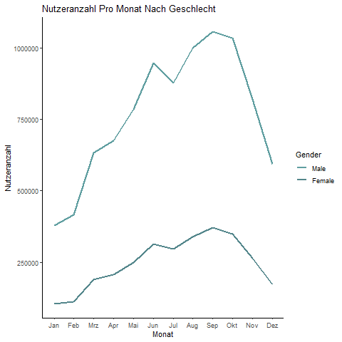
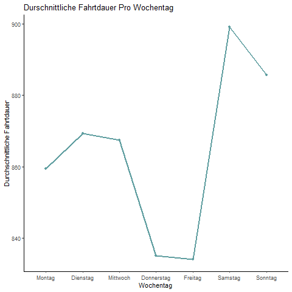
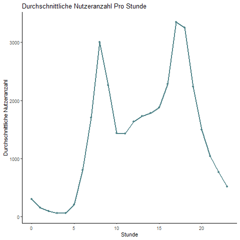

```{r setup, include=FALSE}
knitr::opts_chunk$set(echo = FALSE)
```

# Gliederung

## Gliederung

- Überblick
- Datengrundlage
- Visualisierungen
- Forschungsfragen
- Problemstellungen
- Stündliche Analyse
- Tägliche Analyse
- Ausblick

# Überblick

## Überblick

- Daten der Stadt New York über Bikesharing Programm im Jahr 2016
- Möglichst genaue und sinnvolle Vorhersage der Nutzerzahlen an den einzelnen Stationen
- Weitere Einflussfaktoren wie Wetter, Feiertage 
- Vorhersage mit **K**ünstlichem **N**euronalem **N**etz
  - Spezialform **L**ong **S**hort **T**erm **M**emory Netz
- Benchmark mit linearer Regression
- Fehlermaß ist **R**oot **M**ean **S**quared **E**rror

# Datengrundlage

## Bikesharing Daten

- Datensatz mit einer Leihe pro Zeile
- Informationen zu jeder Leihe:
  - Start- und Endzeitpunkt
  - Start- und Endstation
  - Dauer der Leihe
  - Fahrrad-ID
  - Abostatus
  - Alter
  - Geschlecht
  
## Bikesharing Daten
  


  
## Bikesharing Daten | Aggregationen

- Zu Analysezwecken Perspektivwechsel von Leihe zu Station/Bezirk
- Aggregierte Datensätze enthalten tägliche/stündliche Informationen je Station/Bezirk
- Für verschiedene Zwecke unterschiedliche Informationen
  - z.B. Alter und Fahrtdauer ohne Berücksichtigung in stündlichem Datensatz
  
## Bikesharing Daten | Aggregationen

- Für Analyse genutzte Informationen je Bezirk
  - Datum bzw. Datum und Stunde
  - Bezirk
  - Anzahl der Nutzer, die eine Rad ausleihen
  - Durchschnittliche Fahrtdauer
  - Durchschnittliches Alter
  - Wochen- und Feiertage
  - Monat und Quartal
  
## Wetterdaten

- Tägliches und stündliches Wetter als zusätzliche Einflussfaktoren
- Tägliche Wetterdaten:
  - Maximal-, Minimal-, Durchschnitttemperatur in Grad Celsius
  - Niederschlagsmenge in Millimeter
  - Schneefall in Millimeter
  - Schneetiefe in Millimeter
- Stündliche Wetterdaten
  - Temperatur in Grad Celsius
  - Niederschlagsmenge in Millimeter
  - Windgeschwindigkeit in Km/h
  
## Datensatz für Analysen

- Für Analyse Zusammenführung von Wetter- und Bikesharingdaten
  - Datum und Stunde
  - Bezirk
  - Anzahl der Nutzer, die eine Rad ausleihen
  - Durchschnittliche Fahrtdauer und Alter
  - Wochen- und Feiertage
  - Monat und Quartal
  - Temperatur
  - Nierderschlagsmenge
  - Schneefall und -tiefe
  - Windgeschwindigkeit

# Visualisierungen

## Grundlegende Visualisierungen


## Grundlegende Visualisierungen



## Grundlegende Visualisierungen




## Grundlegende Visualisierungen



## Grundlegende Visualisierungen


## Grundlegende Visualisierungen


## Grundlegende Visualisierungen


## Leihstationen in New York

```{r}
m
```

## Choropleth Map

```{r}
# map ohne marker

leaflet(map_data) %>%
  addTiles() %>% 
  addPolygons(fillColor = ~pal(userperneighborhood), popup = ~neighborhood) %>% 
  addProviderTiles("CartoDB.Positron") %>%
  setView(-73.98, 40.75, zoom = 13) %>%

addLegend( pal=pal, values=~userperneighborhood, opacity=0.9, title = "Total Users", position = "bottomright" )
```

## Choropleth Map Mit Leihstationen

```{r}
leaflet(map_data) %>%
  addTiles() %>% 
  addPolygons(fillColor = ~pal(userperneighborhood), popup = ~neighborhood) %>% 
  addMarkers(~start_station_longitude.x, ~start_station_latitude.x, popup = ~start_station_name, data = points) %>%
  addProviderTiles("CartoDB.Positron") %>%
  setView(-73.98, 40.75, zoom = 13) %>%

addLegend( pal=pal, values=~userperneighborhood, opacity=0.9, title = "Total Users", position = "bottomright" )
```

## Entwicklung der Nutzerzahlen Je Bezirk

```{r}
basemap %>%
  addMinicharts(
    newTest_agg$long, newTest_agg$lat,
    type = "auto",
    chartdata = newTest_agg$users,
    showLabels = TRUE,
    fillColor = pal,
    width = 45,
    time = newTest_agg$start_date,
    colorPalette = colors,
    transitionTime = 0.1,
  ) %>%
  setView(-73.98, 40.75, zoom = 13)
```

# Forschungsfragen

## Forschungsfragen

- Ursprünglich die Vorhersage der Nutzerzahlen je Leihstation
- Diverse Problemstellungen
- Finale Forschungsfragen
  1. Können die Nutzerzahlen je Stunde für den Bezirk Chelsea zuverlässig vorhergesagt werden?
  2. Können die Nutzerzahlen je Tag für den Bezirk Chelsea zuverlässig vorhergesagt werden?
  
# Problemstellungen

## Problemstellungen

- Sehr große Datenmengen
  - Ursprünglicher Datensatz 13 000 000 Zeilen
- Features mit sehr vielen Kategorien
  - über 600 Leihstationen
  - mehr als 60 Bezirke
- Hochdimensionale Daten nach Analyseaufbereitung
  - Dummykodierung notwendig
- Lösung: Nach Bezirken getrennte Analysen

# Stündliche Analyse

## Stündliche Daten

- Daten für den Bezirk Chelsea
- Informationen über:
  - Datum und Stunde
  - Anzahl der Nutzer
  - Wochen- und Feiertag
  - Quartal
  - Temperatur
  - Windgeschwindigkeit
  - Niederschlagsmenge
  
## Stündliche Daten


## Lineare Regression

- Alle Variablen mit einbezogen
- Statistisch signifikant sind:
  - Stunde
  - Feiertag
  - Wochentage Mittwoch und Freitag
  - Temperatur
  - Niederschlagsmenge
- R-Quadrat mit 29.4% sehr niedrig
- RMSE nach Vorhersage mit Testdaten 152.69
  - Durchschnittlicher Fehler von rund 153 Nutzer pro Stunde

## Lineare Regression

```{r, fig.align='center', fig.height=10, fig.width=8}
ggplot() +
  labs(title = "Lineare Regression: Vorhersage Stündlicher Nutzerzahlen") +
  xlab("Date") + ylab("User Count") +
  geom_line(data = hourly_vizdata, aes(y = Values, x = Date, color = "black")) +
  geom_line(data = hourly_vizdata, aes(y = LinReg, x = Date, color = "orange")) +
  theme_minimal() +
  theme(plot.title = element_text(hjust = 0.5),
        panel.grid.major = element_blank(), panel.grid.minor = element_blank(),
        panel.border = element_blank(),
        axis.line = element_line(colour = "black"))+
  facet_wrap(month(hourly_chelsea_test$start_datetime, label = T, abbr = F), scales = "free_x") +
  scale_color_manual(name = "Legende", values = c("black" = "black", "orange" = "orange"), labels = c("Tatsächliche Nutzer", "Lineare Regression Vorhersage"))
```

## Long Short Term Memory Netz

- Einbeziehung aller Variablen außer Datum
- Hyperparameter:
  - Anzahl Epochen:   120
  - Batchsize:          1      
  - Anzahl Lags:        5
  - Anzahl Timesteps:   6

## Long Short Term Memory Netz

```{r, eval=FALSE, echo=TRUE}
hourly_lstm <- fit_lstm(X = hourly.X.train, y = hourly.Y.train,
                 timesteps = hourly.ann.timesteps,
                 validation_split = 0.05,
                 epochs = hourly.ann.epochs,
                 batchsize = c(NA,hourly.ann.batchsize),
                 #k.fold = 3, k.optimizer = "min",
                 hidden = data.frame(c(50,25),c("tanh")),
                 dropout = c(0.5,0.1),
                 output_activation = "linear",
                 stateful = F, return_sequences = T,
                 loss = "mean_squared_error",
                 optimizer = "Ftrl",
                 metrics = c('mean_absolute_error'))
```

## Long Short Term Memory Netz

- RMSE mit `r hourly_lstm_rmse` sehr niedrig
  - Durchschnittlicher Fehler von rund `r round(hourly_lstm_rmse)` Nutzern pro Stunde

```{r, fig.align='center', fig.height=10, fig.width=8}
ggplot() +
  labs(title = "LSTM: Vorhersage Stündlicher Nutzerzahlen") +
  xlab("Date") + ylab("User Count") +
  geom_line(data = hourly_graphdata, aes(y = Value, x = Date, color = "black")) +
  geom_line(data = hourly_graphdata, aes(y = Predictions, x = Date, color = "cadetblue")) +
  theme_minimal() +
  theme(plot.title = element_text(hjust = 0.5),
        panel.grid.major = element_blank(), panel.grid.minor = element_blank(),
        panel.border = element_blank(),
        axis.line = element_line(colour = "black"))+
  facet_wrap(month(hourly.df.test$start_datetime, label = T, abbr = F), scales = "free_x") +
  scale_color_manual(name = "Legende", values = c("black" = "black", "cadetblue" = "cadetblue"), labels = c("Tatsächliche Nutzer", "LSTM Vorhersage"))
```

## Modellvergleich

- LSTM schneidet deutlich besser ab
  - zufriedenstellende Prognose
- RMSE der linearen Regression: `r round(hourly_linreg_test_rmse)`
- RMSE des LSTM Netzes: `r round(hourly_lstm_rmse)`
  
## Modellvergleich

```{r, fig.align='center', fig.height=10, fig.width=8}
ggplot() +
  labs(title = "Vergleich Der Vorhersagen Für Stündliche Nutzerzahlen") +
  xlab("Date") + ylab("User Count") +
  geom_line(data = hourly_graphdata, aes(y = Value, x = Date, color = "black")) +
  geom_line(data = hourly_graphdata, aes(y = Predictions, x = Date, color = "cadetblue")) +
  geom_line(data = hourly_graphdata, aes(x = Date, y = LinReg, color = "orange")) +
  theme_minimal() +
  theme(plot.title = element_text(hjust = 0.5),
        panel.grid.major = element_blank(), panel.grid.minor = element_blank(),
        panel.border = element_blank(),
        axis.line = element_line(colour = "black"))+
  facet_wrap(month(hourly.df.test$start_datetime, label = T, abbr = F), scales = "free_x") +
  scale_color_manual(name = "Legende", values = c("black"="black", "cadetblue" ="cadetblue", "orange" = "orange"),labels = c("Tatsächliche Nutzer", "LSTM Vorhersage", "Lineare Regression Vorhersage"))
```

# Tägliche Analyse

## Tägliche Daten

- Daten für den Bezirk Chelsea
- Informationen über:
  - Datum
  - Anzahl der Nutzer
  - Wochen- und Feiertag
  - Monat
  - Temperatur
  - Niederschlagsmenge
  - Schneefall und -tiefe
  - Durchschnittliche Fahrtdauer und Alter der Nutzer
  
## Tägliche Daten


## Lineare Regression

- Alle Variablen mit einbezogen
- Statistisch signifikant sind:
  - Schneefall und -tiefe
  - Feiertag
  - Monate März-Juni
- R-Quadrat mit 67.14% in Ordnung
- RMSE nach Vorhersage mit Testdaten `r test_q2_rmse`
  - Durchschnittlicher Fehler von rund `r round(test_q2_rmse)` Nutzer pro Tag
  
## Lineare Regression

```{r, fig.align='center', fig.height=10, fig.width=8}
ggplot() +
  labs(title = "Lineare Regression: Vorhersage Täglicher Nutzerzahlen") +
  xlab("Date") + ylab("Anzahl") +
  geom_line(data = daily_vizdata, aes(y = Values, x = Date, color = "black")) +
  geom_line(data = daily_vizdata, aes(y = LinReg, x = Date, color = "orange")) +
  theme_minimal() +
  theme(plot.title = element_text(hjust = 0.5),
        panel.grid.major = element_blank(), panel.grid.minor = element_blank(),
        panel.border = element_blank(),
        axis.line = element_line(colour = "black"))+
  facet_wrap(month(daily_neighborhood_test$start_date, label = T, abbr = F), scales = "free_x") +
  scale_color_manual(name = "Legende", values = c("black" = "black", "orange" = "orange"), labels = c("Tatsächliche Nutzer", "Lineare Regression Vorhersage"))
```

## Long Short Term Memory Netz

- Einbeziehung aller Variablen außer Datum
- Hyperparameter:
  - Anzahl Epochen:   `r ann.epochs` + k-fold cross validation
  - Batchsize:        `r ann.batchsize`     
  - Anzahl Lags:      `r ann.lags`
  - Anzahl Timesteps: `r ann.timesteps`
  
## Long Short Term Memory Netz

```{r,echo=TRUE, eval=FALSE}
lstm <- fit_lstm(X = X.train, y = Y.train,
                 timesteps = ann.timesteps,
                 validation_split = 0.05,
                 epochs = ann.epochs,
                 batchsize = c(NA,ann.batchsize),
                 k.fold = 3, k.optimizer = "min",
                 hidden = data.frame(c(50,25),c("tanh")),
                 dropout = c(0.5,0.1),
                 output_activation = "linear",
                 stateful = F, return_sequences = T,
                 loss = "mean_squared_error",
                 optimizer = "Ftrl",
                 metrics = c('mean_absolute_error'))
```

## Long Short Term Memory Netz

- RMSE mit `r lstm_rmse` niedrig
  - Durchschnittlicher Fehler von rund `r round(lstm_rmse)` Nutzern pro Tag
  
```{r, fig.align='center', fig.height=10, fig.width=8}
#hier fehlt die Grafik für das LSTM
```


## Modellvergleich

- LSTM schneidet deutlich besser ab
  - zufriedenstellende Prognose
- RMSE der linearen Regression: `r round(test_q2_rmse)`
- RMSE des LSTM Netzes: `r round(lstm_rmse)`

## Modellvergleich

```{r, fig.align='center', fig.height=10, fig.width=8}
#Hier fehlt die Grafik für den Modellvergleich
```

# Ausblick

## Ausblick

- Forschungsfragen können positiv beantwortet werden
- Genaue und sinnvolle Prognose möglich
- Optimiert Ressourcenplanung
- Steigert Kundenzufriedenheit

## Ausblick

- Gute Prognose der LSTMs für einen Bezirk
- Übertragbar auf alle Bezirke und Stationen
  - Für jeden Bezirk/jede Station ein KNN
- Vorhersage aller Bezirke/Stationen in einem Netz
  - Lösbar durch mehrere Output-Units
- Problem der Rechenkapazität durch Cloud Computing lösbar

# Vielen Dank Für Ihre Aufmerksamkeit!
